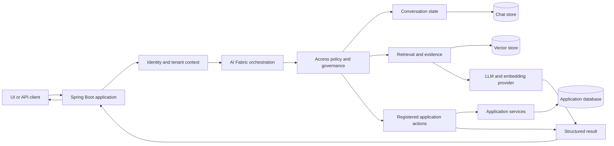

<p align="center">
  <a href="https://ai-fabric.dev">
    
  </a>
</p>

<h1 align="center">AI Fabric Framework</h1>

<p align="center">
  An open-source AI enablement framework for Java and Spring Boot.
</p>

<p align="center">
  Add semantic retrieval, evidence-grounded RAG, governed actions, conversation memory, privacy,
  behavior intelligence, and provider-backed orchestration while your application remains in
  control of domain state, identity, authorization, and side effects.
</p>

<p align="center">
  <a href="https://github.com/Loom-AI-Labs/ai-fabric-framework/actions/workflows/framework-verify.yml"></a>
  <a href="https://central.sonatype.com/artifact/io.github.loom-ai-labs/ai-fabric-bom"></a>
  
  
  <a href="LICENSE"></a>
</p>

<p align="center">
  <a href="docs/getting-started/README.md"><strong>Getting Started</strong></a>
  ·
  <a href="https://ai-fabric.dev/demos"><strong>Live Demos</strong></a>
  ·
  <a href="https://ai-fabric.dev/course"><strong>Course</strong></a>
  ·
  <a href="docs/llm-context/README.md"><strong>Coding-Assistant Context</strong></a>
  ·
  <a href="docs/release-notes/0.5.0.md"><strong>0.5.0 Release Notes</strong></a>
</p>

---

## Why AI Fabric?

Normal Spring Boot applications already own users, permissions, transactions, policies, and
business data. AI Fabric adds an AI capability layer around those application boundaries instead
of asking the model to replace them.

| Your application owns | AI Fabric enables |
| --- | --- |
| Domain entities and source-of-truth data | Annotation-driven indexing and synchronized vector evidence |
| Authentication, current user, and tenant | Policy-aware retrieval and governed action access |
| Transactions and side effects | Typed action discovery, parameter extraction, and confirmation |
| Product policies and allowed capabilities | Modes, positions, curated prompts, and application overlays |
| HTTP/API result projection | Structured orchestration results, evidence, diagnostics, and usage |
| Deployment and secret management | Provider abstraction, local embeddings, and explicit failure evidence |

The central rule is simple: **the LLM can reason and propose; trusted application code decides what
it may see and what it may change.**

## What You Can Build

| Capability | Typical modules | Start here |
| --- | --- | --- |
| Semantic search over application data | `ai-fabric-starter`, one embedding provider, one vector provider | [First Semantic Search](docs/getting-started/03-first-semantic-search.md) |
| Evidence-grounded answers | Search modules plus `ai-fabric-rag` | [First RAG Chat](docs/getting-started/04-first-rag-chat.md) |
| Governed application actions | `ai-fabric-starter`, optional action registry, `ai-fabric-chat-session` | [First Governed Action](docs/getting-started/05-first-governed-action.md) |
| Follow-ups and pending confirmations | `ai-fabric-chat-session` | [Chat Session Memory](docs/getting-started/06-chat-session-memory.md) |
| Live entity create/update/delete synchronization | `ai-fabric-indexing`, optional `ai-fabric-data-sync` | [Live Data Sync](docs/course/production/05-live-data-sync/lesson.md) |
| Existing-data backfill | `ai-fabric-migration-core` | [Migration and Backfill](docs/course/production/04-migration-backfill/lesson.md) |
| Tenant-safe and role-aware retrieval | Access policy hooks plus a metadata-filtering vector provider | [Security and Access Policy](docs/getting-started/10-security-access-policy.md) |
| PII detection and sanitized evidence | `ai-fabric-pii`, optional `ai-fabric-governance` | [Privacy Shield app](examples/real-apps/privacy-first-customer-facing-support/README.md) |
| Behavior insight and agentic UI planning | `ai-fabric-behavior` | [Behavior Signals app](examples/real-apps/behavior-churn-signals/README.md) |
| Bounded, versioned AI specialists | Optional `ai-fabric-execution` plus the capabilities each specialist uses | [Bounded Agentic Enablement](docs/Framework-Dev-Guides/application-patterns/AGENTIC_APP_GUIDE.md) |
| Purpose-specific LLM and embedding routing | `ai-fabric-provider-spring-ai` or `ai-fabric-onnx-starter` | [Provider Routing](docs/course/production/01-provider-routing/lesson.md) |

Use [Choose Your Path](docs/getting-started/01-choose-your-path.md) to install only the modules your
application needs.

## Request Flow



See [Public Architecture](docs/architecture/AI_FABRIC_PUBLIC_ARCHITECTURE.md) for the complete
ownership model and module map.

## Start With `0.5.0`

### Requirements

- Java `21`
- Maven `3.9+`
- Spring Boot `4.1.x`

AI Fabric artifacts are published under `io.github.loom-ai-labs`. No custom Maven repository is
required.

### 1. Import The BOM

```xml
<properties>
  <ai-fabric.version>0.5.0</ai-fabric.version>
</properties>

<dependencyManagement>
  <dependencies>
    <dependency>
      <groupId>io.github.loom-ai-labs</groupId>
      <artifactId>ai-fabric-bom</artifactId>
      <version>${ai-fabric.version}</version>
      <type>pom</type>
      <scope>import</scope>
    </dependency>
  </dependencies>
</dependencyManagement>
```

### 2. Add A Provider And Vector Store

This is a small OpenAI + local Lucene setup:

```xml
<dependencies>
  <dependency>
    <groupId>io.github.loom-ai-labs</groupId>
    <artifactId>ai-fabric-starter</artifactId>
  </dependency>
  <dependency>
    <groupId>io.github.loom-ai-labs</groupId>
    <artifactId>ai-fabric-provider-spring-ai</artifactId>
  </dependency>
  <dependency>
    <groupId>io.github.loom-ai-labs</groupId>
    <artifactId>ai-fabric-vector-lucene</artifactId>
  </dependency>
</dependencies>
```

Prefer local embeddings? Replace the cloud embedding path with
[`ai-fabric-onnx-starter`](docs/getting-started/08-local-onnx-embeddings.md). Prefer a managed
vector database? AI Fabric also provides Pinecone, Qdrant, Weaviate, and Milvus modules.

### 3. Enable AI Fabric

```java
import ai.fabric.annotation.EnableAIInfrastructure;
import org.springframework.boot.SpringApplication;
import org.springframework.boot.autoconfigure.SpringBootApplication;

@SpringBootApplication
@EnableAIInfrastructure
public class Application {
    public static void main(String[] args) {
        SpringApplication.run(Application.class, args);
    }
}
```

### 4. Configure The Runtime

```yaml
ai:
  enabled: true
  providers:
    llm-provider: openai
    embedding-provider: openai
    openai:
      enabled: ${OPENAI_ENABLED:false}
      api-key: ${OPENAI_API_KEY:}
      base-url: ${OPENAI_BASE_URL:https://api.openai.com/v1}
      model: ${OPENAI_MODEL:gpt-4o-mini}
      embedding-model: ${OPENAI_EMBEDDING_MODEL:text-embedding-3-small}
      embedding-dimensions: ${OPENAI_EMBEDDING_DIMENSIONS:512}
  vector-db:
    type: lucene
    lucene:
      index-path: ./data/lucene-vector-index-${OPENAI_EMBEDDING_DIMENSIONS:512}
  service:
    features:
      enable-generation: ${OPENAI_ENABLED:false}
      enable-embeddings: ${OPENAI_ENABLED:false}
      enable-search: true
      enable-rag: true
```

Keep credentials outside source control:

```bash
export OPENAI_ENABLED=true
export OPENAI_API_KEY="<your key>"
```

For CI and no-key local development, use the deterministic
[smoke profile](docs/getting-started/02-installation.md#smoke-profile).

### 5. Make Domain Data Searchable

```java
@Entity
@AICapable(entityType = "support-article")
public class SupportArticle {
    @Id
    @AIIdentity
    @AIContext(key = "entityId", dataType = AIContextDataType.ID, required = true)
    private String id;

    @AISearchable(priority = 100, required = true)
    private String title;

    @AISearchable(maxLength = 8000, priority = 80, required = true)
    private String answer;

    @AIContext(priority = 70)
    private String category;
}
```

Synchronize writes at the trusted transactional service boundary:

```java
@Transactional
@AIProcess(operation = AIProcessOperation.UPDATE)
public SupportArticle update(SupportArticle article) {
    return repository.saveAndFlush(article);
}
```

Since `0.4.0`, AI Fabric projects annotation-backed entity content and metadata, commits durable indexing
work with the source transaction, and applies create/update/delete changes to the configured vector
provider. Follow the complete [semantic-search lifecycle](docs/getting-started/03-first-semantic-search.md)
before exposing retrieval to users.

## Modules At A Glance

### Application capabilities

- `ai-fabric-core`: orchestration, intent, configuration, action contracts, and shared APIs.
- `ai-fabric-starter`: default core + PII + indexing starter.
- `ai-fabric-rag`: evidence retrieval and RAG context.
- `ai-fabric-indexing`: annotation-driven and programmatic indexing lifecycle.
- `ai-fabric-data-sync`: API/connector data synchronization.
- `ai-fabric-chat-session`: recent turns, pinned targets, and pending confirmations.
- `ai-fabric-pii` and `ai-fabric-governance`: privacy and governance controls.
- `ai-fabric-behavior`: event-backed behavior insight.
- `ai-fabric-migration-core`: bounded, resumable data backfill.
- `ai-fabric-execution`: optional bounded, versioned specialist execution and governed composition.

### Providers and storage

- Cloud LLM and embedding abstraction: `ai-fabric-provider-spring-ai`.
- Local ONNX embeddings: `ai-fabric-onnx-starter`.
- Vector providers: Lucene, memory, Pinecone, Qdrant, Weaviate, and Milvus.
- Curated prompt bundles: default, commerce, and support.

The BOM contains the complete supported artifact list. See
[`ai-infrastructure-module/pom.xml`](ai-infrastructure-module/pom.xml) and the
[installation guide](docs/getting-started/02-installation.md) for optional modules.

## Live, Source-Backed Demos

These are deployed Spring Boot applications from `examples/real-apps`, not mocked UI stories.

| Live demo | Framework proof | Backend source |
| --- | --- | --- |
| [AI Shopping Experience](https://ai-fabric.dev/demos/ai-shopping-experience) | Staged commerce RAG, attachments, chat memory, cart actions, checkout confirmation | [`chat-capabilities-demo`](examples/real-apps/chat-capabilities-demo) |
| [Account Resolver](https://ai-fabric.dev/demos/ai-fabric-account-resolver) | Profile reads, policy evidence, blocker reasoning, governed remedies | [`ai-fabric-account-resolver`](examples/real-apps/ai-fabric-account-resolver) |
| [Behavior Signals](https://ai-fabric.dev/demos/ai-fabric-behavior-signals) | Raw events, incremental insight, and allowlisted agentic UI composition | [`behavior-churn-signals`](examples/real-apps/behavior-churn-signals) |
| [Tenant Guard](https://ai-fabric.dev/demos/ai-fabric-tenant-guard) | Tenant-filtered evidence, role visibility, governed writes, scoped deletion | [`tenant-knowledge-portal`](examples/real-apps/tenant-knowledge-portal) |
| [Privacy Shield](https://ai-fabric.dev/demos/ai-fabric-privacy-shield) | PII detection, redacted persistence, safe indexing, sanitized retrieval | [`privacy-first-customer-facing-support`](examples/real-apps/privacy-first-customer-facing-support) |
| [Live Data Sync](https://ai-fabric.dev/demos/ai-fabric-live-data-sync) | Annotation-driven create/update/delete synchronization and current RAG evidence | [`ai-fabric-live-data-sync`](examples/real-apps/ai-fabric-live-data-sync) |

Use the [Real-App Capability Matrix](examples/real-apps/REAL_APP_CAPABILITIES.md) to find additional
examples for provider routing, DB action registries, MCP, document ingestion, migration, vector
readiness, and relationship queries.

## Learn AI Fabric

- [Getting Started](docs/getting-started/README.md): focused guides from first search to production.
- [Interactive course](https://ai-fabric.dev/course): guided lessons, videos, checks, and real-app case studies.
- [Course source](docs/course/AI_FABRIC_EXTERNAL_USER_COURSE.md): versioned curriculum and lab contracts.
- [Architecture](docs/architecture/AI_FABRIC_PUBLIC_ARCHITECTURE.md): request flow and ownership boundaries.
- [Release notes](docs/release-notes/0.5.0.md): current behavior and migration considerations.
- [Production checklist](docs/getting-started/13-production-checklist.md): release and deployment gate.

## Build With A Coding Assistant

AI Fabric includes a compact, code-backed context pack for coding assistants. Start with:

1. [LLM Context Index](docs/llm-context/AI_FABRIC_CONTEXT_INDEX.md)
2. [Capability Map](docs/llm-context/AI_FABRIC_CAPABILITY_MAP.md)
3. [Module Decision Tree](docs/llm-context/AI_FABRIC_MODULE_DECISION_TREE.md)
4. [Rules For Coding Assistants](docs/llm-context/AI_FABRIC_RULES_FOR_CODING_ASSISTANTS.md)
5. [Common Task Recipes](docs/llm-context/AI_FABRIC_COMMON_TASK_RECIPES.md)

Ask the assistant to read those files and the nearest real app before changing code. Require it to
preserve application-owned identity, tenant policy, confirmation, and failure visibility.

## Build And Verify

Build the framework from source:

```bash
mvn -B -V --no-transfer-progress -f ai-infrastructure-module/pom.xml clean verify
```

Install local artifacts, then verify every real app:

```bash
mvn -B -V --no-transfer-progress -f ai-infrastructure-module/pom.xml install
mvn -B -V --no-transfer-progress -f examples/real-apps/pom.xml package
```

Tests are layered deliberately:

- deterministic unit and contract tests run without provider keys;
- smoke profiles prove packaged runtime behavior without hiding failures;
- Docker/Testcontainers suites prove supported infrastructure boundaries;
- keyed provider suites exercise real LLM, embedding, and managed-vector integrations.

See [Testing and Verification](docs/getting-started/11-testing-and-verification.md) and the
[CI Pipeline Guide](docs/Framework-Dev-Guides/testing-verification/CI_PIPELINE_GUIDE.md).

## Repository Layout

```text
ai-infrastructure-module/     Framework modules, providers, vectors, and integration suites
examples/minimal-spring-boot/ Minimal Spring Boot consumer
examples/agentic-execution-consumer/ Standalone public execution API consumer and runtime proof
examples/real-apps/           Product-shaped applications and deployment smoke tests
docs/getting-started/         Canonical external-developer guides
docs/llm-context/             Coding-assistant context and task recipes
docs/course/                  Versioned course lessons and case studies
docs/release-notes/           Release behavior and migration notes
```

## Community And Contributing

AI Fabric is created and maintained by
**[Mahmoud Elgammal](https://www.linkedin.com/in/engmahmoudalgammal/)**. Source is published under
the [Loom AI Labs GitHub organization](https://github.com/Loom-AI-Labs).

- [Contributing guide](CONTRIBUTING.md)
- [Code of Conduct](CODE_OF_CONDUCT.md)
- [Security policy](SECURITY.md)
- [Roadmap and issues](https://github.com/Loom-AI-Labs/ai-fabric-framework/issues)
- [Discord community](https://discord.gg/cBpR7JQuY)
- [Project website](https://ai-fabric.dev)

The project favors focused, well-tested changes with real-app proof over broad rewrites.

## Release Policy

The current release is **`0.5.0`**. AI Fabric remains on a `0.x` release line, so review release
notes and migration guidance before upgrading:

- [AI Fabric 0.5.0 release notes](docs/release-notes/0.5.0.md)
- [AI Fabric 0.4.0 release notes](docs/release-notes/0.4.0.md)
- [Annotation lifecycle 0.4 migration guide](docs/Framework-Dev-Guides/retrieval-vectorization/ANNOTATION_LIFECYCLE_0_4_MIGRATION_GUIDE.md)

## Project Boundary

This repository contains the open-source AI Fabric framework, documentation, examples, and test
suites. It does not contain private managed-product code, customer configuration, deployment
operations, or commercial application code.

## License

Licensed under the [Apache License 2.0](LICENSE).
