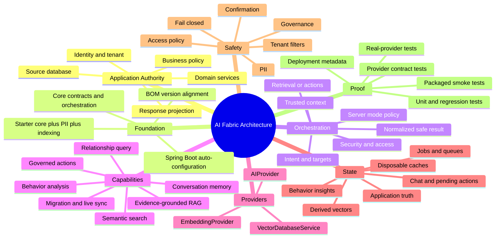

# AI Fabric Architecture Mind Map Blueprint

## Purpose

This document is the canonical production brief for creating an AI Fabric architecture mind map.
It is designed for Miro, XMind, FigJam, Lucidchart, draw.io, Mermaid, or a presentation tool.

The map must explain three things at a glance:

1. AI Fabric runs inside an existing Spring Boot application as an AI enablement framework.
2. The application retains ownership of identity, policy, business data, and side effects.
3. AI Fabric coordinates optional capabilities through separate LLM, embedding, and vector-provider
   boundaries.

This blueprint reflects the current module reactor for AI Fabric `0.4.0`.
Update it when module boundaries or the ordered orchestration pipeline change.

## One-Sentence Architecture

> AI Fabric enables Spring Boot applications with retrieval, evidence-grounded generation,
> governed actions, conversation memory, privacy, behavior analysis, and provider orchestration
> while the application remains the authority for users, tenants, policies, domain state, and
> side effects.

## Recommended Diagram Set

Do not force every detail into one image. Produce one overview and four linked drill-down maps.

| Diagram | Question it answers | Recommended depth |
| --- | --- | --- |
| A. Architecture overview | Where does AI Fabric sit and who owns each concern? | 2-3 levels |
| B. Request lifecycle | How does one natural-language request become a governed result? | Ordered flow |
| C. Capability and module map | Which dependency enables which outcome? | 3 levels |
| D. Provider and storage map | Which systems perform inference and retain each type of state? | 3 levels |
| E. Security and action boundary | Where are identity, policy, confirmation, and side effects enforced? | Ordered flow |

The overview should link to the drill-downs rather than duplicate all their nodes.

## Visual Grammar

Use ownership and responsibility, not technology alone, to determine color.

| Tag | Meaning | Suggested color |
| --- | --- | --- |
| `[USER]` | Human, UI, or external API | Light gray `#E5E7EB` |
| `[APP]` | Application-owned authority or domain behavior | Green `#166534` |
| `[FABRIC]` | AI Fabric runtime contract or orchestration | Deep teal `#0F4C5C` |
| `[MODULE]` | Optional AI Fabric capability module | Blue `#2563EB` |
| `[PROVIDER]` | Model, embedding, connector, or vector adapter | Violet `#7C3AED` |
| `[STORE]` | Durable or derived state | Amber `#B45309` |
| `[SAFETY]` | Security, privacy, tenant, or governance boundary | Red `#B91C1C` |
| `[PROOF]` | Test, readiness, or deployment evidence | Slate `#475569` |

Use solid arrows for runtime calls, dashed arrows for configuration, and dotted arrows for
observability or verification. Put a small lock marker on fail-closed boundaries. Put an open circle
on optional modules and a filled circle on required nodes for the selected use case.

## Diagram A: Architecture Overview

### Canvas Layout

- Center: `[FABRIC] AI Fabric runtime inside the Spring Boot application`.
- Left: request entry and application-owned authority.
- Top: configuration, policy, and safety constraints.
- Right: optional capability modules.
- Bottom: provider contracts, concrete providers, and stores.
- Outer ring: tests, operations, and real-application proof.

### Mind-Map-Ready Hierarchy

The following tab-indented outline can be pasted into most mind-map tools.

```text
AI Fabric Architecture
    Purpose and boundary
        AI enablement for Spring Boot applications
        Embedded framework, not a separate business authority
        Requirement-driven modular assembly
        Application remains source of truth
    Application-owned authority [APP]
        HTTP or messaging entry point
        Authenticated user and tenant identity
        Allowed mode and position mapping
        Business policy and authorization
        Domain services and repositories
        Business transactions and side effects
        User-facing response projection
    Foundation and bootstrapping [FABRIC]
        ai-fabric-bom
            Version alignment only
        ai-fabric-core
            Contracts and service abstractions
            AI-facing entity processing
            Search coordination
            Ordered orchestration pipeline
            Local action discovery
            Prompt resolution
        ai-fabric-starter
            Core
            PII
            Indexing
        ai-fabric-provider-starter
            Core-only convenience starter
        Spring Boot auto-configuration
            Classpath conditions
            Configuration properties
            Required provider beans
            Application overrides
    AI-facing application model [FABRIC]
        AICapable
            Stable entity type
        AISearchable
            Approved text for embeddings
        AIContext
            Structured metadata and approved context
        ai-entity-config.yml
            Application-owned configuration
            Authoritative when YAML and generated annotation metadata conflict
        Lifecycle proof
            Index
            Search
            Update
            Delete
    Orchestration runtime [FABRIC]
        RAGOrchestrator entry
        OrchestrationContext
            User or anonymous session identity
            Conversation and request identity
            Locale
            Requested mode hint
            Position
            Trusted server metadata
            Attachments
        Server-owned orchestration policy
            Allowed modes
            Default mode
            Retrieval gates and budgets
            Action gates
            Suggestion gates
        Intent and target understanding
        Retrieval and action routing
        Result normalization and sanitization
        Optional backend history persistence
    Capability modules [MODULE]
        Semantic search and indexing
            ai-fabric-indexing
            Embedding provider
            Vector provider
        Evidence-grounded RAG
            ai-fabric-rag
            Retrieved evidence
            LLM generation
        Governed actions
            Local AIAction components
            Typed parameters
            Application policy
            Confirmation gate
            Application execution handler
        Conversation memory
            ai-fabric-chat-session
            Bounded recent turns
            Working targets
            Pending actions
            Action drafts
        Privacy and governance
            ai-fabric-pii
            ai-fabric-governance
        Data lifecycle
            ai-fabric-migration-core
            ai-fabric-indexing
            ai-fabric-data-sync
        Behavior intelligence
            ai-fabric-behavior
            Application event provider
            LLM-backed analysis
            Behavior insight store
        Relationship query
            ai-fabric-relationship-query
            LLM planning
            Application-owned relational data
        Optional HTTP surface
            ai-fabric-web
        External and runtime action catalogs
            ai-fabric-actions-connector
            ai-fabric-actions-registry
            ai-fabric-actions-registry-liquibase
        External retrieval connector
            ai-fabric-retrieval-connector
        Curated prompt overlays
            ai-fabric-curated-default
            ai-fabric-curated-commerce
            ai-fabric-curated-support
    Provider boundaries [PROVIDER]
        AIProvider
            LLM orchestration purpose
            LLM generation purpose
            ai-fabric-provider-spring-ai
        EmbeddingProvider
            Remote embeddings through Spring AI provider
            Local embeddings through ai-fabric-onnx-starter
        VectorDatabaseService
            ai-fabric-vector-lucene
            ai-fabric-vector-memory for controlled tests
            ai-fabric-vector-qdrant
            ai-fabric-vector-pinecone
            ai-fabric-vector-weaviate
            ai-fabric-vector-milvus
    State and storage [STORE]
        Application database
            Business source of truth
        Vector store
            Derived embeddings and retrieval metadata
            Rebuildable from source truth
        Indexing queue
            Durable indexing work and failures
        Migration jobs
            Scan progress and retry state
        Chat-session store
            Sessions and turns
            Pending confirmations and drafts
        Behavior insight store
            Derived analysis, not raw business truth
        Action registry database
            Approved connector action definitions
            Not domain execution logic
        Runtime cache
            Rebuildable optimization
            Never identity or authorization authority
    Security and governance [SAFETY]
        Backend-created identity context
        Security analysis
        Access control
        Server-owned capability policy
        PII handling
        Compliance checks
        Tenant metadata filtering
        Action-level authorization
        Confirmation before governed writes
        Response sanitization
        Fail closed on uncertain authority or evidence scope
    Configuration and extension [FABRIC]
        Dependencies select capabilities
        Properties enable and constrain capabilities
        Annotations describe AI-facing domain projection
        YAML can refine application policy
        Default prompt bundle
        Ordered curated overlays
        Narrow application prompt overlay
        Application beans and SPI implementations
        PipelineStep extensions at deliberate order points
    Verification and operations [PROOF]
        Deterministic unit tests
        Prompt and structured-output regression tests
        Vector provider contract tests
        Testcontainers integration tests
        Packaged runtime smoke tests
        Real-provider keyed tests
        Deployment health and exact build metadata
        Real application scenarios
        Visible provider and policy failures
```

## Diagram B: Request Lifecycle

Show a horizontal pipeline. Use phase groups above the ordered steps and ownership bands below them.
Not every optional step is active in every application.

```text
[USER]
new message
    |
    v
[APP]
authenticate -> resolve tenant -> select allowed request context -> call RAGOrchestrator
    |
    v
[FABRIC ordered pipeline]
10 SecurityAnalysis
20 AccessControl
22 OrchestrationPolicyResolution
23 AttachmentNormalization
25 ConversationEnrichment                    optional chat-session
26 AttachmentPromptAugmentation
27 PendingActionPromptAugmentation
30 PIIDetection                              optional PII
40 ComplianceCheck                          optional governance
50 IntentExtraction                         LLM orchestration purpose
51 WorkingSetTargetSeeding                   optional chat-session
52 TargetResolution
55 VectorSpaceResolution
57 ConfirmationResolution                    optional chat-session
60 IntentHandling                            retrieval, generation, or action branch
65 OrchestrationResultNormalization
70 MetadataBuilding
80 SmartSuggestions
90 ResponseSanitization
95 ConversationRecording                     optional chat-session
100 HistoryPersistence
    |
    v
[APP]
project approved result -> return application response
```

### Lifecycle Ownership Labels

- The UI sends the newest message and presentation context.
- The backend supplies trusted user, tenant, and policy context.
- AI Fabric coordinates allowed capabilities.
- The LLM interprets intent and generates text within configured constraints.
- The application action handler performs business writes.
- The configured stores persist evidence or workflow state.

### Example Result Branches

Use three small branches from `IntentHandling`:

```text
Information request -> retrieve evidence -> optional RAG generation -> INFORMATION_PROVIDED
Action request      -> validate and authorize -> pending state       -> CONFIRMATION_REQUIRED
Confirmation reply -> restore pending action -> app handler         -> ACTION_EXECUTED
```

## Diagram C: Capability And Module Assembly

Use a dependency recipe view. The left side states the application outcome; the right side adds only
the required modules and provider roles.

| Outcome | Required pieces | Optional additions |
| --- | --- | --- |
| Local semantic search | `ai-fabric-starter` + `ai-fabric-onnx-starter` + `ai-fabric-vector-lucene` | Governance, web endpoints |
| Managed semantic search | Starter + one embedding provider + one managed vector provider | Migration and live sync |
| Evidence-grounded answer | Semantic-search set + `ai-fabric-rag` + an LLM provider | Chat-session for multi-turn follow-up |
| Local governed action | Core or starter + application `@AIAction` bean | Chat-session for durable confirmation |
| Runtime connector actions | Governed-action set + actions connector/registry | Liquibase registry schema management |
| Durable conversation | `ai-fabric-chat-session` + a production storage provider | Pending-action interceptors |
| Behavior insight | `ai-fabric-behavior` + LLM provider + application `ExternalEventProvider` | Durable insight store |
| Existing-data backfill | `ai-fabric-migration-core` + indexing + embedding + vector provider | Admin web surface |
| Continuous evidence sync | `ai-fabric-data-sync` + indexing/provider path | Migration for initial backfill |
| Relationship-aware query | `ai-fabric-relationship-query` + application relational model | Behavior module when events are also analyzed |
| Tenant-safe retrieval | Trusted application identity/policy + tenant metadata + filter-capable vector provider | Governance audit features |

### Foundation Artifact Callouts

These labels should be visible because they prevent dependency confusion:

```text
ai-fabric-bom
    aligns versions
    provides no runtime capability

ai-fabric-starter
    includes core + PII + indexing
    does not include an LLM, embedding provider, vector provider, RAG, chat-session,
    governance, or behavior analysis

ai-fabric-provider-starter
    includes core for provider-only scenarios
    does not imply indexing or RAG
```

## Diagram D: Provider And Storage Map

### Three Primary Provider Boundaries

Keep the three contracts visually separate.

```text
AIProvider
    purpose-specific LLM work
        orchestration and structured intent
        final answer generation
    adapter
        ai-fabric-provider-spring-ai

EmbeddingProvider
    text -> compatible numeric vector
    adapters
        ai-fabric-provider-spring-ai for configured remote embeddings
        ai-fabric-onnx-starter for local embeddings

VectorDatabaseService
    store, search, lifecycle, and administrative behavior
    adapters
        Lucene
        Memory for tests
        Qdrant
        Pinecone
        Weaviate
        Milvus
```

Do not draw Spring AI as a replacement for the vector lifecycle contract. In the current
architecture it is the bridge used by the cloud LLM and embedding provider module. AI Fabric keeps
its vector-provider contract and provider implementations.

### State Ownership Map

```text
Application database [APP][STORE]
    owns users, tenants, articles, products, tickets, orders, and business events
    application actions commit business mutations here
        |
        | migration, indexing, or trusted sync
        v
Vector store [FABRIC][STORE]
    owns a derived semantic projection
    stores stable entity identity, approved content, vector, and retrieval metadata
    can be rebuilt from application truth

Chat-session store [FABRIC][STORE]
    owns bounded conversation workflow state
    stores turns, working targets, pending confirmations, and action drafts

Indexing and migration stores [FABRIC][STORE]
    own queue entries, progress, retries, and visible failures

Behavior insight store [FABRIC][STORE]
    owns derived insights
    raw events remain application or event-platform data

Action registry database [FABRIC][STORE]
    owns approved connector action definitions
    application services still own execution and authorization

Runtime cache [FABRIC]
    improves performance
    is disposable and must not become correctness, identity, or authorization state
```

## Diagram E: Governed Action And Security Boundary

Use a sequence with red gates and green application-owned execution.

```text
User request
    -> backend authenticated identity
    -> security analysis
    -> access control
    -> server orchestration policy
    -> LLM maps request to an allowlisted action and typed parameters
    -> target and parameter validation
    -> application action policy
    -> confirmation required?
        yes -> persist pending action -> return confirmation request
        no  -> continue
    -> confirmed request restores backend pending state
    -> application action handler executes domain transaction
    -> AI Fabric normalizes and sanitizes structured result
    -> application projects user-facing response
```

Place these statements directly on the diagram:

- The LLM proposes within an allowlisted catalog; it does not register arbitrary actions.
- Application-owned context such as current user or subscription ID is resolved by the backend, not
  requested from the user when already known.
- Confirmation is workflow state, not merely a chat phrase.
- The action result shown to users is a projection, not a raw domain object dump.

## Cross-Link Register

Mind maps hide cross-branch dependencies. Add these explicit secondary connectors after the tree is
laid out.

| ID | From | To | Label |
| --- | --- | --- | --- |
| X01 | Application controller | `RAGOrchestrator` | trusted request entry |
| X02 | Authenticated identity | Access control and action policy | authority |
| X03 | Mode/position mapping | Orchestration policy | allowed capability selection |
| X04 | `AICapable` projection | Indexing/migration | approved source projection |
| X05 | Indexing | `EmbeddingProvider` | create vector |
| X06 | Indexing/search | `VectorDatabaseService` | persist or retrieve evidence |
| X07 | Retrieved evidence | `ai-fabric-rag` | approved generation context |
| X08 | RAG and intent extraction | `AIProvider` | purpose-specific LLM call |
| X09 | Chat-session | Conversation enrichment and confirmation resolution | backend memory |
| X10 | Governed action | Application service | authorized side effect |
| X11 | Application source changes | Data sync/indexing | refresh derived evidence |
| X12 | Migration job | Indexing queue | bounded backfill work |
| X13 | Application events | Behavior module | analysis input |
| X14 | PII/governance | Request and response pipeline | privacy/compliance gate |
| X15 | Tenant metadata | Vector provider filter | evidence isolation |
| X16 | Contract and smoke tests | Provider/module boundaries | release proof |

## Prohibited Or Misleading Connections

Do not draw any of these arrows:

| Incorrect connection | Why it is wrong |
| --- | --- |
| Browser -> LLM provider | Bypasses application identity, policy, privacy, and orchestration |
| Browser -> action handler | Bypasses allowlisting, authorization, and confirmation |
| Client tenant ID -> retrieval authority | Tenant authority must come from trusted backend context |
| LLM -> application database write | Domain writes belong to application action handlers |
| Vector store -> business source of truth | Vectors are a derived projection |
| `ai-fabric-starter` -> bundled provider | The starter does not select LLM, embedding, or vector providers |
| Semantic search -> mandatory LLM | Search needs embeddings and vectors, not generation |
| RAG -> source synchronization | RAG consumes evidence; migration/indexing/sync produce it |
| UI shortcut -> fabricated AI decision | The backend AI Fabric endpoint is the intelligence source |
| Cache -> durable memory or authorization | Cache state is disposable |
| Position == mode | Position is application context; mode is server-owned capability policy |
| Spring AI vector store == AI Fabric vector lifecycle | AI Fabric retains its broader vector lifecycle contract |

## Mermaid Overview Starter

This intentionally stays compact. Use the expanded hierarchy for the production mind map.



## Accuracy Review Checklist

Before publishing the diagram, confirm every item:

- [ ] AI Fabric is shown inside a Spring Boot application, not as the owner of the business domain.
- [ ] The application owns identity, tenant authority, policy, source data, and side effects.
- [ ] UI presentation is separate from AI intelligence and trusted context.
- [ ] BOM, core, starter, provider, and vector roles are not conflated.
- [ ] LLM, embedding, and vector providers are three separate boundaries.
- [ ] Semantic search does not require an LLM.
- [ ] RAG is shown after retrieval, not as a synonym for retrieval.
- [ ] Vectors are derived evidence and the application database remains source of truth.
- [ ] Chat history and pending confirmation are backend-owned workflow state.
- [ ] Action confirmation happens before the application handler performs a write.
- [ ] Tenant filtering is backed by trusted identity and indexed metadata.
- [ ] Optional modules are marked optional and requirement-driven.
- [ ] Failures remain visible; no fallback is shown as equivalent proof.
- [ ] Verification includes deterministic, packaged, provider, and deployment layers.
- [ ] Platform control-plane and relay concerns are not drawn as AI Fabric runtime modules.

## Code And Documentation Evidence

Use these paths when reviewing or updating the map:

| Architecture concern | Evidence |
| --- | --- |
| Public ownership model | `docs/architecture/AI_FABRIC_PUBLIC_ARCHITECTURE.md` |
| Module reactor | `ai-infrastructure-module/pom.xml` |
| Foundation wiring | `ai-infrastructure-module/ai-fabric-core/src/main/java/ai/fabric/config/AIInfrastructureAutoConfiguration.java` |
| Ordered pipeline | `ai-infrastructure-module/ai-fabric-core/src/main/java/ai/fabric/intent/orchestration/pipeline/DefaultOrchestrationPipeline.java` |
| Pipeline steps | `ai-infrastructure-module/ai-fabric-core/src/main/java/ai/fabric/intent/orchestration/pipeline/steps/` |
| LLM boundary | `ai-infrastructure-module/ai-fabric-core/src/main/java/ai/fabric/provider/AIProvider.java` |
| Embedding boundary | `ai-infrastructure-module/ai-fabric-core/src/main/java/ai/fabric/embedding/EmbeddingProvider.java` |
| Vector boundary | `ai-infrastructure-module/ai-fabric-core/src/main/java/ai/fabric/rag/VectorDatabaseService.java` |
| Access boundary | `ai-infrastructure-module/ai-fabric-core/src/main/java/ai/fabric/access/AIAccessControlService.java` |
| AI-facing annotations | `ai-infrastructure-module/ai-fabric-core/src/main/java/ai/fabric/annotation/` |
| Governed actions | `ai-infrastructure-module/ai-fabric-core/src/main/java/ai/fabric/intent/action/` |
| Conversation state | `ai-infrastructure-module/ai-fabric-chat-session/src/main/java/ai/fabric/chat/` |
| Indexing queue | `ai-infrastructure-module/ai-fabric-indexing/src/main/java/ai/fabric/repository/IndexingQueueRepository.java` |
| Migration jobs | `ai-infrastructure-module/ai-fabric-migration/src/main/java/ai/fabric/migration/repository/MigrationJobRepository.java` |
| Behavior events and insights | `ai-infrastructure-module/ai-fabric-behavior/src/main/java/ai/fabric/behavior/spi/` |
| Architecture course source | `docs/course/core/01-ai-fabric-mental-model/notebooklm/AI_FABRIC_ARCHITECTURE_MODULE_MAP_NOTEBOOKLM_SCRIPT.md` |
| Request lifecycle course source | `docs/course/core/01-ai-fabric-mental-model/notebooklm/AI_FABRIC_REQUEST_LIFECYCLE_NOTEBOOKLM_SCRIPT.md` |
| State/storage course source | `docs/course/production/04-migration-backfill/notebooklm/AI_FABRIC_STATE_STORAGE_MAP_NOTEBOOKLM_SCRIPT.md` |

## Definition Of Done

The finished mind map is ready when a Java developer can answer these questions without narration:

1. What remains owned by my Spring Boot application?
2. Which smallest module set implements my use case?
3. Which provider performs generation, embedding, and vector lifecycle work?
4. Where does each form of state live, and which state is authoritative?
5. Where do identity, tenant policy, PII handling, and confirmation run?
6. What proves the workflow is real rather than a UI simulation or hidden fallback?
