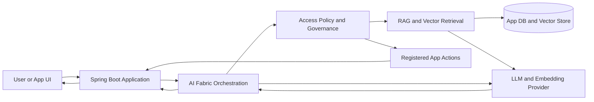

# AI Fabric Public Architecture

AI Fabric is a Java/Spring Boot framework for adding AI workflows to existing applications while keeping domain ownership inside the application.

## Request Flow

## Ownership Model

| Concern | Owner |
| --- | --- |
| Domain model and side effects | Application code |
| Retrieval metadata and vector lifecycle | AI Fabric vector/RAG modules plus the configured vector store |
| LLM and embedding calls | AI Fabric provider abstraction |
| Authorization and tenant rules | Application policy exposed through AI Fabric hooks |
| Action execution | Application services registered as AI Fabric actions |
| Conversation memory | AI Fabric chat-session module |
| Privacy handling | AI Fabric PII module plus application storage policy |

## Module Map

| Capability | Typical Modules |
| --- | --- |
| Semantic search | `ai-fabric-core`, `ai-fabric-indexing`, one embedding provider, one vector provider |
| RAG answers | Semantic search modules plus `ai-fabric-rag` |
| Governed actions | `ai-fabric-core`, action registry modules, optional `ai-fabric-chat-session` |
| Chat memory | `ai-fabric-chat-session` |
| PII detection | `ai-fabric-pii` |
| Behavior analysis | `ai-fabric-behavior` |
| Real provider calls | `ai-fabric-provider-spring-ai` |
| Local embeddings | `ai-fabric-onnx-starter` |

## Design Rules

- Do not fake intelligence in the UI. AI behavior should come from framework-backed backend endpoints.
- Keep policies readable and app-owned.
- Fail closed for access-control uncertainty.
- Prefer small module sets and real-app proof before adding new framework surface area.
- Treat demos as product-shaped verification, not marketing mockups.
