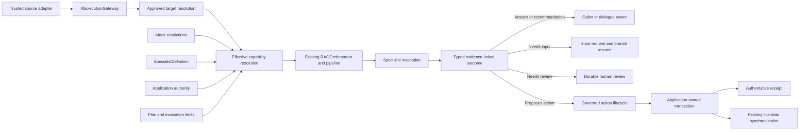
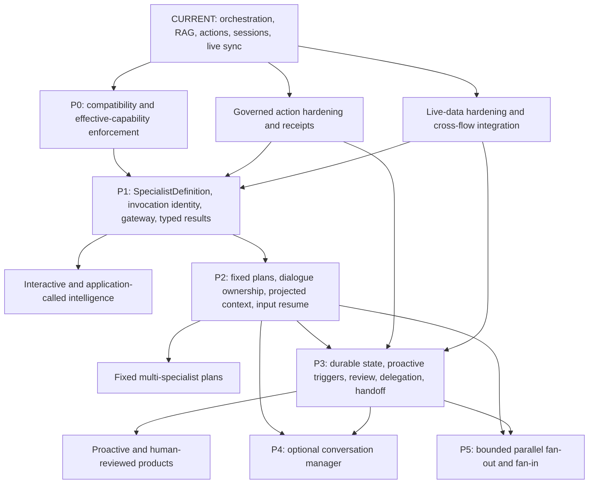

# AI Fabric Business-Flow Architecture Analysis Pack

**Purpose:** Guide a coding assistant through the business purpose, architecture, framework
changes, dependencies, and verification questions behind the twelve AI Fabric flow visuals.

**Framework baseline reviewed:** AI Fabric Framework `0.4.0`

**Repository snapshot:** `Loom-AI-Labs/ai-fabric-framework`, default branch as reviewed on
2026-07-27. The latest visible commit during the review was
[`8162d420`](https://github.com/Loom-AI-Labs/ai-fabric-framework/commit/8162d4200613a5062525913932e7e2f65acb762c).

**Architecture source:** [Product evolution proposal](../Full-Proposal/Product-evolution-proposal.md)

**Visual source:** [AI Fabric business-flow visual pack](../ai-fabric-flow-visuals/README.md)

## 1. How To Read This Pack

Each numbered document is intentionally standalone. It describes one business capability from its
starting condition to its terminal result and then identifies what AI Fabric can reuse, what must
be added, and what should remain deferred.

The status labels are important:

| Label | Meaning |
| --- | --- |
| `CURRENT` | Verified in the reviewed `0.4.0` repository or its packaged modules |
| `CURRENT GAP` | A present capability that needs stronger, more consistent, or more explicit guarantees |
| `PROPOSED` | A new contract, component, policy, or integration requiring implementation |
| `P0` | Compatibility, ownership, effective-capability resolution, and enforcement |
| `P1` | Canonical specialist definition and execution ingress |
| `P2` | Fixed plans, dialogue ownership, projected context, and typed input resume |
| `P3` | Durable execution, proactive starts, human review, delegation, and handoff |
| `P4` | Optional conversation manager and bounded supervised choice |
| `P5` | Bounded parallel specialist execution after isolation and cancellation are proven |
| `LATER` | A valid extension that should wait for adopter evidence |

Do not interpret a conceptual Java snippet as an existing API. Every such snippet is marked
`PROPOSED` and exists to make the contract precise enough to review.

## 2. Non-Negotiable Architecture Decisions

Every case in this pack follows the same ownership rules:

1. `Mode` continues to work as it does in `0.4.0`. It remains a reusable orchestration preset and
   restriction layer. It is not expanded into the definition of an agent.
2. `SpecialistDefinition` is the proposed single, complete declarative view of one agent:
   objective, instructions, typed input/output, evidence, actions, behavior, human controls,
   limits, and delegation.
3. A specialist requests capabilities; it never grants itself authority.
4. Effective capability is the intersection of the specialist request, current Mode restrictions,
   registered framework capabilities, plan restrictions, invocation limits, and current
   application authority.
5. `AIExecutionGateway` is the proposed canonical ingress for user interactions, Java/API calls,
   events, schedules, files, batches, input resume, cancellation, status, and result retrieval.
6. Existing `RAGOrchestrator`, pipeline, retrieval, model-provider, vector-provider, action, and
   live-sync paths are reused. The proposal does not introduce a second agent engine.
7. An execution plan orders work. It does not grant data access, action access, identity, tenant
   authority, or permission.
8. One interactive execution turn has exactly one dialogue owner. Worker specialists receive
   separate, typed, policy-filtered context projections and do not read or write the complete
   conversation.
9. A conversation is optional interaction history. It is not a specialist-to-specialist message
   bus.
10. A machine trigger does not create a fake user, session, conversation, or dialogue owner.
11. AI Fabric governs interpretation, evidence use, proposals, confirmation/review, registered
    handler invocation, coordination, receipt validation, and result finalization.
12. The host application remains the authority for identity, tenant, authorization, domain
    validation, transactions, side effects, idempotency, authoritative receipts, and business
    truth.
13. Durable storage is required when work crosses a request, process, actor, or time boundary. A
    synchronous single-specialist call may remain storage-optional.
14. Product UI, operator screens, and channel-specific presentation are outside this architecture
    pack.

## 3. Case Catalogue

| # | Document | Primary start | Terminal result | Main products opened | Stage |
| --- | --- | --- | --- | --- | --- |
| 01 | [Enablement Landscape](01-ai-fabric-enablement-landscape.md) | Any trusted application source | Typed result, review task, or authoritative application outcome | Embedded copilots, smart APIs, proactive operations, decision workflows | Umbrella, P0–P5 |
| 02 | [Interactive Intelligent Application](02-interactive-intelligent-application.md) | User turn in a real conversation | One coherent response or governed proposal | In-app assistants, support copilots, commerce companions | `CURRENT` + P1/P2 |
| 03 | [Application-Called Intelligence](03-application-called-intelligence.md) | Java service or API call | Typed synchronous or asynchronous result | Smart services, enrichment APIs, classification and recommendation services | P1 |
| 04 | [Fixed Multi-Specialist Plan](04-fixed-multi-specialist-plan.md) | Mapped request to a versioned plan | Deterministically aggregated typed result | Account resolution, case assessment, document decision pipelines | P2 |
| 05 | [Parallel Specialist Analysis](05-parallel-specialist-analysis.md) | Parallel step in an approved plan | Deterministic fan-in result | Parallel risk checks, due diligence, multi-document analysis | P5 |
| 06 | [Proactive Intelligence](06-proactive-intelligence.md) | Event, schedule, file, or batch | Signal, task, recommendation, review, or governed action | Proactive support, anomaly response, operational intelligence | P3 |
| 07 | [Missing Input And Safe Resume](07-missing-input-safe-resume.md) | A branch cannot continue safely | Resumed branch and completed result, or explicit expiry | Guided workflows, incomplete-case resolution, safe form-free automation | P2/P3 |
| 08 | [Durable Human Review](08-durable-human-review.md) | Sensitive or uncertain proposal | Authorized decision and safe continuation | Compliance queues, exception handling, supervised automation | P3 |
| 09 | [Conversation Manager](09-conversation-manager.md) | Ambiguous interactive request | Validated coordination directive and one external response | Intelligent front doors, multi-capability assistants | P4 |
| 10 | [Delegation And Handoff](10-delegation-and-handoff.md) | A specialist needs bounded help or ownership transfer | Linked specialist result or explicit dialogue transfer | Escalation, specialist networks, tiered service journeys | P3 |
| 11 | [Governed Action Lifecycle](11-governed-action-lifecycle.md) | Natural-language or structured action proposal | Authoritative receipt and finalized outcome | Transactional assistants, operations copilots, governed automation | `CURRENT` + P1/P3 |
| 12 | [Live Data Intelligence Loop](12-live-data-intelligence-loop.md) | Authoritative application create/update/delete | Current, policy-scoped searchable evidence | Live-data assistants, current RAG, action-to-evidence loops | `CURRENT` + hardening |

## 4. Current Repository Evidence Used

The documents should be checked against code, not only against product language. The following
sources were read while assembling this pack.

| Current area | Repository evidence | What it proves |
| --- | --- | --- |
| Framework positioning and modules | [`README.md`](https://github.com/Loom-AI-Labs/ai-fabric-framework/blob/main/README.md) | `0.4.0` module map, provider choices, annotation examples, live demos, and application ownership |
| Mode and shared orchestration restrictions | [`OrchestrationProperties`](https://github.com/Loom-AI-Labs/ai-fabric-framework/blob/main/ai-infrastructure-module/ai-fabric-core/src/main/java/ai/fabric/config/OrchestrationProperties.java) | Server-defined modes, position routing, action/retrieval switches, vector-space limits, and bounded read-action settings |
| Request context | [`OrchestrationContext`](https://github.com/Loom-AI-Labs/ai-fabric-framework/blob/main/ai-infrastructure-module/ai-fabric-core/src/main/java/ai/fabric/intent/orchestration/OrchestrationContext.java) | Current user/session validation, optional conversation, position, mode, attachments, and resolved policy |
| Single governed flow | [`RAGOrchestrator`](https://github.com/Loom-AI-Labs/ai-fabric-framework/blob/main/ai-infrastructure-module/ai-fabric-core/src/main/java/ai/fabric/intent/orchestration/RAGOrchestrator.java) | One thin entry point over the existing orchestration pipeline |
| Ordered pipeline | [`DefaultOrchestrationPipeline`](https://github.com/Loom-AI-Labs/ai-fabric-framework/blob/main/ai-infrastructure-module/ai-fabric-core/src/main/java/ai/fabric/intent/orchestration/pipeline/DefaultOrchestrationPipeline.java) | Ordered Spring-discovered steps, skip rules, early termination, error conversion, and timing metadata |
| Existing bounded agentic behavior | [`ReadActionResolutionService`](https://github.com/Loom-AI-Labs/ai-fabric-framework/blob/main/ai-infrastructure-module/ai-fabric-core/src/main/java/ai/fabric/intent/orchestration/information/ReadActionResolutionService.java) | Fail-closed, policy-limited plan → read action → evidence loop |
| Action discovery and schemas | [`AIActionRegistry`](https://github.com/Loom-AI-Labs/ai-fabric-framework/blob/main/ai-infrastructure-module/ai-fabric-core/src/main/java/ai/fabric/intent/action/AIActionRegistry.java) | Annotation/contributor discovery, immutable snapshots, access modes, typed parameters, confirmation, permission and fact hooks |
| Application-owned action handler | [`AIActionHandler`](https://github.com/Loom-AI-Labs/ai-fabric-framework/blob/main/ai-infrastructure-module/ai-fabric-core/src/main/java/ai/fabric/intent/action/AIActionHandler.java) | Permission validation, confirmation text, application execution, and optional post-action facts |
| Immediate confirmation storage | [`PendingActionStore`](https://github.com/Loom-AI-Labs/ai-fabric-framework/blob/main/ai-infrastructure-module/ai-fabric-core/src/main/java/ai/fabric/intent/action/PendingActionStore.java) | Conversation/owner-keyed pending actions with stack-compatible behavior |
| Conversation persistence contract | [`ChatSessionService`](https://github.com/Loom-AI-Labs/ai-fabric-framework/blob/main/ai-infrastructure-module/ai-fabric-chat-session/src/main/java/ai/fabric/chat/service/ChatSessionService.java) | Conversation message loading, turn recording, metadata, listing, and deletion |
| Transaction-aware live sync | [`0.4 annotation lifecycle migration guide`](https://github.com/Loom-AI-Labs/ai-fabric-framework/blob/main/docs/Framework-Dev-Guides/retrieval-vectorization/ANNOTATION_LIFECYCLE_0_4_MIGRATION_GUIDE.md) | Typed annotations, durable class-free indexing work, after-commit provider operations, retry/dead-letter, stale-write protection, and idempotent deletion |
| Operational sync behavior | [`Live Data Sync lesson`](https://github.com/Loom-AI-Labs/ai-fabric-framework/blob/main/docs/course/production/05-live-data-sync/lesson.md) | Source authority, tenant derivation, rollback, retry, reconciliation, batch limits, stable identities, and deletion behavior |

### Important Baseline Correction

The `0.4.0` live-data lifecycle already contains several guarantees that an older proposal might
mistakenly list as future work: transaction-aware queue handoff, after-commit provider operations,
retry/dead-letter visibility, stable logical identities, idempotent deletion, source authority, and
stale update/delete protection. Document 12 therefore treats those capabilities as `CURRENT` and
focuses new work on integration, explicit cross-flow provenance, outcome visibility, and any gaps
confirmed by code-level audit.

## 5. Shared Architecture Map



This map is conceptual. It does not imply that every call needs a plan, conversation, durable
store, review task, or application action.

## 6. Recommended Delivery Dependencies



Recommended sequence:

1. Audit every current action-visibility and action-invocation path before adding specialists.
2. Implement effective-capability resolution and Mode-only regression protection.
3. Prove one specialist through the existing orchestration path.
4. Add application-called execution without fake conversations.
5. Add fixed sequential plans, dialogue ownership, projections, and typed input resume.
6. Introduce durable state only for work that crosses a boundary.
7. Add proactive starts, durable review, and direct delegation/handoff.
8. Add the conversation manager only when a real product needs ambiguous conversational routing.
9. Add parallel execution last, after branch isolation, cancellation, budgets, and restart behavior
   have implementation evidence.

## 7. Shared State And Storage Rule

Storage is not the definition of agentic behavior. It is a reliability choice driven by lifecycle
boundaries.

| Flow condition | Minimum state expectation |
| --- | --- |
| One synchronous specialist call contained in one request | In-memory execution envelope is acceptable |
| Fixed synchronous plan contained in one request | In-memory step state may be acceptable if cancellation and error semantics are explicit |
| Waiting for user input | Persist the waiting branch when it must survive request/process loss |
| Human review | Durable review task and execution checkpoint are required |
| Event, schedule, file, or batch | Durable execution state, idempotency, retry, and outcome publication are required |
| Action with uncertain outcome | Durable receipt/finalization/reconciliation evidence is required |
| Parallel branches that may survive restart | Durable branch state and duplicate-safe fan-in are required |

The coding assistant should map these requirements onto existing framework stores before proposing
new persistence modules.

## 8. Shared Security Review Questions

For every proposed component, answer:

1. Who supplies the trusted identity, tenant, service principal, and authority snapshot?
2. Which inputs are caller claims, and which are server-resolved facts?
3. How are specialist evidence and action scopes intersected with Mode and application policy?
4. Can a plan, supervisor, delegation request, input response, or review decision widen authority?
5. How is the complete conversation protected from worker specialists?
6. How are hidden/system action parameters resolved from trusted context?
7. At what point are authorization, validation, version freshness, and idempotency checked again?
8. What happens when an application action may have committed but its response is lost?
9. Which metadata may be logged, persisted, or dispatched externally?
10. How are tenant boundaries enforced by vector providers that differ in filtering capability?

## 9. Expected Coding-Assistant Analysis

The intended next step is analysis, not automatic implementation. Ask the coding assistant to
produce the following for each document:

1. **Current-code evidence**
   - exact reusable classes, interfaces, configuration, stores, pipeline steps, and tests;
   - exact code paths that contradict or refine the document;
   - whether each `CURRENT` statement is verified.
2. **Gap matrix**
   - already supported;
   - partially supported;
   - absent;
   - intentionally deferred.
3. **Minimal API proposal**
   - candidate public interfaces and records;
   - package/module placement;
   - compatibility adapters;
   - serialization and versioning decisions.
4. **Authority and data-flow review**
   - trust boundaries;
   - capability intersection;
   - identity/tenant propagation;
   - conversation projection;
   - action and review reauthorization.
5. **State model**
   - which cases can remain in memory;
   - which require durable state;
   - lifecycle states, transitions, idempotency keys, and expiry.
6. **Incremental delivery plan**
   - small pull-request slices;
   - dependencies;
   - migration impact;
   - feature flags and rollback plan.
7. **Verification plan**
   - unit, integration, restart, security, provider, and end-to-end tests;
   - regression proof that Mode-only applications are unchanged;
   - measurable acceptance criteria.
8. **Open decisions**
   - choices requiring maintainer approval before code begins;
   - alternatives and trade-offs;
   - assumptions that need adopter evidence.

## 10. Required Analysis Output Template

Use this response shape so the twelve cases can be compared:

```text
Case:
Verdict: SUPPORTED / PARTIAL / NOT SUPPORTED / DEFER

Current evidence:
- file/class/test:
- verified behavior:

Required changes:
- public contract:
- internal coordination:
- policy/security:
- state/storage:
- observability:
- tests:

Compatibility:
- Mode-only behavior:
- existing API impact:
- migration:

Suggested PR sequence:
1.
2.
3.

Risks:
- security:
- consistency:
- operations:

Questions requiring maintainer decision:
1.
2.
```

## 11. Cross-Case Completion Definition

The enablement-layer evolution is credible only when:

- all sources enter through one governed submission boundary;
- all specialists execute through the existing orchestration flow;
- the same resolved action catalogue is enforced at prompt, planning, proposal, confirmation, and
  final invocation;
- Mode-only behavior is covered by regression tests and remains unchanged;
- worker specialists cannot access or append the complete conversation;
- one interactive turn creates at most one external answer from one dialogue owner;
- triggers do not invent users or conversations;
- plans and supervisors cannot widen authority;
- missing input and human review are represented by different typed states;
- application side effects produce authoritative receipts or an explicit unknown outcome;
- uncertain writes are reconciled rather than blindly repeated;
- committed application changes become visible through the existing live-data lifecycle;
- every terminal result includes enough version, policy, evidence, action, and trace references to
  explain how it was produced.
