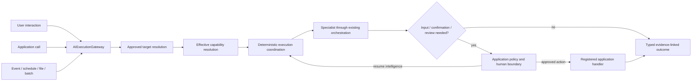

# Visual 01 — AI Fabric Enablement Landscape

## Document purpose

This is a standalone architecture and business-case brief for a coding assistant that already
understands the AI Fabric codebase. It translates the enablement-landscape visual into an
implementation-analysis target. It is not an implementation specification and does not claim that
all illustrated capabilities are already released.

## Status and maturity

| Label | Meaning in this document |
| --- | --- |
| **CURRENT** | Foundation verified in the reviewed AI Fabric `0.4.0` repository and documentation |
| **PROPOSED — P1** | Canonical specialist definition and execution ingress |
| **PROPOSED — P2** | Fixed plans, typed coordination, dialogue ownership, and input resume |
| **PROPOSED — P3** | Durable proactive work, human review, and governed continuation |
| **LATER** | Optional supervised or parallel expansion after bounded foundations are proven |

This visual is the umbrella product architecture. It deliberately spans several delivery phases.
It must not be implemented as one large feature or one universal payload.

## Executive purpose

AI Fabric should become an application-owned AI enablement layer that accepts work from any trusted
business starting point, applies bounded specialist intelligence over live approved evidence, and
returns a typed outcome that the host application can trust and continue processing.

The product promise is:

> Trusted business context → governed specialist intelligence → typed evidence-linked outcome →
> optional human decision or application-owned action.

This makes AI Fabric useful for interactive assistants, embedded Java services, proactive
operations, batch intelligence, and human-reviewed automation while preserving one rule: the host
application remains the authority for identity, authorization, business rules, transactions,
side effects, and final business truth.

## Business problem

AI features are often built as separate chat solutions, even when the useful intelligence belongs
inside an existing application workflow. That creates several problems:

- every new use case invents its own entry point, prompt assembly, and result handling;
- a chat identity is fabricated for work that actually starts from an API, event, schedule, or
  batch;
- model output is confused with a completed business operation;
- authorization, evidence scope, confirmation, and review are applied inconsistently;
- new multi-step use cases create a second orchestration implementation;
- observability is fragmented across model, retrieval, action, and application code;
- conversational state becomes an accidental workflow store.

The landscape architecture creates one governed submission and continuation boundary without
forcing every request into one channel or one interaction style.

## Products and use cases opened

| Product family | Representative uses | Typical outcome |
| --- | --- | --- |
| Embedded copilots | Shopping companion, support copilot, employee assistant | Answer, recommendation, proposal |
| Smart Java APIs | Classification, enrichment, recommendation, risk scoring | Typed service result |
| Proactive operations | Account anomaly triage, order exception detection, policy drift | Signal, case, review task |
| Decision workflows | Account resolution, claims assessment, underwriting preparation | Evidence-linked decision package |
| Human-reviewed automation | Sensitive account changes, compliance remediation | Review decision and governed action |
| Batch intelligence | Document classification, portfolio review, migration analysis | Typed batch records and exceptions |

The layer is not limited to request/response chat. It supports products whose value is created before
a user asks a question and products that end in a task, signal, or application action rather than
text.

## Scope

This architecture includes:

- a channel-neutral framework ingress;
- deterministic target resolution;
- versioned specialist definitions;
- effective capability resolution;
- reuse of the existing AI Fabric orchestration path;
- optional fixed execution plans;
- typed outcomes and finish reasons;
- explicit human-input, confirmation, and review boundaries;
- governed application-action invocation and authoritative receipts;
- source adapters for interactive and machine-initiated work;
- common lifecycle, policy, and observability semantics.

## Non-goals

This architecture does **not**:

- replace the existing `RAGOrchestrator`, retrieval providers, action registry, or live-sync path;
- turn `Mode` into an agent definition;
- grant a specialist authority because it declares a capability;
- require persistence for every synchronous request;
- use a conversation as an inter-specialist bus or execution-state store;
- create an open-ended graph language or unrestricted agent network;
- move domain authorization, validation, transactions, or side effects into AI Fabric;
- define product screens, review screens, chat rendering, or other UI concerns;
- require a public network API when an in-process Java facade is sufficient.

## Actors and trust boundaries

| Actor or component | Responsibility | Trust boundary |
| --- | --- | --- |
| Host application | Authenticates callers, creates trusted context, owns business truth | Ultimate authority |
| Channel/source adapter | Maps a real source into a typed request | Must not invent identity or authority |
| `AIExecutionGateway` | Canonical submit/resume/cancel/status/result facade | Validates source and target request |
| Target-resolution policy | Chooses only from application-approved specialists/plans | Deterministic by default |
| `SpecialistDefinition` | Complete declarative view of one agent | Requests capability; grants none |
| `Mode` | Existing reusable orchestration baseline and restriction source | Works as it does today |
| Effective-capability resolver | Intersects all applicable restrictions | Fails closed |
| Execution coordinator | Advances an implicit or explicit plan deterministically | Orders work; grants no authority |
| Existing orchestration | Performs intent, retrieval, bounded READ planning, and proposal generation | Reused, not duplicated |
| Human participant | Supplies missing input or a governed decision | Must be authenticated for the specific task |
| Registered application handler | Performs a domain operation and issues an authoritative receipt | Application-owned |
| Outcome consumer | Receives a typed result, task, signal, or receipt reference | Sees only approved output |

Two invariants apply across every path:

1. A specialist definition, plan, source mapping, or model proposal can only narrow an already
   registered capability set; none can create authority.
2. The same policy and capability checks must be enforced before model exposure and again before an
   application action is invoked.

## Start-to-result reference flow

### Flow in prose

1. Work starts from a real source: a user interaction, application service, domain event, schedule,
   file, or batch.
2. A trusted adapter creates an `ExecutionRequest` with a real initiator or service identity,
   tenant, subject when relevant, source type, typed input, and an explicit or registered target
   hint.
3. `AIExecutionGateway` validates the source and resolves one approved specialist or execution
   plan. It never accepts an arbitrary prompt or capability definition from the request.
4. AI Fabric resolves and pins the selected definition versions and computes the effective
   capabilities by intersecting specialist declarations, existing Mode restrictions, registered
   evidence/actions, application policy, and current authority.
5. A deterministic coordinator creates an implicit one-step plan or advances the selected fixed
   plan.
6. Every specialist step reuses the existing orchestration pipeline for scoped retrieval, approved
   READ actions, bounded reasoning, typed output, or a governed WRITE proposal.
7. If the work needs missing input, confirmation, or durable review, it enters an explicit wait
   state and resumes only through the appropriate trusted boundary.
8. If a WRITE proposal is approved, AI Fabric invokes a registered application handler. The
   application performs authorization, validation, transaction, and side effect and returns an
   authoritative receipt or an explicit unknown outcome.
9. AI Fabric validates and finalizes the outcome, preserves evidence/provenance, and returns a
   typed result, review task, signal, proposal, or receipt-backed business result.

### Mermaid flow



## Architecture and component responsibilities

### Ingress plane

- `AIExecutionGateway` is the only canonical framework submission and resume boundary.
- Source adapters remain thin and source-specific.
- A request identifies a registered specialist, a registered plan, or a deterministic selection
  key; it does not send an agent definition.
- Reviewer decisions remain a deliberately separate inbound boundary because they require
  reviewer-specific authorization and task-state validation.

### Definition and policy plane

- `SpecialistDefinition` is the single complete view of one agent: purpose, Mode reference,
  instructions, typed I/O, evidence scope, action scope, behavior, human-control references,
  limits, and delegation metadata.
- `Mode` remains a reusable baseline with its current behavior. Agent-specific fields do not move
  into Mode.
- `EffectiveCapabilitiesResolver` computes immutable invocation capabilities. It uses intersection,
  lowest-limit, least-powerful-strategy, and strictest-review semantics.
- Application authority is re-evaluated from trusted current context rather than copied from model
  output.

### Coordination plane

- A direct specialist call becomes an implicit one-step plan.
- An explicit fixed plan pins its plan, specialist, prompt, schema, and effective-profile versions.
- `AIExecutionCoordinator` validates step readiness, input/output mappings, transitions, waits,
  cancellation, budget, and aggregation.
- The coordinator does not call model providers directly. Each specialist step enters the existing
  orchestration.

### Intelligence plane

- Current retrieval, RAG, action discovery, bounded read-action planning, privacy, and provider
  integrations are reused.
- Every model-visible evidence/action catalogue is derived from the resolved specialist profile.
- A result is validated against its declared Java type or schema.

### Human and action plane

- Missing facts, immediate confirmation, durable review, and post-outcome review are distinct
  state transitions.
- AI Fabric governs proposal validation, confirmation/review, registered-handler invocation,
  receipt correlation, and outcome finalization.
- The application owns domain authorization, validation, transaction, side effect, idempotency,
  and receipt truth.

### Result and observability plane

- Common result metadata records evidence, proposals, receipts, finish reason, warnings, and usage.
- Lifecycle events correlate execution, invocation, plan, specialist, policy, action, and review
  references without logging unrestricted prompts or sensitive evidence.
- Synchronous calls may remain in memory; durable state is introduced only when work crosses a
  request, process, actor, or time boundary.

## CURRENT framework foundations to reuse

The proposal baseline identifies the following existing foundations:

- annotation-driven application-data projection and transaction-aware live synchronization;
- evidence-grounded RAG and richer AI Fabric vector-provider contracts;
- `RAGOrchestrator` and `DefaultOrchestrationPipeline`;
- `OrchestrationProperties` and existing Mode behavior;
- `OrchestrationContext` for identity, tenant, and request authority;
- `ReadActionResolutionService` for bounded plan/action/observation READ loops;
- `AIActionRegistry`, registered action handlers, action drafts, and confirmation;
- `PendingActionStore` for immediate confirmation continuity;
- `ChatSessionService` for real conversational continuity;
- privacy, PII, access-policy, and tenant-scoped retrieval controls;
- Spring AI model-provider integration where its contract fits;
- existing live-sync processing after application-owned changes.

These components are the implementation substrate. The landscape must add composition and a common
entry/result model around them, not build replacements.

Current-main inspection adds several important implementation facts:

- `RAGOrchestrator` is a thin, thread-safe facade over the pipeline. The new coordinator should call
  this facade rather than reproduce pipeline control.
- `DefaultOrchestrationPipeline` discovers ordered `PipelineStep` beans, supports skip and early
  termination, catches step failures, and attaches step/total timing. Those semantics and timings
  should remain the inner specialist-execution behavior.
- `OrchestrationPolicyResolutionStep` resolves the server-authoritative Mode before later steps and
  exposes policy diagnostics.
- `OrchestrationProperties.ModeOverrides` already covers action/retrieval/suggestion behavior,
  vector-space allowlists, read-action resolution, allowed READ actions, and iteration/action/
  parallel limits. Specialist scopes must narrow this behavior rather than duplicate it.
- `IntentHandlingStep` already applies `actionsEnabled`, anonymous restrictions, handler
  permission validation, trusted context parameters, required/executable parameter validation,
  drafts, conversation-bound confirmation, `PendingActionStore`, handler execution, and
  post-action generation.
- Current `OrchestrationContext` requires a `userId` or `sessionId`. Channel-neutral application,
  event, schedule, file, and batch ingress therefore needs a first-class execution/service
  identity envelope; it must not satisfy the current invariant by fabricating a user or session.

## PROPOSED framework changes

### Public contracts

- Add versioned `SpecialistDefinition<I,O>` and its evidence, action, behavior, human-control,
  limits, trigger, and delegation value types.
- Add immutable `ResolvedSpecialistProfile` and a safe capability-summary view.
- Add `ExecutionRequest<I>`, `ExecutionHandle`, `AIExecutionResult<O>`, typed finish/failure reasons,
  and source taxonomy.
- Add `AIExecutionGateway` operations for submit, resume, cancel, status, and result.
- Add a minimal `AIExecution` envelope and `SpecialistInvocation` identity.
- Add `ExecutionPlanDefinition<I,O>` for explicit fixed composition and an implicit one-step
  compatibility representation.
- Add typed `NeedsUserInput`, action receipt, action-finalization, and durable review contracts in
  their later phases.
- Define a stable result taxonomy:
  `COMPLETED`, `WAITING_FOR_INPUT`, `WAITING_FOR_CONFIRMATION`, `WAITING_FOR_REVIEW`,
  `ACTION_OUTCOME_UNKNOWN`, `DENIED`, `BUDGET_EXHAUSTED`, `CANCELLED`, and `FAILED`.

### Coordination and execution

- Implement one deterministic `AIExecutionCoordinator`.
- Route every specialist step through the existing `RAGOrchestrator`.
- Implement target resolution in a least-dynamic order: explicit trusted target, registered source
  mapping, deterministic application policy, and only later an optional model-assisted choice over
  an already authorized candidate set.
- Create an implicit one-step plan for direct calls.
- Enforce plan transitions, typed mappings, deadline, budget, cancellation, and finish semantics.
- Keep plans composition-only: they order steps and map types but never add evidence/action
  capability.

### Registration and configuration

- Add an application-owned specialist registry with startup validation.
- Add a versioned execution-plan registry.
- Add prompt-profile, schema/type-contract, deterministic mapper, aggregator, review-policy, and
  source-mapping registries.
- Validate action names/access modes, evidence references, Mode compatibility, type compatibility,
  dialogue eligibility, budget ceilings, and all referenced versions at registration.
- Keep legacy Mode-only configuration and behavior unchanged.

### Security, policy, and context

- Implement one `EffectiveCapabilitiesResolver` used by prompt construction, intent extraction,
  planner READ, direct READ, WRITE proposal, and final pre-execution checks.
- Represent real initiator, subject, tenant, authority, source, and correlation references.
- Add an execution/service identity path that removes the current need to fabricate a `userId` or
  `sessionId` for non-interactive sources, while preserving compatibility for existing context
  construction.
- Reject untrusted conversation references for machine sources by default.
- Pin the effective-profile hash and definition versions to action drafts, pending actions, waits,
  and reviews.
- Re-evaluate authorization, policy, evidence freshness, and affected-resource revision after any
  wait.
- Ensure no plan, specialist, request, receipt, or model output can widen authority.

### State and durability

- Keep direct synchronous execution storage-optional.
- Add execution-state SPI only for work that can wait, retry, resume after restart, or cross a
  process boundary.
- Define optimistic versioning, idempotent resume, cancellation, expiry, retry classification,
  version pinning, and terminal-state immutability.
- Keep large/sensitive evidence outside the coordination envelope and store only safe references.

### Actions and review

- Add `GovernedActionExecutionService` over the existing action registry; do not add a second action
  registry.
- Add typed application-issued `ActionReceipt` and explicit action-outcome finalization.
- Preserve current immediate confirmation and later add durable review SPIs:
  `ReviewTaskStore`, `ReviewTaskDispatcher`, `ReviewerAuthorizer`, and
  `ReviewDecisionGateway`.
- Never blindly retry a write whose commit status is unknown.

### Observability and evaluation

- Define sanitized lifecycle events for target resolution, capability resolution, invocation,
  evidence, action proposal, wait, review, handler invocation, receipt, finalization, and result.
- Correlate execution ID, invocation ID, specialist/version, Mode ID, plan/version, policy hash,
  action invocation, and safe evidence references.
- Add measures for quality, grounding, unsupported claims, action correctness, denial correctness,
  latency, token/cost usage, review rate, resume success, and unknown outcomes.
- Provide replay/evaluation fixtures that use pinned inputs and safe evidence snapshots without
  turning production transcripts into unrestricted test data.

### Tests

- Legacy regression: Mode-only flows behave exactly as before.
- Registration tests: missing/invalid scopes, references, modes, schemas, and actions fail closed.
- Capability tests: every model-facing and action-invocation path uses the same effective sets.
- Source tests: interactive, application, and trigger sources preserve correct identity semantics.
- Result tests: malformed output never becomes a successful typed result.
- State tests: duplicate submit, resume, decision, receipt, and dispatch do not duplicate effects.
- Security tests: a plan, specialist, sibling, or request cannot acquire privilege by composition.
- Observability tests: sensitive prompts, evidence, credentials, and reviewer data are sanitized.

## PROPOSED conceptual contracts

The names are architectural placeholders. The coding assistant should map them onto existing modules
and conventions before proposing packages.

```java
// PROPOSED
public interface AIExecutionGateway {
    <I> ExecutionHandle submit(ExecutionRequest<I> request);
    ExecutionHandle resume(String executionId, ResumeInput input);
    void cancel(String executionId, CancellationReason reason);
    ExecutionStatus status(String executionId);
    Optional<AIExecutionResult<?>> result(String executionId);
}

// PROPOSED
public record ExecutionRequest<I>(
    ExecutionSource source,
    Optional<String> specialistRef,
    Optional<String> planRef,
    Optional<String> selectionKey,
    Optional<String> conversationRef,
    I input,
    TrustedExecutionContextRef trustedContext
) {}
```

```java
// PROPOSED: complete declarative agent view, not an authority object
public record SpecialistDefinition<I, O>(
    String id,
    String version,
    String modeRef,
    String objective,
    TypeContract<I> inputContract,
    TypeContract<O> outputContract,
    SpecialistEvidenceScope evidenceScope,
    SpecialistActionScope actionScope,
    SpecialistBehavior behavior,
    HumanControlProfile humanControl,
    SpecialistLimits limits
) {}
```

```yaml
# PROPOSED: deterministic source mapping; an external request cannot redefine it
ai:
  execution:
    mappings:
      support-chat:
        source: USER_INTERACTION
        target-specialist: support-specialist
      account-resolution-api:
        source: APPLICATION_CALL
        target-plan: account-resolution-plan
      payment-risk-event:
        source: DOMAIN_EVENT
        target-specialist: payment-risk-specialist
```

## Delivery phases and dependencies

### P0 — prove compatibility and enforcement

- Document all existing Mode, action, retrieval, session, confirmation, and context paths.
- Define Specialist/Mode ownership and effective-capability semantics.
- Add regression tests before changing public contracts.
- Prove there is no action exposure or invocation path that bypasses effective capabilities.

### P1 — one specialist and one canonical ingress

- Implement specialist registry, target resolution, effective-profile resolution, gateway,
  invocation identity, typed result, and implicit one-step coordination.
- Copy the current Account Resolver into the independently deployable
  `agentic-ai-action-resolver`, then prove its interactive and application-called paths over the
  same orchestration engine while the original app remains the baseline.
- Keep the synchronous path storage-optional.

### P2 — fixed coordination and input resume

- Add immutable fixed plans, typed mapping, one dialogue owner, context projection, typed missing
  input, deterministic aggregation, and plan budgets.

### P3 — proactive durability, review, and action finalization

- Add machine-source adapters, durable execution state, review SPIs, governed action receipt
  finalization, and restart-safe continuation.

### LATER

- Add optional supervisor-directed choice and bounded parallel work only after isolation,
  cancellation, budget, and evaluation gates demonstrate value.

## Acceptance criteria

1. Every real source enters through `AIExecutionGateway` or the separate authorized reviewer
   decision boundary.
2. A direct specialist and a fixed plan use the same coordinator and existing orchestration path.
3. Mode-only applications retain current behavior.
4. `SpecialistDefinition` is the complete readable agent definition; Mode remains a reusable
   baseline.
5. Effective evidence and action sets are intersections and are enforced at exposure and use.
6. A machine-initiated request needs no fake user, conversation, or dialogue owner.
7. An interactive turn has exactly one dialogue owner.
8. Every successful output is type/schema validated and distinguishes proposals from completed
   actions.
9. A plan orders work but cannot grant specialist, evidence, action, identity, or tenant authority.
10. A registered handler remains the only implementation of a business side effect.
11. An application-issued receipt is the only source of committed business truth.
12. Persistence is optional for a bounded synchronous request and required when a declared
    cross-boundary lifecycle needs it.
13. Duplicate continuation events cannot duplicate a business operation.
14. Logs and lifecycle events contain safe references rather than unrestricted sensitive data.
15. Reference evaluations show that the common layer improves reuse without weakening latency,
    quality, or security relative to the existing single-flow baseline.

## Failure modes and edge cases

- **Unknown target:** fail before invoking the model; never fall back to an unrestricted agent.
- **Conflicting specialist and plan hints:** reject the request rather than guessing precedence.
- **Stale definition after wait:** retain the pinned version and reauthorize; expire if policy no
  longer permits continuation.
- **Mode/specialist incompatibility:** reject registration, not the first production request.
- **Malformed typed output:** retry within explicit policy, request input, review, or fail visibly.
- **Unavailable evidence provider:** return an evidence-aware partial/failure result; do not invent
  facts.
- **Action unavailable or no longer authorized:** remove it before model exposure and reject any
  stale proposal before invocation.
- **Handler timeout without receipt:** record an unknown action outcome and never blindly replay.
- **Duplicate event or resume:** idempotently return the existing execution state/result.
- **Budget exhaustion:** finish with an explicit reason and preserve partial evidence safely.
- **Sensitive data in diagnostics:** sanitize by contract and test; do not depend on log discipline.
- **Provider cancellation:** propagate cancellation to bounded work and block late result commits.
- **Large envelope growth:** keep documents, transcripts, vectors, and domain objects behind typed
  references rather than copying them into `AIExecution`.

## Questions for the coding assistant

1. Which current modules should own gateway, definitions, coordination, persistence SPIs, and
   action finalization without creating dependency cycles?
2. Which existing entry points currently bypass a potential canonical gateway, and what
   compatibility adapters are needed?
3. Where are action catalogues built, planner READ actions selected, direct actions resolved, and
   actions invoked today? Can one resolver output be threaded through all paths?
4. Which current result types can be extended or adapted instead of replaced?
5. What is the smallest `AIExecution` state that supports P1 without becoming a universal context
   object?
6. How should Java type contracts and JSON schemas be registered and versioned consistently?
7. Which existing lifecycle events, metrics, and tracing hooks can carry execution/invocation
   correlation?
8. Which flows currently depend on a conversation identity even when no real conversation exists?
9. What exact compatibility tests are required before introducing specialist-aware resolution?
10. Propose a sequence of small pull requests with explicit API, migration, security, and test
    impact; do not implement until these boundaries are confirmed.

## Related references

- Visual: `../ai-fabric-flow-visuals/01-ai-fabric-enablement-landscape.svg`
- Presentation image: `../ai-fabric-flow-visuals/01-ai-fabric-enablement-landscape.png`
- Proposal: `../Full-Proposal/Product-evolution-proposal.md`
- Most relevant proposal sections: Decision Summary; §§1–7; §§10–12; §14; §15; §17.
