# Visual 02 — Interactive Intelligent Application

## Document purpose

This standalone brief describes the business purpose and architecture of an AI Fabric-powered
interactive application. It is intended for a coding assistant that knows the framework and must
analyze the smallest safe evolution from the current conversational flow to a specialist-defined
flow.

## Status and maturity

| Capability | Status |
| --- | --- |
| Conversation/session continuity, RAG, governed actions, Mode, application context | **CURRENT** |
| Versioned specialist, canonical gateway, typed results, effective-capability profile | **PROPOSED — P1** |
| Frozen turn snapshot, projected worker views, explicit dialogue ownership, typed input resume | **PROPOSED — P2** |
| Optional durable waits/review | **PROPOSED — P3** |
| Conversation manager or parallel workers | **LATER**, not required for this flow |

The initial target is one specialist, one external conversation, and one dialogue owner. Worker
specialists appear only when an explicit plan later proves a need.

## Executive purpose

Give a person natural-language access to live application data and approved application
capabilities while returning one coherent response and keeping all business authority inside the
host application.

This is a smarter application, not merely a chatbot. The user may start from a message, a selected
domain object, an attached document, or an in-application intent. AI Fabric binds that real
interaction to one approved specialist, scopes the evidence and actions, runs the existing
orchestration, and lets exactly one invocation communicate with the user.

## Business problem

An interactive AI feature becomes unsafe or confusing when:

- the model guesses which application data the user means;
- every registered action is exposed because a broad Mode enables actions;
- multiple specialists append competing messages into one conversation;
- conversation history is treated as permission to see all prior content;
- a background worker asks the user directly or reads the unrestricted transcript;
- authorization is checked only before prompt construction;
- model prose is accepted as a valid application result;
- a proposed action is presented as already executed.

The interactive architecture makes user experience coherent without turning conversation state
into authority, workflow state, or an inter-specialist message bus.

## Products and use cases opened

- shopping companion using explicitly attached products;
- account-resolution assistant over approved account/payment evidence;
- customer-support copilot using scoped tickets and knowledge;
- employee assistant over tenant- and role-scoped policies;
- document or case assistant using selected attachments;
- domain-aware help inside an existing Spring Boot screen;
- conversational proposal of governed actions such as add-to-cart, update, or escalation.

The outcome may be a grounded answer, comparison, recommendation, clarification, action proposal,
pending confirmation, or safe failure.

## Scope

- a real user interaction and optional existing conversation;
- trusted channel adaptation and current application context;
- explicit or deterministic specialist/plan selection;
- one frozen conversation snapshot for the turn;
- exactly one dialogue owner;
- specialist-specific evidence and action scopes;
- reuse of the existing orchestration pipeline;
- one validated external response;
- existing immediate confirmation and later typed missing-input/review continuation.

## Non-goals

- no redesign of chat UI or response rendering;
- no shared transcript access for worker specialists;
- no peer-to-peer specialist chat;
- no new planner, retrieval engine, action registry, or provider abstraction;
- no Mode schema expansion merely to hold agent-specific settings;
- no automatic execution of WRITE proposals;
- no mandatory durable store for a bounded synchronous turn;
- no conversation manager for a use case that one root specialist can handle.

## Actors and trust boundaries

| Actor/component | Responsibility | Boundary |
| --- | --- | --- |
| User | Supplies a message, selected object, attachment, or confirmation | Untrusted input |
| Host application/channel adapter | Authenticates and builds tenant, subject, and authority context | Trusted application edge |
| Conversation store / `ChatSessionService` | Maintains real external interaction history | Correlation and continuity, not authority |
| `AIExecutionGateway` | Submits/resumes the turn and resolves approved target | Canonical framework edge |
| Dialogue owner | Only invocation allowed to conduct the external turn | Exactly one per interactive turn |
| `ConversationContextProjector` | Produces an immutable approved view from the frozen snapshot | Enforces per-specialist visibility |
| Specialist invocation | Performs one bounded goal with typed input/output | Declared scope is not authorization |
| Existing orchestration | Retrieval, intent, READ loop, RAG, and proposal generation | Reused |
| Host application policy/handlers | Reauthorize and execute business operations | Final authority |

`conversationRef` is a correlation reference. It does not imply transcript access. A worker receives
only an `ApprovedConversationView` if its resolved profile and application policy permit it.

## Start-to-result reference flow

### Flow in prose

1. The user sends a message or interacts with an application object.
2. The host application authenticates the user and creates trusted tenant, subject, authority, and
   attachment/object references.
3. The channel adapter submits `ExecutionSource.USER_INTERACTION` through
   `AIExecutionGateway`.
4. The gateway resolves an application-approved specialist or plan and creates an implicit
   one-step execution for the initial single-specialist path.
5. AI Fabric binds the real conversation to the execution, freezes its revision for the turn, and
   assigns the root invocation as the only dialogue owner.
6. The effective specialist profile is computed from the specialist definition, referenced Mode,
   registered evidence/actions, and current application authority.
7. `ConversationContextProjector` creates an approved context view. For a single root specialist,
   this is still a filtered view rather than direct store access.
8. The invocation enters the existing orchestration pipeline for intent, scoped retrieval,
   approved READ actions, bounded reasoning, and typed response or action proposal.
9. Application policy and output validation check the result.
10. The dialogue owner appends at most one validated response to the external conversation.
11. A WRITE proposal enters confirmation/review and registered application-handler execution; it
    is not reported as completed until an authoritative receipt exists.

### Mermaid flow

```mermaid
flowchart LR
    U[User message / selected object]
    A[Trusted channel adapter]
    G[AIExecutionGateway]
    T[Approved specialist or plan]
    D[One dialogue owner]
    F[Frozen conversation snapshot]
    V[Approved conversation view]
    S[Existing orchestration under resolved specialist profile]
    P[Application policy and typed validation]
    R[One external response or governed proposal]

    U --> A --> G --> T --> D
    D --> F --> V --> S --> P --> R
```



### Later worker rule

If an explicit plan introduces worker specialists:

```text
one frozen conversation revision
  → one independently projected view per invocation
  → typed worker results returned to the coordinator
  → one result synthesized or selected
  → only the dialogue owner communicates externally
```

Workers never append conversation messages and never inherit the dialogue owner's context.

## Architecture and component responsibilities

### Channel adapter

- Converts channel-specific input into typed application references.
- Creates trusted current context; the model cannot supply identity, tenant, or authority.
- Passes a real conversation reference only for actual interactive work.
- Does not invoke `RAGOrchestrator` directly once the gateway path is enabled.

### Gateway and target resolution

- Validate that the source is interactive.
- Resolve explicit trusted target, registered position/endpoint mapping, or deterministic
  application policy.
- Reject arbitrary prompts, specialist definitions, Mode overrides, review destinations, and
  capability lists from the user.
- Create an implicit one-step plan when a specialist is targeted directly.

### Dialogue ownership

- Bind exactly one `DIALOGUE_CAPABLE` invocation to `DIALOGUE_OWNER`.
- Freeze the conversation revision used by the turn.
- Permit only that invocation to produce the external message.
- Keep dialogue ownership separate from evidence/action authority.
- Preserve ownership across a typed input resume unless an explicit, authorized handoff changes it
  in a later phase.

### Context projection

- Read a frozen snapshot by trusted reference.
- Apply specialist context-source scope, Mode/application restrictions, privacy, tenant, subject,
  authority, attachment, and plan-input restrictions.
- Produce an immutable `ApprovedConversationView`.
- Record safe projection provenance without copying an unrestricted transcript into execution
  state.

### Specialist execution

- Resolve explicit evidence, direct READ, planner READ, and proposable WRITE sets.
- Reuse the existing `RAGOrchestrator` and pipeline.
- Enforce execution strategy against current Mode capabilities.
- Return a typed `SpecialistResult`, `NeedsUserInput`, pending action, denial, or explicit failure.

### Response publication

- Validate schema, evidence references, warnings, and finish reason.
- Ensure proposals are labeled as proposals.
- Append one approved response through the current conversation/session service.
- Return a typed application result independently of how the channel renders it.

## CURRENT framework foundations to reuse

- `ChatSessionService` and current chat-session persistence for real conversation continuity;
- `RAGOrchestrator` and `DefaultOrchestrationPipeline`;
- current Mode configuration and policy resolution;
- `OrchestrationContext` for current user, tenant, and request authority;
- `ReadActionResolutionService` for bounded approved READ-action planning;
- retrieval/RAG, vector-space restrictions, and live application evidence;
- `AIActionRegistry`, action metadata, application-owned handlers, action drafts, and
  `PendingActionStore`;
- privacy and PII controls;
- confirmation before sensitive operations.

The proposed flow should adapt current chat entry points to the gateway without changing observable
legacy behavior until applications opt into specialists.

Current-main inspection clarifies the reuse boundary:

- `RAGOrchestrator` is already a thin, thread-safe pipeline facade.
- `DefaultOrchestrationPipeline` runs ordered `PipelineStep` beans with skip/early-termination,
  error capture, and per-step/total timing.
- `OrchestrationPolicyResolutionStep` resolves the server-owned Mode before later work.
- `OrchestrationContext` already carries conversation ID, position, Mode, attachments, normalized
  attachments, transient inputs, and resolved policy; it currently requires a user or session
  identity, which is appropriate for this real interactive path.
- `IntentHandlingStep` already handles action enablement, anonymous restrictions, handler
  permission validation, trusted context parameters, parameter checks, drafts,
  conversation-bound confirmation, `PendingActionStore`, application-handler execution, and
  post-action response generation.

The specialist path should insert target/profile/interaction bindings around these components and
thread the narrowed effective sets through them. It should not replace their current control flow.

## PROPOSED framework changes

### Public contracts

- `SpecialistDefinition<I,O>` as the single complete agent declaration.
- `SpecialistInvocation` with `executionRole`, conversation correlation, snapshot revision, profile
  hash, and typed input/result references.
- `AIExecutionGateway`, `ExecutionRequest`, `ExecutionHandle`, and `AIExecutionResult`.
- `DialogueOwnerStrategy`, `ConversationAccess`, `ApprovedConversationView`, and safe snapshot
  references.
- Typed `SpecialistResult`, finish/failure reasons, and `NeedsUserInput`.
- Explicit distinction among result, proposal, pending confirmation, completed action, and unknown
  action outcome.

### Coordination and execution

- Create an implicit one-step execution for the direct interactive specialist path.
- Assign exactly one dialogue owner before model invocation.
- Freeze one conversation revision per turn.
- Invoke the existing orchestration with a resolved specialist profile.
- Validate at most one external response.
- In P2, route worker waits through the owner and resume only the requesting branch.

### Registration and configuration

- Register versioned specialists, prompt profiles, typed contracts, and position/endpoint mappings.
- Validate `DIALOGUE_CAPABLE` before a specialist may become an owner.
- Require explicit evidence and action scopes; missing scope fails registration for new
  specialists.
- Preserve existing Mode-only application configuration.
- Register conversation projectors/policies through application-approved names rather than
  accepting channel-supplied rules.

### Security, policy, and context

- Compute one immutable effective profile and use it in prompt construction, intent extraction,
  planner READ, direct READ, WRITE proposal, and final action validation.
- Treat conversation references as correlation only.
- Apply tenant, subject, attachment, privacy, and current authority policy during projection.
- Reauthorize after confirmation or any delayed resume.
- Bind the specialist, prompt, schema, Mode ID, and profile hash to pending action state.
- Preserve current `OrchestrationPolicyResolutionStep` server-authoritative Mode resolution and
  current `IntentHandlingStep` checks as additional enforcement, not compatibility code to remove.
- Prevent a worker from reading or writing the full conversation even if it knows the reference.

### State and durability

- Keep the initial synchronous turn in memory when no wait crosses a request boundary.
- Bind execution ID, invocation ID, conversation reference, snapshot revision, and dialogue owner.
- Reuse existing chat-session and pending-action stores rather than copying their contents.
- Add durable execution/input state only when a turn can survive process restart or wait for an
  external actor.
- Make response publication and resume duplicate-safe.

### Actions and review

- Keep existing immediate confirmation for current short-lived interactions.
- Route approved writes through `GovernedActionExecutionService` over the existing action registry
  in P1.
- Revalidate current authority and affected resource before handler invocation.
- Report execution only after the application-issued receipt is validated.
- Add durable review later for decisions that cross time/process/actor boundaries.
- Keep missing input distinct from confirmation and reviewer authority.

### Observability and evaluation

- Correlate conversation, execution, invocation, specialist, Mode, profile hash, and safe evidence
  references.
- Record selection method, projection policy, action catalogue hash, finish reason, and response
  publication outcome.
- Measure grounding, correct attachment/object use, unauthorized-evidence denial, unsupported
  claims, response coherence, latency, tokens/cost, clarification rate, and confirmation success.
- Record no unrestricted conversation transcript in framework lifecycle logs.

### Tests

- Legacy chat regression with no specialist.
- Exactly-one-owner tests for new and resumed turns.
- Worker isolation tests using intentionally different evidence/action scopes.
- Frozen-snapshot consistency tests when the conversation changes during a turn.
- Context-projection tests for tenant, subject, privacy, attachment, and authority restrictions.
- Action-catalogue tests at prompt, planner, intent, proposal, and invocation stages.
- One-response tests for success, denial, wait, error, and duplicate callback.
- Malformed typed output and unsupported-evidence tests.
- Confirmation/resume tests with changed user authority or domain revision.

## PROPOSED conceptual Java and configuration

```java
// PROPOSED: the application supplies trusted current context.
ExecutionRequest<ShoppingQuestion> request = new ExecutionRequest<>(
    ExecutionSource.USER_INTERACTION,
    Optional.of("shopping-companion@1"),
    Optional.empty(),
    Optional.empty(),
    Optional.of(conversationId),
    new ShoppingQuestion(message, selectedProductRefs),
    trustedExecutionContextRef
);

ExecutionHandle handle = aiExecutionGateway.submit(request);
```

```java
// PROPOSED: conversation access is explicit and bounded.
public enum ConversationAccess {
    NONE,
    PROJECTED_READ,
    DIALOGUE_OWNER
}

public interface ConversationContextProjector {
    ApprovedConversationView project(
        ConversationSnapshotRef frozenSnapshot,
        ResolvedSpecialistProfile profile,
        TrustedExecutionContextRef trustedContext
    );
}
```

```yaml
# PROPOSED: specialist-specific settings stay on the specialist.
ai:
  specialists:
    shopping-companion:
      version: "1"
      mode-ref: shopping
      objective: Compare selected products and propose governed cart actions
      input-contract: ShoppingQuestion
      output-contract: ShoppingAssistantResult
      behavior:
        user-interaction-capability: DIALOGUE_CAPABLE
        execution-strategy: BOUNDED_ITERATIVE
      evidence:
        entity-types: [product]
        context-sources: [request, conversation, pinned-attachments, retrieval]
      actions:
        direct-read: [get_product]
        planner-read: [find_product_evidence]
        proposable-write: [add_to_cart]
```

The referenced `shopping` Mode continues to work as it does today. These specialist declarations
request a narrower agent-specific view; they do not grant authorization.

## Delivery phases and dependencies

### P0

- Trace the current chat entry, response publication, Mode resolution, action exposure, pending
  action, and conversation persistence paths.
- Add regression tests and define effective-capability enforcement points.

### P1

- Add specialist registry, effective profile, gateway adapter, invocation identity, typed result,
  implicit one-step execution, and root dialogue-owner assignment.
- Migrate one reference demo without introducing workers.
- Preserve current confirmation behavior.

### P2

- Add frozen snapshot/projector contracts, explicit interaction policy for plans, typed input wait,
  branch-specific resume, and deterministic aggregation.
- Only then allow isolated worker specialists.

### P3 / LATER

- Persist cross-boundary input/review waits where required.
- Add a conversation manager only for measured ambiguity that deterministic routing and one root
  specialist cannot solve.

## Acceptance criteria

1. The channel adapter submits through `AIExecutionGateway`.
2. A real conversation is optional at the gateway but required for this interactive path.
3. Exactly one invocation is the dialogue owner for each turn.
4. The turn uses one frozen conversation revision.
5. Every invocation receives only its own approved context view.
6. No worker can append to or read the unrestricted conversation.
7. The selected specialist is versioned, registered, and application-approved.
8. Specialist capability declarations are narrowed by Mode, registries, policy, and current
   authority.
9. The existing orchestration performs retrieval, READ planning, and response/proposal generation.
10. At most one validated external response is published.
11. An action proposal is not represented as a completed operation.
12. Any approved action is revalidated and executed by a registered application handler.
13. A delayed confirmation cannot resume under wider authority or a silently changed profile.
14. Mode-only chat behavior remains unchanged.
15. Logs and metrics expose sufficient correlation without leaking the transcript.

## Failure modes and edge cases

- **Conversation updated mid-turn:** continue against the frozen revision and start a new turn for
  later messages.
- **Conversation reference from another tenant:** deny before projection.
- **No eligible dialogue owner:** reject target/plan resolution; do not let a worker answer.
- **Two owners resolved:** reject the plan/configuration.
- **Deleted attachment:** return a typed evidence-unavailable result or clarification; never
  substitute another object.
- **Specialist asks for unavailable action:** reject before model exposure or at final validation.
- **Worker returns user-facing prose:** treat it as internal typed output; only the owner may render
  externally.
- **Malformed output:** retry within policy, ask approved clarification, or fail visibly.
- **Duplicate response callback:** make publication idempotent.
- **Authority changes during confirmation:** reauthorize and deny/expire if access is lost.
- **Model hallucinates completion:** result validation keeps it a proposal until a receipt exists.
- **Conversation becomes very large:** project bounded summaries/references under policy; do not
  copy the full history into coordination state.

## Questions for the coding assistant

1. Which current controller/service calls `RAGOrchestrator` for chat, and where should the
   compatibility adapter call `AIExecutionGateway`?
2. How does `ChatSessionService` version or order messages today, and what is the smallest safe
   frozen-snapshot contract?
3. Where is the available-action section built and how can one resolved action set be injected into
   every relevant path?
4. Can current pending-action state carry specialist/version/profile/snapshot bindings without a
   breaking migration?
5. Which current result type should adapt to `SpecialistResult` and `AIExecutionResult`?
6. What response-publication mechanism guarantees one append under retries?
7. Which privacy/PII components should the context projector compose rather than duplicate?
8. What is the minimum P1 implementation that proves the specialist abstraction without adding
   P2 worker machinery?
9. Which reference demo best proves explicit object attachment, live evidence, and confirmation?
10. Produce a package-level change map and incremental pull-request plan; do not implement until
    compatibility and ownership are confirmed.

## Related references

- Visual: `../ai-fabric-flow-visuals/02-interactive-intelligent-application.svg`
- Presentation image: `../ai-fabric-flow-visuals/02-interactive-intelligent-application.png`
- Proposal: `../Full-Proposal/Product-evolution-proposal.md`
- Most relevant proposal sections: §§4–8; §10; §13 Stage A; §14 P0–P2; §15.
