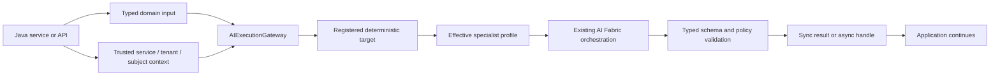

# Visual 03 — Application-Called Intelligence

## Document purpose

This standalone brief describes how a Java application service or API should invoke AI Fabric as a
typed application capability without creating a chat, user message, or artificial conversation.
It is written as an analysis target for a coding assistant familiar with AI Fabric.

## Status and maturity

| Capability | Status |
| --- | --- |
| Existing orchestrator, Mode, RAG, READ actions, policy context | **CURRENT** |
| Specialist definition, gateway, typed source-neutral request/result | **PROPOSED — P1** |
| Explicit fixed plans for repeatable multi-step application calls | **PROPOSED — P2** |
| Durable asynchronous application work | **PROPOSED — P3** |
| Broad external API product or automatic model-based routing | **LATER** |

The first release should prove an in-process Java service call with an ephemeral synchronous
execution. Asynchronous handles may use in-memory completion initially and durable storage only
when the service contract crosses a process or time boundary.

## Executive purpose

Let a Spring Boot service call approved specialist intelligence in the same way it calls another
application capability: with typed input, trusted service context, predictable errors, and a typed
result.

The application does not need to invent a user message or store a fake conversation. It can request
classification, recommendation, enrichment, extraction, or evidence-linked analysis directly while
retaining control of how the result affects its workflow.

## Business problem

When AI integration is chat-first, non-chat use cases usually create awkward workarounds:

- an application service serializes domain input into a synthetic message;
- a fake conversation or fake human identity is created to satisfy an API shape;
- typed domain input becomes unvalidated prompt text;
- model prose must be parsed again by the caller;
- request authority and service identity are confused with end-user identity;
- application code bypasses normal orchestration to get a synchronous answer;
- every team builds its own provider, prompt, retrieval, and policy adapter;
- asynchronous work has no common status, cancellation, or result contract.

Application-called intelligence removes those workarounds and turns AI Fabric into reusable Java
enablement rather than a chat subsystem.

## Products and use cases opened

| Use case | Example typed input | Example typed result |
| --- | --- | --- |
| Classification API | Ticket, document, transaction reference | Category, confidence, evidence |
| Recommendation service | Account state, candidate options | Ranked recommendation and rationale |
| Enrichment pipeline | Product/customer reference | Approved structured attributes |
| Risk signal | Payment/account snapshot reference | Risk band, factors, warnings |
| Smart form | Partial form and policy reference | Missing fields, validation guidance |
| Domain extraction | Document reference and schema | Validated extracted domain object |
| Service decision support | Case/request reference | Decision package, not an executed decision |

The caller may use the typed result to continue a normal service flow, save a recommendation,
create a review task, or present information. A result does not automatically authorize a side
effect.

## Scope

- in-process Java/application invocation;
- typed input and output;
- trusted service/system initiator and optional real subject;
- explicit or registered deterministic specialist/plan mapping;
- no conversation and no dialogue owner by default;
- existing AI Fabric orchestration and policies;
- synchronous result and asynchronous handle semantics;
- explicit result, warning, denial, budget, cancellation, and failure states;
- optional governed action proposal, never implicit execution.

## Non-goals

- no synthetic user, message, conversation, or chat session;
- no public generic “send prompt” API;
- no caller-supplied specialist prompt, action list, evidence scope, Mode override, or model profile;
- no direct model/provider invocation outside the existing orchestration;
- no assumption that service authentication equals subject data authorization;
- no plan or specialist capability grant;
- no mandatory durable store for a bounded synchronous call;
- no UI or API gateway product design.

## Actors and trust boundaries

| Actor/component | Responsibility | Boundary |
| --- | --- | --- |
| Calling application service | Constructs typed domain request | Trusted code, but input still validated |
| Trusted context factory | Represents service initiator, subject, tenant, and current authority | Application-owned |
| `AIExecutionGateway` | Validates request and resolves approved target | Canonical framework edge |
| Target mapping | Maps endpoint/service/selection key to approved specialist or plan | Server-owned |
| Specialist | Declares one bounded goal and typed contract | Cannot authorize itself |
| Existing orchestration | Produces grounded typed intelligence or proposal | Reused |
| Type/schema validator | Validates model output and evidence/proposal structure | Fail closed |
| Calling service | Decides how a valid result participates in application logic | Application-owned |
| Registered action handler | Performs any later business operation | Separate governed boundary |

Identity should distinguish:

- **initiator** — the authenticated service or application principal starting the call;
- **subject** — the person/account/resource whose data is being considered, when applicable;
- **tenant** — the isolation boundary;
- **authority context** — a trusted reference to current policy inputs.

No human identity is invented when the true initiator is a service.

## Start-to-result reference flow

### Flow in prose

1. A Java service receives a normal application request or reaches a point where specialist
   intelligence is useful.
2. It creates a domain-specific input object containing safe values and domain references, not a
   free-form agent definition.
3. The application builds a trusted context reference representing the service initiator, tenant,
   optional subject, authority, and correlation.
4. It submits `ExecutionSource.APPLICATION_CALL` to `AIExecutionGateway`, naming an approved
   specialist/plan or a registered deterministic selection key.
5. The gateway resolves and authorizes the target, creates an implicit one-step execution when
   needed, and sets no conversation or dialogue owner.
6. Effective evidence and action capabilities are resolved and pinned.
7. The specialist executes through the existing orchestration over approved application context,
   retrieval, and READ actions.
8. Model output is validated against the specialist's declared output type/schema and packaged
   with evidence, warnings, proposals, finish reason, and usage.
9. For a synchronous call, the service receives the result directly. For an asynchronous call, it
   receives a handle and obtains the terminal result through status/result or an application-owned
   completion adapter.
10. The service decides how the result affects its domain flow. Any WRITE effect follows the
    separate governed action lifecycle.

### Mermaid flow



## Architecture and component responsibilities

### Application-call adapter

- Exposes an idiomatic Java facade and optionally Spring integration.
- Converts domain-specific application input to the specialist's typed input contract.
- Builds trusted context through an application-owned factory.
- Does not convert the request into chat text or create session state.
- May define a stable registered selection key for the calling endpoint/service.

### Gateway

- Requires source `APPLICATION_CALL`.
- Rejects a conversation reference unless a specific trusted application policy deliberately
  supports a real pre-existing conversation.
- Resolves exactly one approved target.
- Creates an implicit one-step plan for a direct specialist.
- Returns a handle with stable status/result semantics even when the work completes synchronously.

### Specialist and capability resolution

- `SpecialistDefinition` owns the domain goal, instructions, typed I/O, evidence/actions, behavior,
  human-control profile, and limits.
- Referenced Mode continues to supply its current reusable orchestration behavior/restrictions.
- Registered capabilities and current application authority narrow the declaration.
- Application-call source policy may narrow capabilities further than interactive use.

### Existing orchestration

- Receives typed input plus the resolved specialist profile and trusted context.
- Performs intent, retrieval, bounded READ planning, RAG, and optional proposal generation.
- Does not require a conversation or dialogue owner.
- Produces structured output rather than assuming the caller wants a rendered answer.

### Result boundary

- Validate the declared Java type or JSON schema.
- Include evidence references, proposed actions, warnings, finish reason, and usage.
- Distinguish domain-level negative result from infrastructure failure.
- Distinguish a proposal from an application receipt.
- Make sync and async terminal result semantics equivalent.

## CURRENT framework foundations to reuse

- `RAGOrchestrator` and `DefaultOrchestrationPipeline`;
- Mode configuration and current policy resolution;
- `OrchestrationContext` and application-supplied identity/tenant/access inputs;
- retrieval, RAG, evidence references, and vector restrictions;
- `ReadActionResolutionService` for bounded approved READ-action planning;
- `AIActionRegistry` and application-owned action handlers;
- privacy and PII controls;
- Spring AI LLM integration where appropriate;
- richer existing AI Fabric RAG/vector-provider contracts;
- live-sync evidence maintained from application-owned data.

The analysis should first identify whether any current public orchestrator method already supports
non-chat calls and can be adapted behind the gateway.

Current-main inspection identifies one concrete gap: `OrchestrationContext` currently requires
either `userId` or `sessionId`, even though it also carries position, Mode, attachments, transient
inputs, and resolved policy. An application/service invocation must introduce a legitimate
execution/service identity and trusted execution envelope. It must not generate a fake user or
session merely to pass the current constructor invariant.

The existing inner flow remains a strong reuse point:

- `RAGOrchestrator` is a thin, thread-safe facade over the existing pipeline.
- `DefaultOrchestrationPipeline` runs ordered steps, supports skip and early termination, captures
  failures, and records timing.
- `OrchestrationPolicyResolutionStep` resolves server-authoritative Mode configuration first.
- `IntentHandlingStep` already enforces action enablement, anonymous rules, permissions, trusted
  context parameters, argument completeness/executability, drafts, confirmation, handler
  invocation, and post-action generation.

The new application-call boundary should adapt trusted source identity into this path, not create a
parallel intelligence implementation.

## PROPOSED framework changes

### Public contracts

- Add `ExecutionSource.APPLICATION_CALL`.
- Add typed `ExecutionRequest<I>` and `AIExecutionResult<O>`.
- Add `ExecutionHandle`, status, result, cancellation, and typed failure contracts.
- Add `SpecialistDefinition<I,O>` and registry.
- Add `TrustedExecutionContextRef` rather than copying mutable security objects into execution
  state.
- Add a first-class `ExecutionPrincipal` or equivalent service/system initiator representation and
  an adapter into the current orchestration context. Explicitly remove the need for a fabricated
  `userId` or `sessionId`.
- Add type/schema registry contracts and safe evidence/proposal result envelopes.
- Optionally add a small application-call convenience facade over `AIExecutionGateway`.

### Coordination and execution

- Use an implicit one-step plan for direct calls.
- Set interaction policy to `NONE`: no conversation and no dialogue owner.
- Reuse the same `AIExecutionCoordinator` and existing orchestrator as interactive work.
- Provide a direct completion path for synchronous calls and stable handle semantics for
  asynchronous calls.
- Enforce deadline, cancellation, model/action-call count, token, and cost budgets.
- Ensure late provider results cannot overwrite a cancelled or timed-out terminal state.

### Registration and configuration

- Register specialist definitions, type contracts, prompt profiles, and service/endpoint selection
  keys.
- Validate every referenced Mode, action, evidence source, schema, policy, and limit at startup.
- Allow application code to bind a service method to an approved target without accepting a target
  from an untrusted request.
- Preserve Mode-only integrations.

### Security, policy, and context

- Represent service/system initiator explicitly.
- Represent subject separately and only when real.
- Apply tenant, resource, privacy, evidence, and action policy to the current call.
- Reject arbitrary context claims from typed business input.
- Use effective capability sets before prompt exposure and again before action invocation.
- Add source-specific policy so application calls cannot use capabilities merely because an
  interactive specialist declares them.
- Preserve server-authoritative Mode resolution and all current `IntentHandlingStep` permission,
  argument, confirmation, and handler checks.

### State and durability

- Keep bounded synchronous executions ephemeral.
- Store only execution identity and completion state needed for an asynchronous in-process handle.
- Add durable execution-state SPI in P3 for work that survives restart, waits for review, or crosses
  a process/time boundary.
- Define duplicate request/idempotency behavior at the application adapter and execution levels.
- Keep domain objects/evidence behind references rather than serializing them into execution state.

### Actions and review

- Return action proposals explicitly; do not automatically execute because the source is a trusted
  service.
- Apply the specialist human-control profile and application policy.
- Execute approved writes only through `GovernedActionExecutionService` and registered handlers.
- Require an authoritative receipt before reporting a committed application operation.
- Add durable review only when the application-call workflow can wait across request boundaries.

### Observability and evaluation

- Correlate caller/service, execution, invocation, target mapping, specialist, Mode, schema, and
  evidence references.
- Measure type-valid result rate, evidence sufficiency, latency, timeouts, cancellation, token/cost,
  denial correctness, and downstream acceptance/use of recommendations.
- Distinguish model/provider failure, evidence failure, policy denial, schema failure, and
  application-handler outcome.
- Sanitize service input and evidence; do not log full domain objects by default.

### Tests

- No-conversation test: an application call completes without chat/session creation.
- No-fake-user test: service initiator and optional subject remain distinct.
- Type-contract tests for input and output.
- Registered-target-only tests, including conflicting hints.
- Effective-capability tests for application-call source restrictions.
- Sync/async semantic parity tests.
- Cancellation/deadline and late-result tests.
- Duplicate/idempotency tests.
- Malformed output, unavailable evidence, policy denial, and provider failure tests.
- Legacy direct-orchestrator compatibility tests during migration.

## PROPOSED conceptual Java and configuration

```java
// PROPOSED: idiomatic in-process Java use, no chat artifacts.
AccountResolutionRequest input =
    new AccountResolutionRequest(customerRef, transactionRef, resolutionQuestion);

ExecutionRequest<AccountResolutionRequest> request = new ExecutionRequest<>(
    ExecutionSource.APPLICATION_CALL,
    Optional.of("account-resolver@1"),
    Optional.empty(),
    Optional.empty(),
    Optional.empty(), // no conversation
    input,
    trustedServiceContextRef
);

ExecutionHandle handle = aiExecutionGateway.submit(request);
AIExecutionResult<AccountResolutionResult> result =
    (AIExecutionResult<AccountResolutionResult>)
        aiExecutionGateway.result(handle.executionId()).orElseThrow();
```

```java
// PROPOSED: optional convenience adapter; it delegates to the canonical gateway.
public interface SpecialistClient<I, O> {
    O execute(I input, TrustedExecutionContextRef context);
    ExecutionHandle submit(I input, TrustedExecutionContextRef context);
}
```

```yaml
# PROPOSED: application-owned deterministic binding.
ai:
  execution:
    mappings:
      account-resolution-service:
        source: APPLICATION_CALL
        specialist-ref: account-resolver@1
        allowed-initiator-types: [SERVICE]
        conversation-policy: FORBIDDEN
```

`SpecialistClient` is a convenience, not a second execution path. It must delegate to
`AIExecutionGateway`.

## Delivery phases and dependencies

### P0

- Trace current non-chat orchestration calls and current context construction.
- Define source identity semantics and typed-result migration.
- Add legacy regression and capability-enforcement tests.

### P1

- Add specialist/registry, gateway, application-call source, implicit one-step execution,
  effective profile, typed result, and an in-process sync adapter.
- Prove the application-called path in the separate `agentic-ai-action-resolver` app without any
  chat/session artifacts; keep the current Account Resolver unchanged as the interactive baseline.
- Add asynchronous handle semantics without mandatory durable storage.

### P2

- Permit a registered fixed plan when a single specialist is insufficient.
- Keep no dialogue owner and preserve typed step boundaries.

### P3

- Add durable application work, restart-safe status/result, and human review only for workflows
  that actually cross request/process/time boundaries.

## Acceptance criteria

1. A Java service invokes AI Fabric without a message, conversation, chat session, or fake user.
2. The request contains typed input and trusted service context.
3. The target is explicit and trusted or resolved from a registered deterministic mapping.
4. The execution has no dialogue owner.
5. The selected specialist and effective profile are versioned/pinned.
6. Existing orchestration performs all intelligence work.
7. Model output is validated against the declared result type/schema.
8. Synchronous and asynchronous paths expose the same terminal result semantics.
9. Service initiator, optional subject, and tenant are represented independently.
10. A specialist declaration, plan, or trusted service identity does not grant action authority.
11. A WRITE remains a proposal until separately governed and receipt-backed.
12. A bounded synchronous call needs no durable execution store.
13. Cancellation/deadline prevents late completion from mutating terminal state.
14. Mode-only or existing direct calls remain compatible during migration.
15. Observability distinguishes policy, evidence, schema, provider, and domain-operation outcomes.

## Failure modes and edge cases

- **Caller supplies both specialist and plan:** reject as ambiguous.
- **No target mapping:** fail before invoking a model.
- **Application input contains claimed identity/tenant:** ignore/reject it; use trusted context.
- **Subject is absent:** allow only specialists/policies that do not require one.
- **Conversation reference supplied:** reject by default for this source.
- **Typed input version mismatch:** fail with a contract error and safe compatibility details.
- **Output cannot be validated:** retry only within specialist policy or return a typed failure.
- **Evidence is stale/unavailable:** preserve the limitation in finish reason/warnings; do not
  fabricate a recommendation.
- **Caller times out while provider continues:** cancel or quarantine the late result according to
  the execution state.
- **Duplicate asynchronous submission:** require a stable application idempotency/correlation
  strategy.
- **Proposal returned where caller expects a committed change:** make result types impossible to
  confuse and require the governed action path.
- **Large batch sent through single call:** reject or route to a batch adapter rather than inflating
  one execution envelope.

## Questions for the coding assistant

1. What current in-process Java entry points exist besides chat, and what assumptions do they make
   about conversation/session/user state?
2. Can `OrchestrationContext` represent a service initiator and separate subject today? What
   additions or adapters are required?
3. Which current orchestration result classes can back the typed result envelope?
4. What is the cleanest generic type/schema resolution strategy within the existing module graph?
5. Where should a convenience `SpecialistClient<I,O>` live so it cannot bypass the gateway?
6. How should sync completion, async handles, cancellation, and provider callbacks share one state
   model?
7. Which endpoint/service mapping mechanism best fits current Spring configuration conventions?
8. What source-specific security checks are absent from the current chat-centric path?
9. Which one reference service can prove no-chat invocation with measurable business value?
10. Produce an incremental change map and compatibility plan before implementation.

## Related references

- Visual: `../ai-fabric-flow-visuals/03-application-called-intelligence.svg`
- Presentation image: `../ai-fabric-flow-visuals/03-application-called-intelligence.png`
- Proposal: `../Full-Proposal/Product-evolution-proposal.md`
- Most relevant proposal sections: §§1–7; §8.6; §11; §12; §13 Stages A/B; §14 P1–P3; §15.
