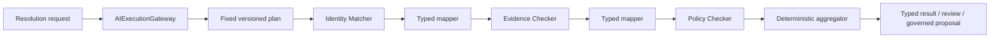

# Visual 04 — Fixed Multi-Specialist Plan

## Document purpose

This standalone brief converts the fixed multi-specialist visual into an architecture and
business-case analysis target. It describes how repeatable expert work can be decomposed into
independently bounded specialist steps without creating an open-ended agent network or granting
privilege through composition.

## Status and maturity

| Capability | Status |
| --- | --- |
| One existing bounded orchestration flow and current Account Resolver | **CURRENT foundation** |
| Specialist-defined single-agent path and canonical gateway | **PROPOSED — P1 dependency** |
| Immutable fixed sequential plans, typed mappings, deterministic aggregation | **PROPOSED — P2** |
| Durable human review and machine-trigger continuation | **PROPOSED — P3** |
| Supervisor-directed and parallel plans | **LATER — P4/P5**, outside first plan release |

The first plan release supports acyclic fixed sequential specialist steps, deterministic decisions,
and deterministic aggregation. It must prove value against the simpler single-specialist baseline.

## Executive purpose

Turn a stable, repeatable business process into a traceable sequence of focused specialist
invocations with typed boundaries, version pins, independent policy enforcement, explicit budgets,
and deterministic aggregation.

The plan exists when decomposition materially improves quality, reuse, evaluation, or auditability.
It does not exist merely to label pipeline stages as agents. Each specialist must own an independent
goal, bounded context, typed output, and invocation lifecycle.

The central rule is:

> The plan orders work and maps types; it grants no specialist, evidence, action, identity, tenant,
> or application authority.

## Business problem

A single oversized prompt often combines identity matching, evidence verification, policy analysis,
recommendation, and action proposal. That makes it difficult to:

- test each responsibility independently;
- restrict each responsibility to only the evidence and actions it needs;
- reuse a focused capability in another product;
- identify which stage caused an unsupported conclusion;
- version or improve one part without changing the whole flow;
- apply different budgets and review policies;
- preserve typed evidence and disagreement;
- compare results with a deterministic business baseline.

An unrestricted agent network is not the answer. It introduces dynamic routing, privilege unions,
unbounded loops, and hard-to-reproduce outcomes. A fixed plan captures known business order while
using the same bounded specialist mechanism at each step.

## Products and use cases opened

- account resolution: identity match → evidence check → policy check → deterministic result;
- claims assessment: claim extraction → coverage evidence → fraud indicators → review package;
- onboarding: document validation → identity checks → policy readiness → exception list;
- underwriting preparation: applicant evidence → risk factors → policy constraints → analyst pack;
- compliance checks: scope determination → evidence collection → rule evaluation → finding;
- support resolution: case classification → account evidence → approved remedy options;
- complex document processing: extraction → verification → policy mapping → structured result.

The typical product outcome is an evidence-linked typed result, human-review task, or governed
proposal—not a collection of independent chat messages.

## Scope

- immutable, versioned fixed plans;
- acyclic sequential specialist steps;
- registered typed input/output mappings;
- independent specialist authorization and context projection;
- per-step and aggregate budgets;
- deterministic decisions and aggregation;
- explicit success/failure/wait transitions;
- one optional dialogue owner for an interactive invocation of the plan;
- no dialogue owner for application/event invocation;
- one existing orchestrator call per specialist step.

## Non-goals

- no arbitrary graph language;
- no model-generated plan definition;
- no dynamic insertion of unregistered specialists;
- no capability inheritance or union across steps;
- no shared conversation among worker specialists;
- no parallel execution in the first release;
- no supervisor model in the deterministic flow;
- no specialist-to-specialist free-form messaging;
- no business side-effect implementation in the coordinator;
- no mandatory persistence when the complete plan is bounded and synchronous;
- no UI workflow designer.

## Actors and trust boundaries

| Actor/component | Responsibility | Boundary |
| --- | --- | --- |
| Trusted source | Supplies typed plan input and current context | User, service, or event is represented truthfully |
| `AIExecutionGateway` | Resolves the registered plan | Canonical ingress |
| `ExecutionPlanRegistry` | Stores immutable versioned blueprints | Application-approved definitions only |
| `AIExecutionCoordinator` | Validates readiness, mappings, transitions, budgets, and aggregate | Deterministic authority over order only |
| Specialist registry | Resolves pinned specialist definitions | Definitions request capabilities |
| Effective-capability resolver | Authorizes each invocation independently | No sibling/parent privilege union |
| Existing orchestrator | Executes each specialist goal | Reused per step |
| Registered mappers/aggregator | Transform typed outputs and produce final typed result | Deterministic, server-owned code |
| Dialogue owner | Communicates externally if the plan is interactive | Exactly one; workers remain internal |
| Application action handler | Performs any approved final operation | Application-owned business authority |

An aggregator may combine typed results and evidence. It cannot authorize a new action or convert a
proposal into a committed result.

## Start-to-result reference flow

### Flow in prose

1. A user, application call, or trusted event submits a typed account-resolution request through
   `AIExecutionGateway`.
2. The gateway resolves a registered `AccountResolutionPlan` version.
3. AI Fabric pins the plan, specialist, prompt, schema, Mode IDs, and effective-profile hashes.
4. The coordinator validates the plan input and starts the entry step.
5. An Identity Matcher receives only its typed input and approved context, runs through the
   existing orchestrator, and returns `IdentityMatchResult`.
6. A registered mapper transforms that result plus permitted original input into the
   `EvidenceCheckRequest` for the next step.
7. The Evidence Checker is independently authorized, receives its own context projection, and
   returns `EvidenceCheckResult`.
8. A second mapper creates `PolicyCheckRequest`; the Policy Checker returns
   `PolicyCheckResult`.
9. A registered deterministic aggregator validates all required outputs, preserves evidence and
   disagreement, and returns `AccountResolutionResult`, a review requirement, or a governed action
   proposal.
10. If the plan is interactive, one declared dialogue owner returns one validated response. If the
    source is an application/event, there is no conversation or owner.

### Mermaid flow



Every specialist box above means:

```text
independently resolved specialist profile
  → approved typed input and projected context
  → existing RAGOrchestrator
  → validated typed output
```

It does not mean that output from one specialist automatically exposes its full context to the
next.

## Architecture and component responsibilities

### `ExecutionPlanDefinition`

- Stable ID and immutable version.
- Typed plan input and output contracts.
- Entry and terminal steps.
- Fixed specialist, deterministic decision, and aggregate steps.
- Explicit allowed transitions.
- Registered mapper references.
- Interaction policy.
- Per-plan maximum budget and failure policy.
- No prompt, action implementation, evidence content, or authority duplication.

### Resolved plan

- Pins plan, specialist, prompt-profile, and schema versions.
- Records referenced Mode IDs and effective-profile hashes.
- Validates every step against current application policy before execution.
- Allocates budgets no greater than specialist and application ceilings.
- Records typed mapper and aggregator versions.

### Deterministic coordinator

- Validates ready steps and typed mappings.
- Creates one `SpecialistInvocation` per specialist step.
- Calls the existing orchestrator for each step.
- Advances only through declared transitions.
- Manages waiting, cancellation, deadline, budget, partial state, and aggregation.
- Does not select arbitrary specialists, execute application services, or alter specialist scope.

### Step isolation

- Each specialist is independently authorized.
- Each receives only its declared typed input and policy-projected evidence/context.
- An output mapping selects explicit fields; it does not forward the preceding prompt, transcript,
  or full evidence set.
- Siblings/predecessors do not grant a union of capabilities.
- For an interactive plan, workers may receive projected read-only conversation views but cannot
  write externally.

### Deterministic aggregation

- Validates all required step outputs.
- Preserves evidence references and warnings by source invocation.
- Handles disagreement through declared business rules.
- Produces one plan output type.
- May return `REVIEW_REQUIRED`, but may not choose an unregistered reviewer/channel.
- Never treats a WRITE proposal as executed.

## CURRENT framework foundations to reuse

- current Account Resolver as the unchanged behavioral baseline;
- separately deployable `agentic-ai-action-resolver` as the new plan reference proof;
- `RAGOrchestrator` and the existing bounded orchestration pipeline;
- Mode as reusable behavior/restriction preset;
- `ReadActionResolutionService` inside a specialist step;
- retrieval, RAG, live evidence, and vector-space policy;
- `OrchestrationContext` and application-supplied authority;
- `AIActionRegistry`, application-owned handlers, action drafts, and confirmation;
- chat-session continuity for genuinely interactive use;
- privacy and tenant isolation.

The plan must call the current orchestrator once per specialist step. It must not create a separate
multi-agent model loop.

Current-main inspection confirms the inner step boundary:

- `RAGOrchestrator` is a thin, thread-safe facade over `DefaultOrchestrationPipeline`.
- The pipeline uses ordered `PipelineStep` beans, skip/early termination, error handling, and
  step/total timings.
- `OrchestrationPolicyResolutionStep` resolves a server-authoritative Mode before later steps.
- `IntentHandlingStep` already owns the current checks and lifecycle for action enablement,
  permissions, parameters, drafts, conversation-bound confirmation, `PendingActionStore`,
  application-handler invocation, and post-action generation.
- Current Account Resolver configuration already uses one `resolver` Mode with a RAG vector
  allowlist and iterative, allowlisted `get_account_profile` READ planning, bounded to two
  iterations and one parallel action.

Therefore the first proof must copy the current one-specialist behavior into
`agentic-ai-action-resolver` and run that new app through an implicit one-step plan. The original
Account Resolver remains unchanged for comparison. Identity Matcher, Evidence Checker, and Policy
Checker are optional decomposition candidates, not claims about either existing implementation and
not replacements for ordinary pipeline stages.

## PROPOSED framework changes

### Public contracts

- `ExecutionPlanDefinition<I,O>`, `PlanStrategy.FIXED`, `PlanStep`, and `PlanTransition`.
- Initial step types: `SpecialistStep`, `DeterministicDecisionStep`, and `AggregateStep`.
- `InteractionPolicy` and `DialogueOwnerStrategy`.
- Versioned `TypeContract`, mapper, and aggregator references.
- `ResolvedExecutionPlan` with pinned versions/profile hashes.
- `AIExecution`, per-step status, `SpecialistInvocation`, and typed plan result.
- Typed finish/failure/wait reasons.
- Reserve later step types in documentation only unless implementing them is required.

### Coordination and execution

- Add deterministic `AIExecutionCoordinator`.
- Generate an implicit one-step plan for direct specialist compatibility.
- Validate directed acyclic structure, entry/terminal steps, mappings, transitions, and budget at
  registration.
- Execute fixed sequential steps in P2.
- Route each specialist step through the existing orchestrator.
- Preserve `OrchestrationPolicyResolutionStep` and current Mode resolution within every specialist
  invocation.
- Implement deterministic decisions/aggregation as registered Java components, not model prompts.
- Add cancellation and deadline propagation.
- Reject undeclared transitions and late/duplicate step completions.

### Registration and configuration

- Add plan registry with immutable version keys.
- Register specialists, mappers, aggregators, type contracts, and prompt profiles independently.
- Validate that every referenced specialist/version exists and every adjacent type mapping is
  compatible.
- Validate one eligible dialogue owner for interactive plans.
- Reject cycles, missing terminal paths, unbounded budgets, unknown references, and Mode/specialist
  incompatibilities at startup.
- Keep Mode unchanged and independently reusable by several specialists.

### Security, policy, and context

- Authorize the plan target and each specialist independently.
- Resolve a separate effective capability profile for every invocation.
- Project only approved original input, predecessor output fields, and context/evidence.
- Never union parent, predecessor, or sibling action/evidence sets.
- Reauthorize after any wait and before a governed WRITE.
- Pin all versions/profile hashes to continuation and action state.
- Treat dialogue ownership as a communication role, not a capability grant.

### State and durability

- Allow an entirely synchronous fixed plan to remain in memory.
- Store plan progress, typed output references, waits, budget, and aggregate state in
  `AIExecution`; never in the conversation transcript.
- Add durable state in P3 if the plan crosses process/time/actor boundaries.
- Make step start/completion, mapper application, aggregate, and resume idempotent.
- Preserve terminal step results and evidence provenance for audit/evaluation.

### Actions and review

- Specialists may produce declared WRITE proposals only.
- A plan transition may route a proposal to confirmation/review or action handling but cannot grant
  authority.
- Invoke approved actions through one `GovernedActionExecutionService`.
- Use application-issued receipts and outcome finalization.
- Add `HumanReviewStep` only when durable review support exists; do not simulate it with a
  conversation message.
- Preserve `NeedsUserInput` as a separate typed wait in P2.

### Observability and evaluation

- Trace plan/version, step, invocation, specialist/version, Mode, mapper, aggregator, profile hash,
  evidence, budget, and transition.
- Record accepted/rejected transitions and type-mapping errors.
- Measure per-step and end-to-end quality, evidence sufficiency, latency, cost, disagreement,
  failure, review rate, and aggregate correctness.
- Compare the plan against the single-specialist Account Resolver baseline.
- Make it possible to identify which step introduced an unsupported conclusion.

### Tests

- Plan-registration graph and type validation.
- Immutable/version-pinning tests.
- Independent effective-capability tests for every step.
- No privilege-union tests.
- Mapper allowlist/projection tests.
- Undeclared-transition and cycle rejection tests.
- Aggregate evidence/disagreement tests.
- Budget/deadline/cancellation tests.
- Duplicate/late step completion tests.
- Interactive exactly-one-owner and non-interactive no-owner tests.
- Legacy implicit one-step compatibility tests.
- Evaluation comparison against the current Account Resolver.

## PROPOSED conceptual Java and configuration

```java
// PROPOSED: composition only; it grants no authority.
public record ExecutionPlanDefinition<I, O>(
    String id,
    String version,
    TypeContract<I> inputContract,
    TypeContract<O> outputContract,
    String entryStepId,
    Map<String, PlanStep> steps,
    Set<PlanTransition> allowedTransitions,
    InteractionPolicy interactionPolicy,
    Optional<String> aggregatorRef,
    ExecutionBudget maximumBudget,
    FailurePolicy failurePolicy
) {}
```

```java
// PROPOSED: registered deterministic mapping, not free-form specialist messaging.
public interface StepInputMapper<FROM, TO> {
    TO map(FROM predecessorResult, PlanInputView approvedOriginalInput);
}

public interface PlanAggregator<O> {
    O aggregate(List<ValidatedStepResult<?>> results);
}
```

```yaml
# PROPOSED: illustrative Account Resolver fixed plan.
ai:
  execution-plans:
    account-resolution:
      version: "1"
      input-contract: AccountResolutionRequest
      output-contract: AccountResolutionResult
      strategy: FIXED
      interaction:
        dialogue-owner-strategy: ROOT_SPECIALIST
        dialogue-owner-specialist-ref: identity-matcher@1
      maximum-budget:
        timeout: 20s
        model-calls: 6
        action-calls: 8
      steps:
        identity:
          specialist-ref: identity-matcher@1
        evidence:
          specialist-ref: evidence-checker@1
          input-mapper-ref: identity-to-evidence@1
        policy:
          specialist-ref: policy-checker@1
          input-mapper-ref: evidence-to-policy@1
        aggregate:
          aggregator-ref: account-resolution-aggregate@1
      transitions:
        - identity -> evidence
        - evidence -> policy
        - policy -> aggregate
```

If evidence does not prove that three specialists outperform one Account Resolver, the production
plan should remain an implicit one-step plan. Architectural ability is not a reason to add
operational complexity.

## Delivery phases and dependencies

### P0 / P1 dependencies

- Preserve Mode-only behavior.
- Implement `SpecialistDefinition`, effective-capability resolution, typed results, gateway, and
  single-specialist invocation first.
- Establish a measured baseline from the current Account Resolver and reproduce it in the
  single-specialist `agentic-ai-action-resolver`.

### P2 first release

- Add plan/registry, implicit one-step compatibility, coordinator, fixed sequential specialist
  steps, deterministic decision/aggregate, typed mappers, version pins, budgets, and interaction
  policy.
- Prove one-step Account Resolver through the plan abstraction in
  `agentic-ai-action-resolver` before decomposition.
- Add identity/evidence/policy specialists only when evaluation shows improvement.

### P3

- Add durable waits, proactive source, human review, and action receipt finalization for the
  Account Resolution Queue.

### LATER

- Add supervisor-directed decisions or parallel groups only after sequential isolation,
  cancellation, durability, and evaluation gates are met.

## Acceptance criteria

1. The plan is immutable and versioned.
2. The coordinator accepts only registered, type-compatible, acyclic fixed steps.
3. Every specialist is independently registered, authorized, and profile-resolved.
4. A predecessor or plan cannot grant a capability to a later specialist.
5. Mappers forward only declared typed fields and approved references.
6. Every specialist step reuses the existing orchestrator.
7. The plan pins specialist, prompt, schema, mapper/aggregator, Mode, and profile information needed
   for reproducibility.
8. Aggregate and per-step budgets are enforced using the lowest applicable limit.
9. The aggregator preserves evidence and disagreement and returns one typed result.
10. An interactive plan has exactly one eligible dialogue owner; workers do not write externally.
11. A non-interactive plan has no conversation or dialogue owner.
12. A WRITE remains a proposal until the governed action lifecycle produces a receipt.
13. A synchronous no-wait plan can remain storage-optional.
14. Duplicate/late completions cannot advance a step twice.
15. The decomposed Account Resolver meets or exceeds explicit quality/audit/latency/cost criteria
    relative to the single-specialist baseline.

## Failure modes and edge cases

- **Cycle in configuration:** reject registration.
- **Missing or ambiguous terminal step:** reject registration.
- **Type mismatch:** reject registration when static; otherwise fail the transition visibly.
- **Unregistered specialist/version:** reject plan resolution.
- **Specialist loses authority before start:** deny that step and follow declared failure policy.
- **Predecessor emits extra sensitive fields:** mapper exposes only declared fields.
- **One step returns `NeedsUserInput`:** wait only that branch, route through the owner/application
  channel, and resume from the pinned state.
- **One step proposes a write:** collect/govern the proposal; do not execute inside the coordinator.
- **Budget consumed early:** stop with explicit budget outcome; do not borrow undeclared budget.
- **Model output invalid:** retry within step policy or fail/wait/review according to declared
  transition.
- **Aggregator sees disagreement:** preserve it and apply registered policy; never ask a model to
  hide it unless a separately defined specialist owns synthesis.
- **Definition changes during execution:** continue against pinned versions and reauthorize current
  policy.
- **Duplicate callback after timeout:** ignore or record safely; do not reopen terminal execution.
- **Single specialist is better:** retain the implicit one-step plan and do not force decomposition.

## Questions for the coding assistant

1. What existing classes can represent a plan, step state, and result without duplicating the
   orchestration pipeline?
2. Where should the coordinator live so it can invoke `RAGOrchestrator` without creating module
   cycles?
3. How should Java generic types and persisted schema/version identifiers coexist?
4. Which current Account Resolver responsibilities are genuinely independent specialist goals,
   and which are ordinary deterministic pipeline/service stages?
5. What baseline evaluation proves whether identity/evidence/policy decomposition adds value?
6. How should mapper and aggregator registries fit current Spring bean discovery conventions?
7. What state is required for synchronous P2 and what can wait for P3 durability?
8. How will exactly-one dialogue ownership be enforced when an explicit plan is invoked
   interactively?
9. Which action/pending-state objects need plan/step/version/profile bindings?
10. Produce an incremental pull-request sequence beginning with implicit one-step compatibility;
    do not implement a graph DSL or parallel path in this phase.

## Related references

- Visual: `../ai-fabric-flow-visuals/04-fixed-multi-specialist-plan.svg`
- Presentation image: `../ai-fabric-flow-visuals/04-fixed-multi-specialist-plan.png`
- Proposal: `../Full-Proposal/Product-evolution-proposal.md`
- Most relevant proposal sections: §§5.2–5.5; §§7–9; §13 Stages A/B; §14 P1/P2; §15.
