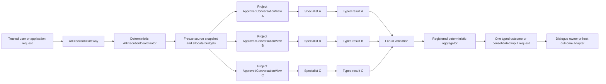

# Flow 05 — Parallel Specialist Analysis

**Document purpose:** Architecture and business-case brief for implementation analysis
**Maturity:** `PROPOSED — P5`
**Prerequisites:** P0 effective-capability enforcement, P1 specialist execution, P2 fixed
sequential plans, and P3 durable branch state where work can outlive one process
**Delivery position:** Add only after sequential composition, context isolation, cancellation, and
deterministic aggregation are proven
**UI scope:** None

## 1. Executive Purpose

Parallel specialist analysis lets AI Fabric run several independent expert checks at the same time,
then combine their typed findings into one governed outcome.

The business value is lower decision latency when independent checks would otherwise run one after
another. The architecture must not obtain that speed by sharing conversation state, combining
privileges, or allowing competing write operations.

This is **fan-out/fan-in over isolated specialist invocations**. It is not an agent group chat.

## 2. Business Problem

Many application decisions need several distinct assessments:

- fraud, policy, and affordability checks for one account case;
- security, privacy, and quality checks for one document;
- inventory, suitability, and commercial checks for one product recommendation;
- technical, customer-impact, and compliance analysis for one incident;
- independent extraction or classification checks over a file or batch.

If the checks are independent, sequential execution increases response time without improving
governance. An unconstrained parallel implementation is also unsafe: one branch may see another
branch's data, budgets can multiply unexpectedly, and concurrent action proposals may conflict.

AI Fabric therefore needs bounded parallelism with explicit eligibility, isolation, fan-in policy,
and one final outcome boundary.

## 3. Products And Use Cases Opened

| Product pattern | Example outcome |
| --- | --- |
| Real-time risk assessment | Fraud, affordability, and policy findings merged into one decision packet |
| Compliance review assistant | Independent privacy, retention, and disclosure checks |
| Incident intelligence | Security, service-health, and customer-impact assessments produced together |
| Multi-criteria recommendation | Product-fit, availability, and policy results merged without privilege union |
| Document intelligence | Parallel extraction, validation, and sensitivity checks |
| Account-resolution workbench | Identity, payment, and policy evidence checked with lower latency |

The first reference case should use read-only specialists whose output can be aggregated
deterministically.

## 4. Scope And Non-Goals

### In scope

- explicit parallel groups inside a registered `ExecutionPlanDefinition`;
- immutable shared source snapshot and branch-specific approved context;
- independent, typed specialist inputs and outputs;
- aggregate and per-branch budgets, deadlines, cancellation, and failure evidence;
- safe parallel READ actions when action metadata and application policy permit them;
- proposal-only WRITE handling until after fan-in;
- deterministic aggregation and explicit conflict/failure policy;
- restart-safe fan-out/fan-in when execution is durable;
- exactly one external response or consolidated input request.

### Not in scope

- multiple specialists writing to one conversation;
- unrestricted specialist-to-specialist messaging;
- concurrent application mutations from sibling branches;
- combining the evidence, action, or authority scopes of sibling specialists;
- a general distributed-workflow engine;
- automatic graph generation by an LLM;
- redesigning `Mode`;
- product screens or review inboxes.

## 5. Actors And Trust Boundaries

| Actor/component | Responsibility | Trust boundary |
| --- | --- | --- |
| Host application | Supplies trusted identity, tenant, subject, authority, plan selection, and domain services | Final authority for data and business effects |
| `AIExecutionGateway` | Canonical submission, resume, cancel, status, and result boundary | Accepts only trusted application integration context |
| `AIExecutionCoordinator` | Validates the plan, freezes source state, creates branches, enforces limits, and performs fan-in | Deterministic framework control; never grants capability |
| `SpecialistDefinition` | Canonical definition of one agent and its requested evidence/actions | Declaration only; never authorization |
| `Mode` | Existing reusable orchestration preset and restriction source | Remains compatible and may only narrow execution |
| `ConversationContextProjector` | Produces one immutable `ApprovedConversationView` per branch | Prevents full-transcript and cross-branch leakage |
| Worker specialist | Performs one bounded independent analysis | Sees only its resolved profile, typed input, and approved view |
| Registered action handler | Performs an application-owned operation after governance | Only host code can assert business outcome |
| Aggregator | Combines typed branch results under registered policy | Cannot widen evidence, rewrite receipts, or invent success |
| Dialogue owner/host adapter | Emits one external result or question | Workers never communicate externally |

## 6. Start-To-Result Reference Flow

1. A trusted source submits a request to `AIExecutionGateway`.
2. The gateway resolves a registered plan containing a permitted parallel group.
3. The coordinator authorizes and version-pins the plan and every referenced specialist.
4. For an interactive request, it freezes one conversation snapshot revision. A machine request
   has no conversation and no dialogue owner.
5. It creates a separate typed input and separately projected `ApprovedConversationView` for each
   branch.
6. It allocates branch budgets below the execution ceiling and starts only independent work.
7. Each branch runs through the existing AI Fabric orchestration and returns a typed result,
   failure, cancellation, or `NeedsUserInput`.
8. Parallel READ actions are permitted only when their registered metadata and current application
   policy mark them safe. WRITE actions remain proposals.
9. The coordinator applies the declared fan-in policy, validates every result, and sends the
   validated set to a registered deterministic aggregator.
10. Conflicting WRITE proposals are rejected, clarified, or sent to governance after fan-in.
11. One aggregate result—or one consolidated input request—is returned through the dialogue owner
    or host outcome adapter.



## 7. Architecture And Component Responsibilities

### `ParallelStep`

Declares a bounded group of independently runnable specialist steps. It references registered step
IDs and a fan-in policy. It does not contain prompts, credentials, evidence, or action grants.

### `AIExecutionCoordinator`

- proves all branches are ready and independent;
- derives one immutable source snapshot reference;
- creates distinct invocation state and context projections;
- allocates budgets and enforces concurrency ceilings;
- controls start, timeout, cancellation, retry, and fan-in transitions;
- records branch provenance and partial failure evidence;
- blocks concurrent WRITE execution;
- emits at most one final interactive response.

### `ConversationContextProjector`

Produces separate projections from the same frozen snapshot:

```text
snapshot
∩ specialist evidence/context declaration
∩ current Mode restrictions
∩ tenant, privacy, subject, and authority policy
∩ plan input mapping
= branch ApprovedConversationView
```

The branch with the broadest visibility must not become an accidental data bridge for its siblings.

### Branch executor

Uses the existing `RAGOrchestrator` and orchestration pipeline. Parallel support must wrap the
current specialist path, not create another model, retrieval, or action path.

### Fan-in validator and aggregator

Validates schemas, evidence references, finish reasons, failures, and action proposals. A
registered Java aggregator is the default for business decisions. A read-only synthesis specialist
may explain an already validated aggregate, but cannot change facts, policies, receipts, or
unresolved outcomes.

## 8. `CURRENT` Foundations To Reuse

The proposal baseline already has:

- `RAGOrchestrator` and `DefaultOrchestrationPipeline`;
- Mode-based orchestration and retrieval restrictions; current `ModeOverrides` already exposes
  read-plan limits including iterations, action totals, and a parallel ceiling;
- `OrchestrationPolicyResolutionStep`, which creates server-authoritative policy and applies
  read-plan limits/allowlists before handling;
- `ReadActionResolutionService` for fail-closed bounded planning over policy-eligible READ actions;
- `OrchestrationContext` for identity, tenant, and authority integration;
- action registration, confirmation, and application-owned handlers;
- conversation/session support;
- evidence-grounded RAG and live-data synchronization.

These foundations support a single governed execution path. They do **not** currently prove:

- a versioned parallel-plan contract;
- branch-specific specialist identity and effective capability snapshots;
- immutable, independent conversation projections;
- aggregate budget allocation and cancellation;
- restart-safe fan-out/fan-in;
- deterministic partial-failure and conflict policy.

The current parallel configuration ceiling is therefore a useful restriction to reuse, not
evidence that isolated multi-specialist fan-out/fan-in already exists.

## 9. `PROPOSED` Framework Changes

### 9.1 Public contracts

- add `ParallelStep` to the versioned plan contract;
- add `FanInPolicy` with `ALL_REQUIRED` as the first supported behavior;
- add typed `BranchResult`, `BranchFailure`, and aggregate-result envelopes;
- expose branch status and safe failure evidence through execution status/result contracts;
- preserve `SpecialistDefinition` as the canonical agent definition;
- keep `Mode` unchanged unless a separately proven shared concern passes the Mode admission rule.

### 9.2 Coordination and execution

- add branch readiness validation and dependency analysis;
- freeze one source snapshot before fan-out;
- invoke every branch through the existing specialist execution path;
- implement bounded scheduling, join, timeout, cancellation, and deterministic terminal states;
- allocate every child budget from the parent ceiling;
- prevent a new interactive turn from starting a competing write path while the active turn runs;
- implement explicit fan-in and registered aggregation;
- prevent plans and aggregators from granting capabilities.

### 9.3 Registration and configuration

- validate unique branch IDs, type-compatible inputs/outputs, known specialist versions, and a
  registered aggregator;
- reject cycles and branch dependencies that make the group non-independent;
- validate that every branch fits plan and application limits;
- register read-safety and idempotency metadata on actions rather than infer safety from names;
- feature-gate parallel plans until P5 is enabled.

### 9.4 Security, policy, and context

- compute an independent `ResolvedSpecialistProfile` per branch;
- project a distinct `ApprovedConversationView` for every branch;
- forbid direct conversation-store access and conversation append for workers;
- re-evaluate current tenant/subject/application authority before branch start and resume;
- ensure results do not carry hidden evidence into a consumer that lacks access;
- prevent privilege union across branches, aggregator, or synthesis specialist.

### 9.5 State and durability

- represent branch state, leases, attempts, budgets, deadlines, snapshot revision, and result
  references in the execution-state store;
- use tenant-scoped idempotency keys and optimistic state versions;
- make branch completion and fan-in transition duplicate-safe;
- recover abandoned branches without replaying committed actions;
- persist only when the work crosses a request/process boundary or recovery evidence is required;
- provide in-memory and JDBC/JPA adapters.

### 9.6 Actions and review

- permit parallel actions only when metadata and policy classify them as safe READ operations;
- collect WRITE proposals without executing them in worker branches;
- conflict-check proposals after fan-in;
- route any permitted proposal through `GovernedActionExecutionService`;
- route judgment/authority needs to `ReviewTask`, and missing facts to `NeedsUserInput`;
- never blind-retry `OUTCOME_UNKNOWN`.

### 9.7 Observability and evaluation

- record plan/step/specialist versions, effective-profile hashes, snapshot revision, branch latency,
  budget use, finish reason, and aggregator version;
- expose branch-level traces without raw unrestricted prompts or evidence;
- compare parallel latency, cost, and output quality against the sequential baseline;
- measure cancellation responsiveness, partial-failure frequency, and consolidation quality;
- retain provenance from every aggregate field to contributing branch results.

### 9.8 Tests

- prove separate projections from the same frozen snapshot;
- prove a broad branch cannot leak data to a narrow branch through aggregation;
- prove no worker appends to the conversation;
- prove only safe READ actions execute in parallel;
- prove conflicting WRITE proposals do not execute;
- test `ALL_REQUIRED`, timeout, cancellation, duplicate completion, and restart;
- test aggregate and child budget exhaustion;
- test one consolidated `NeedsUserInput` response;
- test tenant isolation and current-authority changes at resume;
- prove one external response for an interactive execution.

## 10. Conceptual Contracts

These are analysis sketches, not claims about shipped APIs.

```java
public record ParallelStep(
    String id,
    List<String> branchStepIds,
    FanInPolicy fanInPolicy,
    String aggregatorRef,
    int maximumConcurrency
) implements PlanStep {}

public enum FanInPolicy {
    ALL_REQUIRED
    // QUORUM and BEST_EFFORT are LATER after explicit product evidence.
}

public record ParallelBranchOutcome<O>(
    String invocationId,
    String specialistId,
    String specialistVersion,
    BranchStatus status,
    Optional<SpecialistResult<O>> result,
    Optional<SafeFailureEvidence> failure,
    UsageSummary usage
) {}
```

```yaml
ai-fabric:
  execution-plans:
    account-assessment:
      version: "1"
      strategy: FIXED
      maximum-budget:
        model-calls: 6
        deadline: 8s
      steps:
        checks:
          type: parallel
          branches: [fraud-check, policy-check, affordability-check]
          fan-in: ALL_REQUIRED
          aggregator: account-assessment-aggregator
          maximum-concurrency: 3
```

Each referenced specialist still owns its evidence, action, behavior, and output declaration. The
plan only composes those specialists and narrows their budgets.

## 11. Delivery Phases And Dependencies

1. **Sequential baseline:** measure the same specialists in a fixed sequential plan.
2. **Contract reservation:** register `ParallelStep` but reject execution unless the P5 feature is
   enabled.
3. **Read-only in-memory proof:** support `ALL_REQUIRED`, one frozen snapshot, separate projections,
   deterministic aggregation, and no persistence.
4. **Budget and cancellation proof:** enforce aggregate/branch ceilings, timeout, and cancellation.
5. **Durable proof:** add duplicate-safe branch recovery and fan-in with JDBC/JPA state.
6. **Governance proof:** collect conflicting WRITE proposals and route the selected proposal through
   the existing governed action lifecycle.
7. **Evaluation gate:** ship generally only if latency improves without unacceptable cost, quality,
   or security regression.

`QUORUM`, `BEST_EFFORT`, model-based synthesis, and wider adapters are `LATER`.

## 12. Acceptance Criteria

1. Every branch uses one registered, version-pinned `SpecialistDefinition` and current `Mode`.
2. Plans order and group work but never grant evidence, action, identity, or provider authority.
3. Siblings start from one frozen source revision and receive distinct approved views.
4. No worker reads or appends the unrestricted conversation.
5. Aggregate and branch budgets are enforced, measurable, and cannot be enlarged by a branch.
6. Only policy-approved READ actions can execute concurrently.
7. WRITE operations remain proposals until fan-in and governance complete.
8. The first release supports deterministic `ALL_REQUIRED` aggregation.
9. Duplicate completions and process restart cannot produce duplicate fan-in or business effects.
10. Failure and cancellation evidence remains attributable to the exact branch.
11. Interactive execution produces one external response or one consolidated input request.
12. Parallel execution demonstrates measured value over the sequential baseline.

## 13. Failure Modes And Edge Cases

| Condition | Required behavior |
| --- | --- |
| One branch times out | Apply declared policy; for first release fail `ALL_REQUIRED` with safe branch evidence |
| One branch requests input | Pause that branch; consolidate compatible requests before one external question |
| Several branches request conflicting facts | Produce typed unresolved input or review; do not let workers converse |
| One branch exceeds budget | Stop future work for that branch and apply fan-in policy |
| Parent execution is cancelled | Cancel future branch work; do not claim committed application work was undone |
| Duplicate branch completion | Accept once by invocation/version; ignore or reject the duplicate visibly |
| Branch result schema mismatch | Mark branch invalid; never pass malformed output to aggregation |
| Conflicting WRITE proposals | Do not execute either automatically; resolve deterministically or require review |
| Authority narrows during execution | Deny or re-resolve before use; never preserve a wider stale capability |
| Process stops after branch completion | Recover from durable state without re-executing a committed operation |
| Aggregator fails | Preserve validated branch results and retry only under declared idempotent policy |
| New user turn arrives | Queue, reject, or explicitly replace; do not create a competing active turn |

## 14. Questions For The Coding Assistant

1. Which existing plan/configuration types can be extended without breaking Mode-only integrations?
2. Where should branch scheduling live so every specialist still enters the existing
   `RAGOrchestrator` path?
3. What concrete action metadata can distinguish safe parallel reads from writes or unsafe reads?
4. How should one source snapshot revision be captured across chat, application, and trigger
   sources?
5. Which current session APIs must be wrapped to prevent worker transcript access and append?
6. What minimum state model is needed for duplicate-safe fan-in and restart recovery?
7. How should aggregate and per-branch token/cost limits be enforced across current providers?
8. Can deterministic aggregators reuse an existing registry pattern?
9. Which error/result contracts already exist and can carry branch provenance?
10. What reference benchmark will prove latency benefit without unacceptable cost or quality loss?
11. Propose an incremental PR sequence and flag every public API compatibility risk.
12. Do not implement `QUORUM`, `BEST_EFFORT`, or concurrent writes without a separate accepted
    design.

## 15. References

- Visual: [`05-parallel-specialist-analysis.svg`](../ai-fabric-flow-visuals/05-parallel-specialist-analysis.svg)
- Presentation image: [`05-parallel-specialist-analysis.png`](../ai-fabric-flow-visuals/05-parallel-specialist-analysis.png)
- Proposal: [`Product-evolution-proposal.md`](../Full-Proposal/Product-evolution-proposal.md), especially
  sections 8.3–8.4, 9.5–9.8, 12, P2, and P5.
