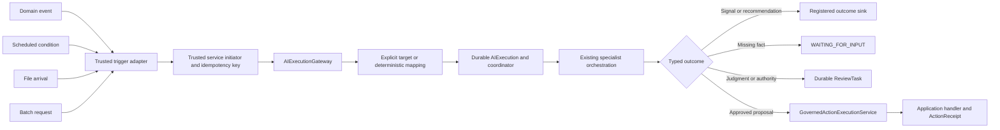

# Flow 06 — Proactive Intelligence

**Document purpose:** Architecture and business-case brief for implementation analysis
**Maturity:** `PROPOSED — P3`, built on the P1 canonical execution ingress
**Prerequisites:** P0 capability enforcement, P1 `SpecialistDefinition` and
`AIExecutionGateway`, plus durable state for asynchronous/retried work
**UI scope:** None

## 1. Executive Purpose

Proactive intelligence allows a trusted application event, scheduled condition, file, or batch to
start the same governed AI Fabric specialist flow before a user asks a question.

It is not a second AI engine. It is a new trusted starting point for specialist-defined
intelligence:

> trusted signal → deterministic target mapping → governed specialist execution → typed outcome

The initial result should usually be a signal, recommendation, review task, or action proposal—not
an unsolicited model-controlled mutation.

## 2. Business Problem

Important application conditions often appear before a person opens a chat:

- a payment fails or an account becomes inconsistent;
- a support case is near its service-level deadline;
- a policy, document, or product record changes;
- a scheduled portfolio or compliance check becomes due;
- a new file or batch requires classification, extraction, or exception detection;
- behavior signals cross an application-defined threshold.

If AI Fabric is usable only from a request/response conversation, application teams must build a
separate background intelligence path. That duplicates model, RAG, policy, action, and observability
logic and weakens the framework's enablement-layer position.

Proactive intelligence reuses the same specialist, Mode, effective-capability, orchestration,
review, and governed-action boundaries for non-chat sources.

## 3. Products And Use Cases Opened

| Product pattern | Trigger | Typical outcome |
| --- | --- | --- |
| Proactive account resolution | Payment/account domain event | Resolution recommendation or review task |
| Operational risk monitor | Scheduled or threshold event | Evidence-linked risk signal |
| Service-assurance assistant | Incident/SLA event | Priority and response recommendation |
| Document intake intelligence | File arrival | Typed extraction, classification, or exception |
| Compliance surveillance | Schedule or application event | Review queue item with source evidence |
| Batch enrichment | Application batch | Typed records and stable failure report |
| Retention/churn support | Behavior-signal event | Suggested outreach requiring application governance |
| Inventory or policy watcher | Domain change | Alert, recommendation, or approved action proposal |

## 4. Scope And Non-Goals

### In scope

- programmatic application-service submission;
- Spring application/domain-event adapters;
- registered schedule, file, and batch adapters after the core contract is proven;
- explicit specialist/plan target or deterministic registered mapping;
- service/system initiator and trusted tenant/authority context;
- no conversation or dialogue owner by default;
- durable, idempotent execution for asynchronous/retried work;
- typed outcomes delivered to registered application-owned sinks;
- typed missing-input wait, durable human review, and governed action proposal;
- retry, cancellation, status, evidence, and recovery.

### Not in scope

- creating a fake authenticated user;
- creating a fake conversation for a machine trigger;
- allowing an event payload or model to select arbitrary specialists, actions, reviewers, or
  recipients;
- letting trigger adapters invoke domain actions directly;
- hiding transaction phase, ordering, idempotency, or retry ownership behind an annotation;
- a general event broker or scheduler;
- automatic mutation from every detected condition;
- redesigning `Mode`;
- alert, review, or workflow screens.

## 5. Actors And Trust Boundaries

| Actor/component | Responsibility | Trust boundary |
| --- | --- | --- |
| Domain/application source | Publishes a meaningful event, schedule occurrence, file reference, or batch request | Application-owned source truth |
| Trusted trigger adapter | Verifies source, constructs trusted context, maps source payload to typed execution input | May not invent human identity or authority |
| Trigger mapping registry | Resolves one explicit, application-approved specialist or plan | Deterministic; never model-selected by default |
| `AIExecutionGateway` | Canonical submit/resume/cancel/status/result boundary | All non-chat sources enter here |
| `AIExecutionCoordinator` | Pins definitions, advances state, handles waits/retries, and emits terminal outcome | Deterministic framework control |
| Specialist invocation | Runs through existing governed orchestration | Capabilities are intersected with current authority |
| Outcome sink | Receives a typed result, signal, or safe reference | Application-selected registered adapter |
| Human-review integration | Delivers and receives governed decisions | Dispatcher delivers; authorizer and gateway decide validity |
| Registered action handler | Performs a confirmed/reviewed domain operation | Application owns transaction, idempotency, and receipt |

## 6. Start-To-Result Reference Flow

1. A domain event, schedule, file arrival, or batch occurrence reaches a trusted adapter.
2. The adapter verifies the source and creates a service/system initiator, tenant, subject, and
   authority references from trusted application integration.
3. It derives a stable idempotency key and typed input.
4. It submits an `ExecutionRequest` through `AIExecutionGateway`; it does not invoke a specialist or
   action handler directly.
5. The gateway resolves an explicit target or deterministic registered trigger mapping.
6. The coordinator authorizes and pins the specialist/plan and current effective capabilities.
7. It creates a durable execution with no conversation and no dialogue owner.
8. Every specialist step runs through the existing `RAGOrchestrator`.
9. The execution produces a typed signal/recommendation, `NeedsUserInput`, `ReviewTask`, or governed
   action proposal.
10. A registered outcome sink receives the terminal result or safe work reference.
11. Duplicate delivery returns the existing execution/result and does not duplicate business
    effects.



## 7. Architecture And Component Responsibilities

### Trigger adapter SPI

An adapter translates one trusted source into a channel-neutral request. It owns source-specific
verification and payload mapping, but not specialist selection policy, orchestration, review
authority, or business execution.

The initial adapters should be:

1. programmatic submission from application code;
2. Spring application/domain event;
3. later, schedule, file, and batch adapters based on adopter demand.

### Trigger mapping registry

Maps a registered trigger key/version to exactly one specialist or plan and a typed input mapper.
Mappings are application-authored, validated at startup, and deterministic. An annotation may
eventually register the same mapping, but programmatic submission remains canonical.

### `AIExecutionGateway`

Normalizes source metadata and ensures target resolution, authorization, idempotency, status, and
resume rules cannot be bypassed by adapters.

### `AIExecutionCoordinator`

Creates a no-conversation execution, advances plan/specialist state, persists lifecycle state when
necessary, applies retry/cancellation policy, and routes waits, reviews, actions, and outcomes.

### Outcome sink SPI

Receives a safe typed terminal result or a reference to a durable result. Examples include an
application callback, event publication, record writer, or work-queue integration. A sink is
transport, not authority; it cannot rewrite the result or execute an action.

## 8. `CURRENT` Foundations To Reuse

AI Fabric already provides the important intelligence and governance foundations:

- `RAGOrchestrator` and the common orchestration pipeline;
- Mode-based retrieval/action behavior and restrictions;
- `ReadActionResolutionService`;
- `OrchestrationContext` integration for tenant and authority;
- evidence-grounded RAG and live-data synchronization;
- action registry, application handlers, and immediate confirmation;
- chat/session support where genuine conversation exists.

The current foundation does **not** yet establish:

- one canonical ingress for event/schedule/file/batch sources;
- a trusted machine-initiator contract with no fake user;
- deterministic trigger-to-specialist/plan mappings;
- durable, idempotent execution and duplicate trigger handling;
- typed outcome-sink contracts;
- machine-flow input/review pause and safe resume;
- source-neutral status, cancellation, and result APIs.

## 9. `PROPOSED` Framework Changes

### 9.1 Public contracts

- extend `ExecutionSource` with explicit application/event/schedule/file/batch values;
- define trusted `TriggerReference`, `ServiceInitiatorReference`, and source-specific correlation;
- define channel-neutral `ExecutionRequest<I>` and `AIExecutionResult<O>`;
- define `TriggerMapping`, typed `TriggerInputMapper`, and registered `ExecutionOutcomeSink`;
- expose submit, status, result, cancel, and typed resume on `AIExecutionGateway`;
- preserve `SpecialistDefinition` as the canonical agent definition and leave Mode compatible.

### 9.2 Coordination and execution

- resolve explicit targets first, then deterministic registered mappings;
- create an implicit one-step plan for one specialist or resolve a registered plan;
- invoke every specialist through the existing orchestration path;
- represent no conversation/no dialogue owner as the normal machine state;
- handle terminal result, retry, wait, review, action, cancellation, and expiry transitions;
- prevent adapters and sinks from calling specialist internals or domain handlers directly.

### 9.3 Registration and configuration

- register mapping ID/version, source type, payload contract, target specialist/plan, input mapper,
  idempotency extractor, and allowed outcome sink;
- fail startup for ambiguous mappings, unknown versions, incompatible input schemas, or
  unauthorized source/target combinations;
- select adapters and sinks only from server-owned registries;
- make trigger annotations a later registration convenience, not a hidden execution path.

### 9.4 Security, policy, and context

- construct initiator, tenant, subject, and authority references only from authenticated trusted
  integration;
- reject human identity or conversation references supplied by ordinary event payload data;
- independently authorize every resolved specialist step and current effective profile;
- restrict source types and trigger keys permitted to select each specialist/plan;
- reauthorize before resume, review continuation, and action execution;
- sanitize outcome-sink and review-dispatch payloads.

### 9.5 State and durability

- add in-memory state for local/synchronous proof and JDBC/JPA for asynchronous work;
- persist source reference, mapping/version, idempotency key, pinned definitions, status, attempts,
  budgets, waits, result references, and safe failure evidence;
- enforce tenant-scoped unique idempotency keys and optimistic transitions;
- define at-least-once delivery semantics with duplicate-safe coordination;
- add worker lease/heartbeat/recovery if background workers process executions;
- never claim exactly-once distributed execution; business-effect safety requires application
  handler idempotency;
- do not require storage for a bounded synchronous application call.

### 9.6 Actions and review

- default proactive outcomes to signal, recommendation, review task, or action proposal;
- route proposals only through `GovernedActionExecutionService`;
- persist review tasks before dispatch and accept decisions only through `ReviewDecisionGateway`;
- expose `NeedsUserInput` through a host input channel without creating a conversation;
- bind waits, decisions, proposals, and action receipts to exact execution/invocation/version
  references;
- reconcile `OUTCOME_UNKNOWN`; never blind-replay a write.

### 9.7 Observability and evaluation

- record trigger/mapping/source versions, idempotency key hash, initiator type, specialist/plan
  versions, effective-profile hashes, retries, waits, decisions, and outcome;
- expose safe lifecycle events and execution status;
- measure duplicate rate, queue delay, execution latency, retry recovery, review conversion,
  terminal failure, and action-outcome distribution;
- preserve evidence and source-revision provenance without leaking raw payloads;
- correlate the source event, execution, review, action invocation, receipt, and final result.

### 9.8 Tests

- duplicate event delivery maps to one logical execution;
- machine sources create no user, conversation, or dialogue owner;
- untrusted payload data cannot set tenant, authority, reviewer, target, or sink;
- unknown/ambiguous mappings fail safely;
- every target step is independently authorized;
- restart resumes from durable state without duplicate business effects;
- retry exhaustion, cancellation, expiry, and terminal failure remain observable;
- missing input pauses and resumes the same pinned branch;
- review is persisted before dispatch and decisions are idempotent;
- trigger/sink adapters cannot bypass governed action execution.

## 10. Conceptual Contracts

These contracts are proposed analysis sketches.

```java
public record ExecutionRequest<I>(
    ExecutionSource source,
    I input,
    Optional<ExecutionTarget> explicitTarget,
    Optional<TriggerReference> trigger,
    TrustedExecutionContextRef trustedContext,
    String idempotencyKey,
    Optional<String> outcomeSinkRef
) {}

public sealed interface ExecutionTarget
    permits SpecialistTarget, PlanTarget {}

public interface TrustedTriggerAdapter<S, I> {
    ExecutionRequest<I> map(S source, TrustedAdapterContext context);
}

public interface ExecutionOutcomeSink<O> {
    OutcomeDeliveryReceipt deliver(
        AIExecutionResult<O> result,
        TrustedOutcomeDeliveryContext context
    );
}
```

```yaml
ai-fabric:
  trigger-mappings:
    payment-failed-v1:
      source: APPLICATION_EVENT
      payload-contract: PaymentFailed
      target:
        plan: account-resolution
        version: "1"
      input-mapper: payment-failure-resolution-request
      idempotency-extractor: payment-event-id
      outcome-sink: account-resolution-results
```

An optional later annotation may register the same mapping:

```java
@AITrigger(event = PaymentFailed.class, plan = "account-resolution")
public ResolutionRequest map(PaymentFailed event) {
    return requestFactory.from(event);
}
```

The annotation must not conceal transaction phase, duplicate delivery, authority construction,
ordering, or retry policy.

## 11. Delivery Phases And Dependencies

1. **P1 programmatic call:** synchronous `ExecutionRequest` with explicit specialist/plan and no
   mandatory persistence.
2. **Spring-event proof:** deterministic mapping, trusted service initiator, stable idempotency,
   typed terminal result.
3. **Durable execution:** in-memory and JDBC/JPA adapters, retry/cancel/status/recovery.
4. **Outcome sinks:** registered application callback/event/record adapters with duplicate-safe
   delivery.
5. **Input and review waits:** durable `WAITING_FOR_INPUT` and `WAITING_FOR_REVIEW`.
6. **Governed action proof:** approved proposal reaches the registered application handler and
   returns an authoritative receipt.
7. **Additional sources:** schedule, file, and batch adapters only after the source contract and
   recovery model are stable.

The Account Resolution Queue should be the first end-to-end reference proof.

## 12. Acceptance Criteria

1. Every source enters through `AIExecutionGateway`.
2. A machine trigger uses a trusted service/system initiator and does not invent a human.
3. No conversation or dialogue owner is created unless a product deliberately opens real dialogue.
4. Target resolution is explicit or deterministic and server registered.
5. Every specialist uses one versioned definition, current Mode restrictions, and current
   application authority.
6. Duplicate source delivery cannot duplicate logical execution or business effects.
7. Asynchronous work survives restart with stable state and evidence.
8. Missing facts, human decisions, and action proposals use distinct governed contracts.
9. Adapters and outcome sinks cannot invoke domain actions directly.
10. Typed results retain source, specialist, evidence, and decision provenance.
11. Failed or unknown write outcomes are not replayed blindly.
12. The first proof produces a useful proactive signal/recommendation/review without a chat.

## 13. Failure Modes And Edge Cases

| Condition | Required behavior |
| --- | --- |
| Duplicate event | Return or advance the existing execution under the same tenant-scoped key |
| Event delivered before application commit | Adapter must use an after-commit/outbox-compatible source; otherwise reject the integration |
| Missing tenant/authority context | Reject before target resolution |
| Ambiguous mapping | Fail registration or submission; never ask the model to choose freely |
| Payload schema mismatch | Reject safely with source correlation and no model call |
| Process stops mid-execution | Recover from durable state and lease/attempt data |
| Sink delivery fails | Retry the same result delivery without rerunning intelligence or actions |
| Specialist requests a fact | Enter `WAITING_FOR_INPUT`; expose through host channel |
| Specialist needs judgment | Create durable `ReviewTask`; do not treat missing data as approval |
| Review dispatch fails | Keep the task waiting and retry dispatch under the same task ID |
| Action outcome unknown | Reconcile or review; never blindly repeat |
| Authorization changes while waiting | Reauthorize and deny/expire if current authority is insufficient |
| File changes after trigger | Pin/check content reference and revision; do not process silently changed content |
| Batch partially fails | Produce typed item-level and batch-level evidence under declared failure policy |

## 14. Questions For The Coding Assistant

1. Which existing entry points can become adapters over `AIExecutionGateway` without breaking
   current APIs?
2. Where should trusted service/system identity and tenant context be constructed in Spring
   integrations?
3. What repository types already represent correlation, status, cancellation, or typed results?
4. What minimum `ExecutionStateStore` SPI is needed before adding JDBC/JPA?
5. How can Spring transaction synchronization or an outbox ensure after-commit event submission?
6. Where should trigger mapping registration and startup validation live?
7. Which idempotency concepts already exist in action handling and can be reused?
8. How should outcome sinks receive large results: inline, safe reference, or both?
9. Which errors are retryable, terminal, or require review?
10. How can current live-sync revision metadata be attached to trigger and result provenance?
11. Propose an incremental PR sequence, migrations, compatibility tests, and one
    `agentic-ai-action-resolver` reference implementation while preserving the current Account
    Resolver as the baseline.
12. Keep annotations and wider adapters out of the first PR unless the core programmatic contract
    is already proven.

## 15. References

- Visual: [`06-proactive-intelligence.svg`](../ai-fabric-flow-visuals/06-proactive-intelligence.svg)
- Presentation image: [`06-proactive-intelligence.png`](../ai-fabric-flow-visuals/06-proactive-intelligence.png)
- Proposal: [`Product-evolution-proposal.md`](../Full-Proposal/Product-evolution-proposal.md), especially
  sections 5.3, 8.6, 10, 11, 12, reference-proof Stage C, and P3.
