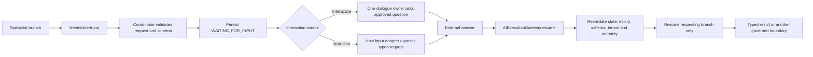

# Flow 07 — Missing Input And Safe Resume

**Document purpose:** Architecture and business-case brief for implementation analysis
**Maturity:** `PROPOSED — P2` for typed in-process continuation; `PROPOSED — P3` for durable
cross-process waiting and recovery
**Prerequisites:** P1 specialist identity and canonical gateway; P2 execution/invocation state and
dialogue ownership
**UI scope:** None

## 1. Executive Purpose

Missing-input continuation lets a specialist stop safely when it lacks a required fact, ask for
exactly that fact through an approved interaction channel, and resume only the waiting branch.

The specialist must not guess, expose its whole context, restart completed work, or acquire new
authority from the answer.

The core contract is a typed `NeedsUserInput` outcome, distinct from approval or human review.

## 2. Business Problem

Real application tasks are frequently incomplete:

- an account resolver needs the exact account or transaction reference;
- a shopping assistant needs quantity, delivery location, or selected variant;
- a policy checker needs a jurisdiction or effective date;
- a document process needs a missing classification field;
- one branch in a multi-specialist plan needs a fact that other branches do not need.

Today, teams often handle this by putting clarification into free-form chat prompts or restarting
the entire workflow after the answer. That causes ambiguous state, duplicate model/action work,
weak schema validation, and accidental privilege widening.

AI Fabric needs a first-class pause/resume contract that works in an interactive conversation and
in a non-chat product channel.

## 3. Products And Use Cases Opened

| Product pattern | Missing input example | Resume behavior |
| --- | --- | --- |
| Account-resolution assistant | Account/transaction reference | Resume only the resolver branch |
| E-commerce companion | Size, quantity, or address region | Continue the pending comparison/action draft |
| Case-management copilot | Case type or jurisdiction | Continue the policy specialist |
| Document intake | Required metadata absent | Expose a typed task through host application |
| Proactive operations queue | Machine event lacks an application fact | Wait without inventing a chat |
| Multi-specialist assessment | One check needs a date or identifier | Other completed branches remain complete |

## 4. Scope And Non-Goals

### In scope

- typed `NeedsUserInput` result with purpose, safe question, response schema, target, and expiry;
- coordinator validation and branch-specific `WAITING_FOR_INPUT`;
- one dialogue owner for interactive delivery;
- host-application input channel for non-chat work;
- `AIExecutionGateway.resume(...)` as the canonical return path;
- current authority, state, version, expiry, and schema revalidation;
- resuming only the requesting invocation or declared successor;
- deterministic consolidation of compatible requests from parallel branches;
- durable pending-input state when work crosses request/process/time boundaries.

### Not in scope

- treating a missing fact as approval;
- allowing worker specialists to talk directly to the user;
- giving a worker unrestricted transcript access;
- changing a specialist's capabilities after the answer;
- resuming every branch or restarting the whole plan;
- accepting untyped arbitrary conversation text as trusted execution context;
- allowing the model to choose recipient, reviewer, or channel;
- redesigning `Mode`;
- input forms or conversation UI.

## 5. Actors And Trust Boundaries

| Actor/component | Responsibility | Trust boundary |
| --- | --- | --- |
| Requesting specialist | Returns a typed request for a fact | Cannot contact the user or change its authority |
| `AIExecutionCoordinator` | Validates, records, routes, and resumes the correct branch | Deterministic owner of wait state |
| Dialogue owner | Phrases/delivers one approved question in an interactive execution | Cannot change the response schema or target |
| Host input adapter | Exposes/collects the fact for non-chat work | Establishes trusted current caller/service context |
| External user/operator | Supplies a value | The value is untrusted until validated |
| `AIExecutionGateway` | Canonical typed resume boundary | Rejects stale, duplicate, malformed, or unauthorized resumes |
| `ConversationContextProjector` | Reprojects approved context if needed after resume | Conversation correlation does not grant access |
| Application policy | Supplies current tenant, subject, and authority decisions | May narrow or deny continuation |

## 6. Start-To-Result Reference Flow

1. A specialist invocation determines it cannot satisfy its typed result contract without one
   permitted fact.
2. It returns `NeedsUserInput`; it does not append a question to the external conversation.
3. The coordinator validates the purpose code, response contract, safe question, target invocation,
   expiry, and whether clarification is allowed by the resolved specialist profile.
4. The invocation enters `WAITING_FOR_INPUT`; completed sibling/previous steps remain unchanged.
5. In an interactive execution, the one dialogue owner emits the approved question. In a machine
   execution, a host input adapter exposes the typed request without creating a conversation.
6. The answer returns through `AIExecutionGateway.resume(...)` with trusted current context.
7. The gateway/coordinator validate request ID, execution/invocation, optimistic version, expiry,
   response schema, tenant, subject, and current authority.
8. The answer is stored as typed invocation input, not broad conversation authority.
9. Only the waiting invocation or its declared successor resumes through the existing orchestration.
10. The plan continues to a typed result, another permitted wait, review, or governed action.



## 7. Architecture And Component Responsibilities

### `NeedsUserInput`

A validated specialist outcome, not a prompt fragment. It identifies:

- the request and requesting invocation;
- a stable purpose code;
- a safe user-facing question or host-facing description;
- the expected typed response;
- permitted response target/channel profile;
- optional expiry and retry/question limits;
- safe provenance references.

It carries no reviewer authority and cannot request credentials, secrets, or data outside the
specialist's approved scope.

### Pending-input state

The execution coordinator records the exact branch, pinned definition/schema versions,
effective-profile hash, request contract, expiry, optimistic version, and safe context references.
The conversation transcript is not the execution-state store.

### Dialogue owner and host adapter

The dialogue owner may phrase an approved request but cannot add requirements or expose worker
context. A non-chat adapter may render the contract as an API task, form, queue item, or callback,
but the framework does not define that UI.

### Resume validation

Resume is a state transition, not a new free-form request. It must match one open request and carry
trusted current context. The returned fact is type checked and passed only to the waiting branch.

### Consolidation

If parallel branches wait:

- compatible requests may be merged deterministically;
- each response field retains the requesting branch IDs;
- incompatible or ambiguous requests remain separate or are prioritized by declared policy;
- a conversation manager may improve wording only within its own approved view;
- one external prompt should be emitted at a time unless the product contract explicitly supports a
  typed multi-field response.

## 8. `CURRENT` Foundations To Reuse

The current framework already has:

- `RAGOrchestrator` and the bounded orchestration pipeline;
- `IntentHandlingStep` behavior that can clarify missing action parameters, maintain a
  conversation-bound draft, use immediate confirmation, revalidate the registered handler, execute
  it, and generate the post-action response;
- `PendingActionStore`, keyed by conversation and owner, for immediate confirmation state;
- `ChatSessionService` for real conversation continuity;
- `OrchestrationContext`, currently requiring a `userId` or `sessionId` and optionally carrying
  conversation, position/Mode, attachments, and resolved policy;
- Mode and policy restrictions plus application authority integration.

These are useful precedents, but they do **not** yet provide a general specialist-level input wait:

- `PendingActionStore` represents immediate confirmation/action state, not arbitrary branch input;
- the current missing-parameter clarification is request/action-draft scoped rather than a general
  typed wait for any specialist invocation;
- a free-form chat answer does not identify and version one waiting invocation;
- current `OrchestrationContext` is conversation/user-shaped and cannot represent a machine wait by
  inventing fake IDs;
- there is no typed `NeedsUserInput` outcome or branch-specific resume contract.

The new continuation path should reuse compatible store/state patterns without overloading
`PendingActionStore`.

## 9. `PROPOSED` Framework Changes

### 9.1 Public contracts

- define `NeedsUserInput`, `PendingInputRequest`, `ResumeInput`, and typed resume results;
- add `WAITING_FOR_INPUT` and terminal rejection/expiry reasons;
- expose `AIExecutionGateway.resume(executionId, ResumeInput)`;
- let `SpecialistResult` express completion or a typed wait without pretending an answer exists;
- distinguish the requester's invocation from the dialogue owner;
- keep specialist behavior in `SpecialistDefinition`; keep Mode current and reusable.

### 9.2 Coordination and execution

- validate that the specialist may request clarification;
- transition only the requesting invocation to waiting;
- preserve completed plan steps and siblings;
- route the request to the dialogue owner or host adapter;
- apply one-active-turn/queue policy for interactive conversations;
- resume only the exact invocation or explicit successor;
- support deterministic consolidation for compatible parallel requests;
- invoke resumed specialists through the same `RAGOrchestrator` path.

### 9.3 Registration and configuration

- register allowed purpose codes and typed response contracts;
- optionally register named input-delivery adapters for non-chat work;
- validate clarification limits, maximum questions, expiry policy, and safe field constraints;
- reject a specialist definition whose input-request contract conflicts with its input/output
  schema or privacy policy;
- server policy selects adapters; the model/request cannot supply arbitrary endpoints.

### 9.4 Security, policy, and context

- bind request to tenant, subject, initiator, specialist/plan/schema versions, referenced Mode, and
  resolved-profile hash;
- reauthorize from trusted current context at resume;
- reject any attempt to use a conversation ID as transcript authorization;
- prevent the answer from enlarging evidence/action scopes;
- redact questions and safe task envelopes;
- validate current data/authority if the wait made earlier evidence stale;
- separate input provider identity from reviewer authority.

### 9.5 State and durability

- add a dedicated pending-input store or execution-state record; do not misuse confirmation state;
- persist request ID, invocation ID, response contract/version, expiry, attempts, optimistic
  version, and idempotency key;
- provide in-memory state for same-process proof and JDBC/JPA for durable waits;
- make resume duplicate-safe and return the already-applied result for an identical retry;
- expire/close stale requests deterministically;
- support restart without rerunning completed branches;
- store safe references rather than unrestricted conversation/evidence payloads.

### 9.6 Actions and review

- if the missing value is an action parameter, integrate the typed input with the existing action
  draft rather than create a second action proposal;
- after the input arrives, all action validation/confirmation rules still apply;
- if a human must approve, reject, correct, or escalate, create a `ReviewTask` instead;
- a review decision requesting information may create a new `NeedsUserInput`, but the records remain
  distinct;
- no input response may authorize action execution by itself.

### 9.7 Observability and evaluation

- record request purpose, contract/version, requester, delivery path, wait duration, attempts,
  resume status, expiry, and safe finish reason;
- trace which answer fields resumed which branches;
- measure clarification rate, answer completion rate, repeated-question loops, stale resumes, and
  latency added by waits;
- redact user values according to privacy/retention policy;
- correlate input requests with resulting evidence, proposal, or terminal result.

### 9.8 Tests

- worker cannot append a question to the conversation;
- one dialogue owner emits the approved question;
- non-chat execution exposes input without creating user/conversation IDs;
- malformed, stale, expired, wrong-tenant, and wrong-invocation responses fail closed;
- capability scope cannot widen after resume;
- only the waiting branch resumes and completed branches do not rerun;
- duplicate resume is idempotent;
- authority narrowing while waiting is respected;
- compatible requests consolidate without losing branch mappings;
- input and review decisions cannot be confused.

## 10. Conceptual Contracts

These contracts are proposed analysis sketches.

```java
public record NeedsUserInput(
    String requestId,
    String requestingInvocationId,
    String purposeCode,
    String safeQuestion,
    TypeContract<?> responseContract,
    Optional<Instant> expiresAt
) {}

public record ResumeInput<T>(
    String requestId,
    T value,
    TrustedExecutionContextRef currentContext,
    String idempotencyKey
) {}

public interface AIExecutionGateway {
    ExecutionHandle submit(ExecutionRequest<?> request);
    ExecutionHandle resume(String executionId, ResumeInput<?> input);
    void cancel(String executionId, CancellationReason reason);
}
```

```yaml
ai-fabric:
  specialists:
    account-resolver:
      behavior:
        clarification:
          enabled: true
          maximum-requests: 2
          allowed-purpose-codes:
            - MISSING_ACCOUNT_REFERENCE
            - MISSING_TRANSACTION_REFERENCE
      limits:
        input-wait: 24h
```

The configuration requests clarification behavior for this specialist. Current application policy
may narrow or deny it.

## 11. Delivery Phases And Dependencies

1. **Typed outcome:** add `NeedsUserInput` and response-schema validation to one specialist.
2. **Interactive in-memory proof:** root/dialogue-owner question and exact branch resume.
3. **Plan proof:** a worker asks through the owner while completed steps remain complete.
4. **Non-chat proof:** host adapter exposes a typed request without user/conversation fabrication.
5. **Durable P3 proof:** JDBC/JPA pending-input state, expiry, idempotent resume, and restart.
6. **Parallel consolidation:** merge compatible branch requests only after parallel isolation ships.
7. **Evaluation:** measure reduced guessing/restarts and check repeated-question behavior.

The first proof should use one narrowly typed Account Resolver clarification inside the separate
`agentic-ai-action-resolver` app, leaving the current Account Resolver unchanged for comparison.

## 12. Acceptance Criteria

1. A specialist can return a typed input request instead of guessing.
2. The request identifies one invocation, contract, purpose, expiry, and pinned execution state.
3. A worker does not read/write the unrestricted conversation.
4. Exactly one dialogue owner or trusted host adapter delivers the request.
5. Resume occurs only through `AIExecutionGateway`.
6. Current state, schema, tenant, subject, authority, and expiry are revalidated.
7. Only the requesting invocation or declared successor resumes.
8. Completed branches do not rerun.
9. Duplicate resume does not apply input twice.
10. Missing information remains distinct from confirmation and human review.
11. Non-chat work does not create fake users, sessions, or conversations.
12. A stale response cannot widen the original capability set.

## 13. Failure Modes And Edge Cases

| Condition | Required behavior |
| --- | --- |
| Response fails schema | Reject with safe reason; keep request waiting within attempt policy |
| Request expired | Close/expire; require a new execution or explicitly governed successor |
| Wrong tenant/subject | Deny without revealing task existence |
| Duplicate identical response | Return idempotent prior transition/result |
| Conflicting second response | Reject visibly using optimistic state version |
| Authority narrows | Deny/expire or require new authorized execution |
| Source data changes materially | Revalidate evidence/revisions before continuation |
| Several compatible waits | Consolidate fields while preserving branch mappings |
| Several incompatible waits | Ask separately under deterministic priority or require review |
| Dialogue owner unavailable | Keep waiting; host may use an approved alternate input channel |
| Conversation closes | Do not lose execution state; expire or expose through host policy |
| Process stops while waiting | Restore exact pinned branch from durable state |
| Input is actually approval | Reject as wrong contract and direct to review/confirmation path |
| Specialist repeats same question | Enforce maximum clarification count and terminate/escalate safely |

## 14. Questions For The Coding Assistant

1. Which current action-draft and pending-action types can be reused without conflating input and
   confirmation?
2. Where should `NeedsUserInput` enter the current orchestration result hierarchy?
3. How can `AIExecutionGateway.resume` adapt to current chat APIs while preserving compatibility?
4. Which current context requirement forces user/session IDs, and what service/system envelope
   should replace fake identities?
5. What state transitions and optimistic-lock fields are required for duplicate-safe resume?
6. How should current conversation snapshots be frozen and projected for a waiting worker?
7. How can the framework validate typed Java and JSON-schema response contracts consistently?
8. Which privacy filters must apply to safe questions, stored answers, and diagnostics?
9. How should input merge detect compatible contracts across parallel branches?
10. Which action-parameter collection logic should remain in the current action-draft path?
11. Propose an incremental PR sequence and compatibility tests, starting with one interactive
    `agentic-ai-action-resolver` example.
12. Do not implement UI or reuse `ReviewTask` for ordinary missing facts.

## 15. References

- Visual: [`07-missing-input-safe-resume.svg`](../ai-fabric-flow-visuals/07-missing-input-safe-resume.svg)
- Presentation image: [`07-missing-input-safe-resume.png`](../ai-fabric-flow-visuals/07-missing-input-safe-resume.png)
- Proposal: [`Product-evolution-proposal.md`](../Full-Proposal/Product-evolution-proposal.md), especially
  sections 5.5, 8.4, 9.5, 10.2, 12, P2, and P3.
