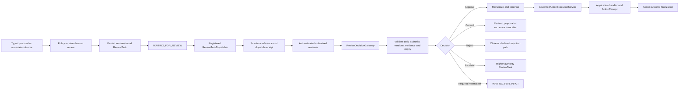

# Flow 08 — Durable Human Review

**Document purpose:** Architecture and business-case brief for implementation analysis
**Maturity:** `CURRENT` immediate active-request confirmation foundation;
`PROPOSED — P3` durable review across request, process, actor, or time boundaries
**Prerequisites:** P1 specialist/action identity and canonical ingress; durable execution state for
cross-boundary work
**UI scope:** None; inboxes, portals, notifications, and workflow screens belong to host products

## 1. Executive Purpose

Durable human review lets AI Fabric pause sensitive or uncertain work, preserve the exact proposal
and evidence state, deliver a safe review task through a registered adapter, accept a decision from
an authorized person, and resume the pinned execution safely.

The framework owns the governed review lifecycle. The host application owns reviewer identity,
eligibility, business authority, delivery infrastructure, and final domain operations.

This extends—not replaces—the current immediate confirmation flow.

## 2. Business Problem

An active user can often confirm a low-friction action immediately. Enterprise work frequently
needs a different boundary:

- an operations analyst must review a proactive account-resolution recommendation;
- a compliance officer must approve, reject, correct, or escalate a sensitive case;
- a high-impact action needs separation of duties;
- a document extraction requires qualified correction;
- a write outcome is uncertain and needs reconciliation;
- a completed result is selected for quality or compliance sampling;
- a decision may arrive hours later, in another process, through another authorized actor.

Keeping such state only in a chat/session or notification callback loses version, authority, and
evidence guarantees. A dispatcher must not be mistaken for an approver, and notification delivery
must not be mistaken for a decision.

## 3. Products And Use Cases Opened

| Product pattern | Review type | Possible decision |
| --- | --- | --- |
| Proactive operations queue | Operational review | Approve, reject, correct, escalate |
| High-compliance case assistant | Separation-of-duty review | Approve or route to higher authority |
| Document intelligence | Correction | Submit typed corrected extraction |
| Governed automation | Pre-effect review | Authorize application handler invocation |
| Outcome reconciliation | Post-outcome review | Accept, flag, reconcile, or authorize corrective action |
| Quality/compliance sampling | Quality sample | Record evaluation without changing result |
| Account-resolution workbench | Sensitive recommendation | Approve/correct under current account policy |

## 4. Scope And Non-Goals

### In scope

- version-bound `ReviewTask` and explicit review state machine;
- durable persist-before-dispatch lifecycle;
- registered `ReviewTaskStore`, `ReviewTaskDispatcher`, and `ReviewerAuthorizer` SPIs;
- AI Fabric-owned `ReviewDecisionGateway`;
- safe review request envelopes and separate dispatch receipts;
- approve, reject, correct, request information, escalate, expire, and cancel transitions;
- current reviewer authorization, original-authority revalidation, freshness, and schema checks;
- pre-effect and post-outcome review;
- idempotent dispatch, decisions, resume, and escalation;
- continuation through `GovernedActionExecutionService` after approval.

### Not in scope

- replacing immediate active-conversation confirmation for every action;
- treating every missing fact as human review;
- implementing email, Teams, Slack, portal, or workflow-system UI;
- letting the model choose reviewers, recipients, dispatcher, or return endpoint;
- letting a dispatcher authorize, decide, or resume work;
- moving domain action implementation into AI Fabric;
- retroactively “rejecting” a committed business operation;
- generic rollback or blind compensating action;
- redesigning `Mode`.

## 5. Actors And Trust Boundaries

| Actor/component | Responsibility | Trust boundary |
| --- | --- | --- |
| Specialist/action/application policy | Declares that review is required | May request review; cannot approve itself |
| `AIExecutionCoordinator` | Creates task, enters wait state, and resumes validated continuation | Deterministic lifecycle control |
| `ReviewTaskStore` | Persists and transitions tenant-scoped review state | SPI implementation; no decision authority |
| `ReviewTaskDispatcher` | Delivers a sanitized task reference and returns delivery receipt | Transport only; no approval or resume authority |
| Host authentication integration | Establishes trusted reviewer identity/context | Credentials and authentication remain application-owned |
| `ReviewerAuthorizer` | Evaluates role, tenant, subject, separation-of-duty, and decision authority | Application SPI; checked for each decision |
| Reviewer | Makes one allowed decision | Cannot expand decision schema or application authority |
| `ReviewDecisionGateway` | Validates and applies trusted reviewer decision | Framework-owned inbound boundary |
| `GovernedActionExecutionService` | Revalidates and invokes a registered handler after approval | Never performs domain business logic itself |
| Registered application handler | Executes domain transaction and issues `ActionReceipt` | Sole authority for committed business outcome |

## 6. Start-To-Result Reference Flow

1. A specialist produces a typed result/action proposal, or outcome-finalization policy identifies
   uncertainty/high impact.
2. Specialist, action, plan, application, or outcome policy requires review.
3. The coordinator creates a version-bound `ReviewTask`, persists it, and moves the execution or
   invocation to `WAITING_FOR_REVIEW`.
4. After commit, AI Fabric resolves a registered dispatcher and sends a sanitized task reference.
5. The dispatcher records a delivery receipt. Delivery does not change the review decision state.
6. The host application authenticates a reviewer and constructs `TrustedReviewerContext`.
7. The reviewer submits one allowed decision through `ReviewDecisionGateway`.
8. The gateway verifies task state/version, expiry, reviewer authority, proposal/evidence
   freshness, specialist/plan/action versions, current policy, and typed decision schema.
9. Approval resumes the pinned execution and revalidates immediately before any action invocation.
   Correction creates a revised proposal or successor; rejection closes/follows a declared path;
   escalation creates/routes a higher-authority task; information request enters a distinct input
   wait.
10. If an approved write proceeds, the registered application handler returns an authoritative
    `ActionReceipt`.
11. Outcome finalization records the governed result. Unknown/high-impact outcomes may create a
    separate post-outcome review.



## 7. Architecture And Component Responsibilities

### `ReviewTask`

The durable decision record must bind:

- execution, invocation, plan step, proposal, and optional action/finalization IDs;
- specialist, prompt, schema, plan, action, and referenced Mode identity/version;
- resolved-specialist-profile hash;
- tenant, subject, initiator, and reviewer-policy references;
- safe evidence/source revision references and proposal hash;
- review type, allowed decisions, typed correction/input contracts;
- expiry, escalation policy, optimistic version, and idempotency key.

It must not store credentials or an unrestricted transcript by default.

### `ReviewTaskStore`

Persists before dispatch and enforces tenant scope, optimistic transitions, legal state changes, and
duplicate safety. An in-memory adapter supports local development; JDBC/JPA provides durable waits.

### `ReviewTaskDispatcher`

Delivers a safe task envelope through an application-selected channel. It returns a dispatch
receipt proving acceptance/delivery attempt only. Failure leaves the same task waiting and eligible
for retry under the same review-task ID.

### `ReviewerAuthorizer`

Uses trusted application context to evaluate current reviewer eligibility, tenant/subject scope,
role, separation of duty, and the specific proposed decision. The task payload cannot assert this
authority.

### `ReviewDecisionGateway`

The only framework-owned inbound decision path. It checks idempotency, state, versions, expiry,
authority, evidence freshness, and decision schema before asking the coordinator to continue.

### `GovernedActionExecutionService`

Approval is permission to continue, not proof that an operation committed. This service performs
final validation and calls the existing registered application handler. Only the handler issues an
authoritative `ActionReceipt`.

## 8. `CURRENT` Foundations To Reuse

The proposal baseline already provides:

- action registration and application-owned handlers;
- `OrchestrationPolicyResolutionStep`, which establishes server-authoritative policy before action
  handling;
- `IntentHandlingStep`, which performs current request-bound missing-parameter clarification,
  immediate confirmation, handler revalidation, execution, and post-action response generation;
- immediate confirmation before sensitive actions;
- `PendingActionStore`, keyed by conversation and owner, with stack-compatible defaults;
- `OrchestrationContext`/application policy integration;
- evidence-grounded orchestration and live-data synchronization;
- chat/session state for active conversation continuity.

`PendingActionStore` is useful for active-request confirmation. It is **not** a durable review
workflow:

- it is conversation/owner shaped;
- it does not model a qualified reviewer acting later;
- it does not provide persist-before-dispatch notification semantics;
- it does not bind a durable decision to all specialist/plan/evidence/action versions;
- it does not separate delivery receipt, reviewer authorization, and decision;
- it does not model correction, escalation, expiry, or post-outcome review.

Immediate confirmation should remain the lightweight path when the same active authorized user can
decide in the current interaction.

## 9. `PROPOSED` Framework Changes

### 9.1 Public contracts

- define versioned `ReviewTask`, `ReviewDecision`, `ReviewTransition`, `ReviewDispatchReceipt`, and
  `ReviewDecisionResult`;
- define review types: confirmation, operational review, correction, escalation, outcome review,
  and quality sample;
- define `ReviewTaskStore`, `ReviewTaskDispatcher`, and `ReviewerAuthorizer` SPIs;
- define framework-owned `ReviewDecisionGateway`;
- add `WAITING_FOR_REVIEW`, `WAITING_FOR_OUTCOME_REVIEW`, approved/rejected/corrected/escalated/
  expired terminal or continuation states;
- retain current `PendingAction` confirmation contract separately.

### 9.2 Coordination and execution

- create/persist the task before dispatch and enter the correct wait state atomically;
- use after-commit/outbox-compatible delivery;
- allow only declared transitions for the exact review type;
- resume the pinned invocation/step or deliberately create a successor;
- revalidate immediately before registered handler invocation;
- preserve historical proposal/evidence on correction;
- route request-for-information to `WAITING_FOR_INPUT`;
- route post-outcome review to reconciliation/corrective governance, never historical rollback.

### 9.3 Registration and configuration

- register store, dispatcher, reviewer-authorizer, escalation-policy, and typed decision/correction
  contracts;
- select dispatcher IDs through server-owned policy;
- validate review profiles referenced by specialist/action/plan definitions;
- reject unknown adapters, unbounded expiry, incompatible correction schemas, or ambiguous
  escalation targets at startup;
- keep review profiles out of Mode unless a genuinely shared Mode concern passes the strict
  admission rule.

### 9.4 Security, policy, and context

- construct `TrustedReviewerContext` only after host authentication;
- enforce tenant/subject scope on every store lookup and transition;
- re-check reviewer authority, separation of duty, and allowed decision;
- re-check original initiator/subject authority and current action/application policy;
- bind exact proposal/evidence/source revisions and all relevant definition versions;
- reject stale or conflicting decisions visibly;
- sanitize task envelopes; never let model/request choose recipient, dispatcher, or callback;
- prevent task existence disclosure across tenants.

### 9.5 State and durability

- provide in-memory and JDBC/JPA implementations;
- add review task and dispatch records plus links to execution, invocation, proposal, receipt, and
  finalization state;
- use optimistic state versions and tenant-scoped idempotency keys;
- make create, dispatch retry, decision, escalation, expiry, and resume duplicate-safe;
- preserve waiting state when delivery fails;
- recover tasks/executions after process restart;
- enforce retention, redaction, encryption, deletion, and bounded evidence/history sizes.

### 9.6 Actions and review

- route approved writes only through `GovernedActionExecutionService`;
- require application handler idempotency and authoritative `ActionReceipt`;
- do not treat dispatch receipt as review approval or action outcome;
- correct creates a revised proposal/successor, never rewrites the reviewed historical object;
- escalation creates/routes a distinct higher-authority task with lineage;
- post-outcome review cannot “reject” a committed operation; it may accept, flag, reconcile, or
  authorize a separately governed corrective/compensating action;
- `OUTCOME_UNKNOWN` goes to reconciliation/review, not blind retry.

### 9.7 Observability and evaluation

- record task/review type, versions, state transitions, dispatch attempts/receipts, wait duration,
  reviewer-policy result, safe decision code, resume result, and linked action outcome;
- correlate proposal → review task → decision → action invocation → receipt → finalization;
- expose safe audit events without sensitive evidence or reviewer credentials;
- measure time-to-decision, approval/correction/rejection/escalation rates, stale decisions,
  dispatch failures, expiry, duplicate decisions, and post-review action outcomes;
- support compliance export through application-approved safe references.

### 9.8 Tests

- task is committed before dispatch;
- dispatch failure leaves the same task waiting;
- dispatcher cannot approve or resume;
- reviewer identity from payload is ignored/rejected;
- wrong tenant, unauthorized role, separation-of-duty breach, stale version, and expired task fail
  closed;
- duplicate dispatch and decision are idempotent;
- correction preserves original proposal/evidence and creates a revision/successor;
- approval revalidates current policy immediately before action invocation;
- committed outcomes cannot be retroactively rejected;
- process restart resumes one pinned execution without duplicate effect;
- immediate confirmation and durable review remain distinct.

## 10. Conceptual Contracts

These contracts are proposed analysis sketches.

```java
public interface ReviewTaskStore {
    ReviewTask save(ReviewTask task, TrustedReviewScope scope);
    Optional<ReviewTask> find(String reviewTaskId, TrustedReviewScope scope);
    ReviewTask transition(ReviewTransition transition, TrustedReviewScope scope);
}

public interface ReviewTaskDispatcher {
    ReviewDispatchReceipt dispatch(
        ReviewRequest request,
        ReviewDispatchContext context
    );
}

public interface ReviewerAuthorizer {
    ReviewerAuthorization authorize(
        ReviewTask task,
        ReviewDecision decision,
        TrustedReviewerContext reviewer
    );
}

public interface ReviewDecisionGateway {
    ReviewDecisionResult submit(
        String reviewTaskId,
        ReviewDecision decision,
        TrustedReviewerContext reviewer
    );
}
```

```java
public sealed interface ReviewDecision
    permits Approve, Reject, Correct, RequestInformation, Escalate {}

public record ReviewPolicyProfile(
    String id,
    Set<ReviewDecisionType> allowedDecisions,
    String reviewerAuthorizerRef,
    String dispatcherRef,
    Duration expiry,
    Optional<String> escalationPolicyRef
) {}
```

```yaml
ai-fabric:
  review-policies:
    sensitive-account-resolution:
      decisions: [APPROVE, REJECT, CORRECT, REQUEST_INFORMATION, ESCALATE]
      reviewer-authorizer: account-operations-reviewers
      dispatcher: operations-review-queue
      expiry: 24h
      escalation-policy: senior-operations
```

The model may request a registered review profile only where the resolved specialist/action/plan
policy allows it. Server and application policy choose actual adapters and enforce authority.

## 11. Delivery Phases And Dependencies

1. **State machine/contracts:** define task identity, versions, decisions, legal transitions, and
   links to execution/proposal.
2. **In-memory reference:** prove create, authorize, decide, resume, and correction semantics.
3. **JDBC/JPA durability:** optimistic transitions, idempotency, restart, expiry, and tenant scope.
4. **Dispatcher SPI:** persist before after-commit dispatch; retry under one task ID.
5. **Authorization SPI:** application-owned role/tenant/separation-of-duty checks.
6. **Action continuation:** approval flows through governed action service and authoritative receipt.
7. **Post-outcome review:** unknown/high-impact outcome and separately governed correction.
8. **Reference product:** Proactive Account Resolution Queue with a safe application-owned review
   channel.

Additional channel adapters and external workflow integrations are `LATER`.

## 12. Acceptance Criteria

1. Durable review is used only when a decision crosses a request, actor, process, or time boundary
   or when outcome review is required.
2. Immediate active-user confirmation remains a separate lightweight path.
3. Every task is persisted before dispatch and bound to exact execution/proposal/evidence/version
   references.
4. Dispatcher delivery and reviewer decision are separate records.
5. Only `ReviewDecisionGateway` accepts a decision.
6. Current reviewer and original action authority are revalidated.
7. Wrong-tenant, stale, expired, malformed, and unauthorized decisions fail closed.
8. Duplicate dispatches/decisions/resumes do not duplicate tasks or effects.
9. Approval does not assert commit; only the registered application handler's receipt does.
10. Correction/escalation retain historical lineage.
11. A committed action cannot be retroactively rejected.
12. Review state and pinned execution survive restart.

## 13. Failure Modes And Edge Cases

| Condition | Required behavior |
| --- | --- |
| Store commit fails | Do not dispatch |
| Dispatcher fails | Keep same task waiting; retry safely under policy |
| Duplicate dispatch | Dispatcher deduplicates by task ID; record safe receipt |
| Reviewer not eligible | Deny without changing task state |
| Reviewer conflicts with separation-of-duty rule | Deny and optionally escalate under policy |
| Task expired | Reject decision; expire/escalate deterministically |
| Proposal/evidence version changed | Reject stale decision or create new review task |
| Original initiator loses authority | Do not execute; deny/expire/re-review according to policy |
| Duplicate identical decision | Return idempotent prior result |
| Conflicting second decision | Reject using optimistic state version |
| Reviewer requests missing fact | Create distinct `NeedsUserInput`; do not encode as approval |
| Correction changes action parameters | Create revised proposal and apply full governance again |
| Process stops after decision | Recover and resume once from durable transition |
| Action receipt is missing/unknown | Enter reconciliation or outcome review; never blind-retry |
| Operation already committed | Reviewer may flag/reconcile/authorize separate correction, not reject history |
| Notification contains sensitive evidence | Sanitize to safe reference and fetch under authenticated host control |

## 14. Questions For The Coding Assistant

1. Which current `PendingActionStore` patterns are reusable, and which assumptions make it unsafe
   for durable cross-actor review?
2. Where should review state link to current action draft/proposal and future action finalization?
3. What minimal `ReviewTaskStore` SPI supports both in-memory and JDBC/JPA adapters?
4. How should after-commit/outbox dispatch integrate with Spring transaction boundaries?
5. Where should `TrustedReviewerContext` be constructed and how can tenant scope be impossible to
   omit?
6. Which version/hash fields can reuse existing specialist, Mode, action, evidence, or policy types?
7. What decision schema supports typed correction without mutating historical records?
8. How will approval re-enter the coordinator and then `GovernedActionExecutionService` without
   adapter bypass?
9. What existing idempotency and receipt contracts can be reused?
10. Which lifecycle events and metrics are safe enough for audit without exposing evidence?
11. Propose an incremental PR/migration/test plan and an `agentic-ai-action-resolver` reference
    integration that does not modify the current Account Resolver baseline.
12. Do not build notification/review UI or allow dispatcher adapters to decide/resume tasks.

## 15. References

- Visual: [`08-durable-human-review.svg`](../ai-fabric-flow-visuals/08-durable-human-review.svg)
- Presentation image: [`08-durable-human-review.png`](../ai-fabric-flow-visuals/08-durable-human-review.png)
- Proposal: [`Product-evolution-proposal.md`](../Full-Proposal/Product-evolution-proposal.md), especially
  sections 10, 11, 12, reference-proof Stage C, and P3.
