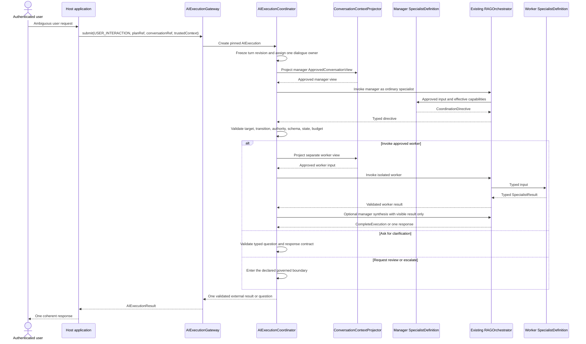

# Flow 09 — Conversation Manager

## Document purpose

This brief converts the **Conversation Manager** business visual into an architecture and framework-analysis case. It is intended for a coding assistant that already understands AI Fabric and needs to determine the smallest safe extension required to implement the case.

This is not a UI specification and does not propose a general-purpose autonomous agent network.

## Status and maturity

| Label | Meaning in this case |
| --- | --- |
| `CURRENT` | AI Fabric already has governed orchestration, Mode restrictions, retrieval, actions, `OrchestrationContext`, and chat-session continuity. |
| `PROPOSED — P1/P2 dependency` | `SpecialistDefinition`, `SpecialistInvocation`, `AIExecutionGateway`, `AIExecution`, one dialogue owner, projected context, typed results, and deterministic plan coordination must exist first. |
| `PROPOSED — P4` | Add an optional conversation-manager specialist and bounded supervised-choice semantics. |
| `LATER` | Add broader manager patterns only after product evidence shows that fixed routing and direct specialists are insufficient. |

The manager is deliberately P4. Most interactive use cases should remain either one direct specialist or a fixed plan. Another model call is justified only when conversational ambiguity, clarification, routing, or synthesis genuinely requires it.

## Executive purpose

Provide one intelligent, coherent front door to several independently governed capabilities.

A user may describe a need without knowing whether it belongs to account support, payment investigation, order servicing, policy guidance, or another capability. The conversation manager may interpret that ambiguity and **propose one permitted next move**. The deterministic coordinator then validates the proposal against the registered plan, approved targets, current authority, schemas, state, and remaining limits.

The essential boundary is:

> The conversation manager proposes the next intelligent move. Deterministic Java coordination validates and applies it.

The manager is an ordinary `SpecialistDefinition`, eligible to own dialogue when explicitly assigned. It does not become a privileged control plane, an action executor, or a source of authority.

## Business problem

Without a conversation manager, a product with several capabilities often forces one of two weak experiences:

1. the user must select the correct capability before explaining the problem; or
2. an opaque model receives every tool and every data source and decides freely what to do.

The first approach creates product friction. The second creates an oversized context, unclear ownership, weak auditability, and potential privilege union.

This flow supports a third option:

- the user speaks to one dialogue owner;
- the manager receives only its approved view;
- it may propose only typed, pre-approved directives;
- each worker specialist is invoked separately with its own effective capabilities;
- one validated response returns to the user.

## Product types and business cases opened

- enterprise AI front door across separately owned business capabilities;
- banking or insurance concierge that routes between servicing, investigation, and policy specialists;
- unified customer-support assistant with governed escalation;
- employee operations assistant spanning HR, IT, facilities, or finance without combining their privileges;
- case-intake assistant that determines the next qualified specialist;
- conversational operations console that explains results from fixed back-office workflows;
- guided onboarding that asks only the clarification needed to select the correct bounded process.

The manager is valuable when the **next conversational move is ambiguous**. It is unnecessary when a route is already explicit, deterministic, or owned by the application.

## Scope

The first supported scope should be:

- one external conversation;
- one dialogue-owning manager invocation for an active interactive turn;
- a registered `SUPERVISED_BOUNDED` execution plan;
- a pre-filtered set of permitted next targets and transitions;
- typed `CoordinationDirective` output;
- isolated worker invocations through the existing `RAGOrchestrator`;
- at most one user-facing question or response for the turn;
- deterministic validation, limits, termination, and audit evidence.

## Non-goals

- replacing `Mode` with a manager configuration;
- embedding model reasoning in `AIExecutionCoordinator`;
- allowing the manager to create specialists, Modes, prompts, plans, actions, permissions, or budgets;
- letting all specialists participate in one shared chat;
- giving the manager unrestricted transcript access;
- executing business actions from the manager;
- generating an unrestricted executable graph;
- making every interactive flow use a manager;
- building a generic low-code agent builder;
- defining product screens or review inboxes.

## Actors and trust boundaries

| Actor/component | Responsibility | Trust boundary |
| --- | --- | --- |
| External user | Supplies the authenticated conversation turn and any later clarification. | User text is untrusted input and grants no capability. |
| Host application/channel | Authenticates the user, creates trusted tenant/subject/authority context, and presents the validated response. | It is the authority source for identity and business access. |
| `AIExecutionGateway` | Accepts the trusted interactive submission and resolves a permitted plan. | Canonical ingress; the channel cannot bypass target resolution. |
| `AIExecutionCoordinator` | Pins versions, assigns one owner, validates directives, advances state, and enforces budgets. | Deterministic state-transition authority. |
| Conversation manager specialist | Interprets the approved turn and proposes a typed next move. | Model-assisted and non-authoritative. |
| `ConversationContextProjector` | Produces an immutable manager or worker view from a frozen conversation revision. | Prevents transcript and context leakage. |
| Worker specialist | Performs one independently scoped business-intelligence task. | Cannot read or append the unrestricted conversation. |
| Existing `RAGOrchestrator` and pipeline | Executes every manager and worker specialist under existing policy, retrieval, and action controls. | Remains the only intelligence-orchestration path. |
| Application action handler | Performs any approved domain operation and returns authoritative evidence. | Owns authorization, validation, transaction, side effects, and final business truth. |

`Mode` continues to work as it does today. The manager and every worker reference one Mode, but the Mode does not become the agent definition. `SpecialistDefinition` remains the complete view of each agent.

## Start-to-result reference flow

### Prose flow

1. The authenticated user submits an ambiguous request through a real product conversation.
2. The host application calls `AIExecutionGateway` with `USER_INTERACTION`, the conversation reference, input, and trusted context.
3. The gateway resolves an application-approved supervised plan and creates an `AIExecution`.
4. The coordinator freezes the conversation revision, resolves the manager's effective profile, and assigns the manager as the sole dialogue owner.
5. `ConversationContextProjector` creates the manager's approved view. The manager does not query the conversation store directly.
6. The existing `RAGOrchestrator` invokes the manager specialist.
7. The manager returns a typed `CoordinationDirective`, such as `AskUser`, `InvokeSpecialist`, `HandoffTo`, `CompleteExecution`, `RequestHumanReview`, or `Escalate`.
8. The coordinator validates that directive against the pinned plan, approved next-target set, schemas, current authority, current state, and remaining budgets.
9. For worker invocation, the coordinator creates a separate `SpecialistInvocation`, independently resolves its effective capabilities, and projects a separate approved context.
10. The worker returns a typed result. It cannot append to the conversation.
11. The coordinator maps the result back to the manager or a deterministic aggregator.
12. The manager may formulate one final user-facing response, or another approved directive may continue the bounded flow.
13. Exactly one validated response or question is appended through the dialogue owner.

### Mermaid sequence



## Architecture and component responsibilities

### `ConversationManagerSpecialist`

The manager is registered through the same specialist registry as any other specialist. Its definition should include:

- a stable ID and version;
- one existing `modeRef`;
- a narrow objective focused on clarification, routing, handoff, or narrative synthesis;
- `DIALOGUE_CAPABLE` behavior if it may own dialogue;
- evidence and context limited to what is necessary for conversational coordination;
- no WRITE actions in the first release;
- normally no business READ actions, except narrowly justified read-only routing data;
- typed `ConversationManagerInput` and `CoordinationDirective` output;
- strict manager-turn, model-call, time, token, and cost limits;
- an explicit set of delegation/handoff candidates further narrowed by the plan and current policy.

### `AIExecutionCoordinator`

The coordinator remains deterministic. It:

- resolves the pinned supervised plan;
- constructs `approvedNextTargets` before the model call;
- invokes the manager through the existing pipeline;
- validates every returned directive;
- creates separate worker or successor invocations;
- prevents privilege union;
- preserves one dialogue owner;
- detects repeated directives, repeated questions, no-progress loops, and exhausted budgets;
- applies deterministic terminal or escalation behavior.

### `ConversationContextProjector`

It computes:

```text
frozen conversation snapshot
∩ manager or worker declared context scope
∩ referenced Mode restrictions
∩ privacy and tenant policy
∩ current identity, subject, and authority
∩ plan input mapping
```

The result is an immutable `ApprovedConversationView`. A shared `conversationRef` is correlation, not transcript permission.

### `EffectiveCapabilitiesResolver`

It intersects:

- the specialist's requested evidence and action scopes;
- current Mode restrictions;
- registered evidence and action metadata;
- current application and tenant authority;
- step-specific input and smaller budget allocations.

The manager cannot enlarge a worker's scope by selecting it.

## CURRENT foundations reused

The implementation should reuse, not duplicate:

- `RAGOrchestrator` and `DefaultOrchestrationPipeline`;
- `OrchestrationProperties` and current Mode behavior;
- `OrchestrationContext` for trusted identity, tenant, subject, and authority;
- `ChatSessionService` for external conversational continuity;
- the current policy-resolution, retrieval, privacy, and PII stages;
- `ReadActionResolutionService` when a worker's `ExecutionStrategy` uses the existing bounded loop;
- `AIActionRegistry`, pending confirmations, and application-owned action handlers;
- existing evidence, vector, and live-data synchronization contracts.

The manager does not receive a special orchestration path or direct model-provider access.

## PROPOSED framework changes

### Public contracts

- Add or finalize `SpecialistDefinition<I,O>` and registry support for a manager definition.
- Add `UserInteractionCapability.DIALOGUE_CAPABLE`.
- Add `ConversationManagerInput`.
- Add sealed, typed `CoordinationDirective`.
- Add `ExecutionPlanDefinition` strategy `SUPERVISED_BOUNDED`.
- Add `InteractionPolicy` with `DialogueOwnerStrategy.CONVERSATION_MANAGER`.
- Add explicit directive acceptance/rejection reason types.
- Ensure `AIExecutionResult` can represent completion, clarification, review required, escalation, budget exhaustion, and safe failure.

### Coordination and execution

- Extend `AIExecutionCoordinator` to invoke the manager only at declared ambiguity points.
- Build the approved target set before manager invocation.
- Validate every directive against a registered transition matrix.
- Create a separate invocation for every worker and successor.
- Route all specialists through `RAGOrchestrator`.
- Enforce maximum manager turns and total execution limits.
- Add no-progress and repeated-question detection.
- Route only one final response through the dialogue owner.

### Registration and configuration

- Validate that the manager specialist exists, is versioned, and is `DIALOGUE_CAPABLE` when assigned ownership.
- Validate manager input/output schemas and all directive target references.
- Validate the supervised plan's allowed transition matrix.
- Reject plans that rely on arbitrary manager-created targets or transitions.
- Keep Mode configuration unchanged; the manager references an existing Mode.
- Permit the host application to disable supervised plans entirely.

### Security, policy, and context

- Enforce one dialogue owner per active interactive turn.
- Freeze one conversation revision for the turn.
- Project a separate immutable view for the manager and every worker.
- Treat user text, manager directives, and model-selected target names as untrusted proposals.
- Reauthorize each target specialist independently.
- Prevent capability union between manager, workers, siblings, or predecessors.
- Prevent the manager from supplying reviewer identities, dispatchers, callbacks, credentials, prompts, or model settings.

### State and durability

- For synchronous bounded work, allow ephemeral execution state.
- Persist manager turn count, accepted/rejected directives, pinned versions, dialogue owner, snapshot revision, budgets, waits, and terminal reason when the execution crosses a request, actor, process, or time boundary.
- Make duplicate resume and callback processing idempotent.
- Preserve one-active-turn or explicit queue/cancel semantics per conversation.
- Support safe recovery without replaying a committed application action.

### Actions and human review

- Do not allow the manager to execute business actions.
- If the manager returns `RequestHumanReview`, validate it against the plan and registered review policy before creating a `ReviewTask`.
- If it proposes a specialist that later produces an action proposal, use the normal `GovernedActionExecutionService` lifecycle.
- An `AskUser` directive from a non-owner must become a typed input request routed through the actual owner.

### Observability and evaluation

Record safe, structured evidence for:

- manager invocation ID and version;
- approved target set;
- proposed directive;
- acceptance or rejection and reason;
- selected target and independently resolved profile hash;
- manager turns, model calls, latency, token/usage, and cost where available;
- repeated-question/no-progress detection;
- final route, result, and escalation reason;
- conversation snapshot revision without logging unrestricted transcript content.

Evaluate:

- correct-route rate;
- clarification rate and usefulness;
- unsupported-target rejection;
- task completion versus fixed/direct routing;
- extra latency and cost introduced by the manager;
- repeated-turn and escalation rates;
- context-leakage and privilege-widening test results.

### Testing

Add:

- registration tests for unknown targets, invalid schemas, and non-dialogue-capable owners;
- directive validation tests for every permitted and rejected directive;
- tests proving the manager cannot add a target, transition, action, Mode, or budget;
- tests proving workers cannot read or append the full conversation;
- tests proving exactly one external response is produced;
- authority and tenant-isolation tests for target selection;
- no-progress, repeated-question, timeout, cancellation, and budget tests;
- resume and restart tests for a manager-triggered input or review wait;
- regression tests proving fixed plans and Mode-only flows do not require a manager.

## PROPOSED conceptual Java and configuration

These contracts are design sketches for analysis, not claims about current APIs.

```java
public sealed interface CoordinationDirective
    permits AskUser,
            ContinueCurrent,
            InvokeSpecialist,
            HandoffTo,
            CompleteExecution,
            RequestHumanReview,
            Escalate {}

public record ConversationManagerInput(
    Optional<ApprovedUserTurn> latestApprovedUserTurn,
    ApprovedConversationSummary summary,
    List<VisibleStepResult> visibleResults,
    Set<SpecialistTargetRef> approvedNextTargets,
    RemainingBudget remainingBudget
) {}

public record InvokeSpecialist(
    SpecialistTargetRef target,
    TypedInputMappingRef inputMapping
) implements CoordinationDirective {}
```

```yaml
ai:
  specialists:
    service-conversation-manager:
      version: "1"
      mode-ref: conversational-routing
      objective: >
        Clarify ambiguous service requests and propose only a permitted
        next specialist or terminal conversational outcome.
      prompt-profile-ref: service-manager-v1
      input-contract: ConversationManagerInput
      output-contract: CoordinationDirective
      behavior:
        execution-strategy: SINGLE_PASS
        user-interaction-capability: DIALOGUE_CAPABLE
      actions:
        direct-read: []
        planner-read: []
        proposable-write: []
      limits:
        maximum-model-calls: 1
        timeout: 8s

  execution-plans:
    unified-service-front-door:
      version: "1"
      strategy: SUPERVISED_BOUNDED
      interaction:
        dialogue-owner-strategy: CONVERSATION_MANAGER
        dialogue-owner-specialist-ref: service-conversation-manager:1
      approved-specialists:
        - account-resolver:1
        - payment-investigator:1
        - policy-guide:1
      maximum-manager-turns: 3
      allowed-transitions:
        - service-conversation-manager -> account-resolver
        - service-conversation-manager -> payment-investigator
        - service-conversation-manager -> policy-guide
        - service-conversation-manager -> complete
        - service-conversation-manager -> review
```

The exact binding syntax may change. The architectural requirement is that the candidate set, transitions, versions, and limits are registered before the manager call.

## Phased delivery and dependencies

### Phase 1 — prerequisite enforcement (`P0–P2`)

- Preserve current Mode behavior.
- Implement specialist definitions, effective-capability resolution, typed results, gateway ingress, execution envelope, and invocation identity.
- Implement fixed plans, one dialogue owner, frozen conversation revisions, projected views, and typed input resume.

### Phase 2 — manager proof (`P4`)

- Register one read-only manager specialist.
- Support `AskUser`, `InvokeSpecialist`, and `CompleteExecution`.
- Enforce an approved target set and transition matrix.
- Add turn, cost, deadline, repeated-question, and stall limits.
- Prove one business case against direct and fixed routing baselines.

### Phase 3 — governed expansion (`P4`)

- Add controlled `HandoffTo`, `RequestHumanReview`, and `Escalate`.
- Add optional read-only synthesis of already validated results.
- Add durable continuation only for flows that cross a boundary.

### LATER

- Consider model-assisted initial selection across a pre-authorized candidate set only if deterministic entry mappings and the registered manager plan do not cover adopter needs.

## Acceptance criteria

1. The manager is registered as an ordinary versioned `SpecialistDefinition`.
2. A direct or fixed flow continues to work without a manager.
3. One interactive turn has exactly one dialogue owner.
4. The manager receives only an approved conversation projection.
5. The manager can propose only typed directives.
6. Every target and transition is validated against a registered, pinned plan.
7. Every selected worker is independently authorized and receives its own effective capability profile.
8. Workers cannot read or append the unrestricted conversation.
9. No capabilities are unioned across manager and workers.
10. The coordinator—not the manager—applies state transitions.
11. Manager loops terminate under declared turn, cost, call, and deadline limits.
12. One validated question or final response reaches the external user.
13. Any business action still follows confirmation/review, governed invocation, and application-issued receipt semantics.
14. Observability can explain why a directive was accepted or rejected without exposing sensitive transcript data.

## Failure modes and edge cases

| Scenario | Required handling |
| --- | --- |
| Manager names an unapproved specialist | Reject the directive with a stable reason; do not attempt fallback through a broader catalogue. |
| Manager proposes an illegal transition | Reject, record safe evidence, and follow the plan's retry, clarification, or escalation rule. |
| Manager repeatedly asks the same question | Trigger stall detection and deterministic escalation or termination. |
| User changes subject mid-turn | Queue, cancel/replace under explicit policy, or start a later turn; do not let two executions append competing replies. |
| Target becomes unauthorized after selection | Fail closed during independent target resolution; optionally return a safe alternative or escalation. |
| Worker requests missing input | Keep the worker waiting and route one typed request through the manager as dialogue owner. |
| Worker proposes a WRITE action | Use the normal governed action lifecycle; the manager cannot approve it. |
| Manager exceeds budget or deadline | Return a typed budget/timeout finish reason and apply deterministic fallback. |
| Manager output fails schema validation | Retry only within policy, then clarify, escalate, or fail visibly. |
| Manager is unavailable | Apply registered deterministic fallback; never widen the target set. |
| Conversation contains data outside manager scope | Remove it during projection; possessing the conversation reference grants no access. |
| Manager tries to embed a new prompt, action, or permission in a directive | Schema rejects it; only registered references are accepted. |

## Questions for the implementation-analysis assistant

1. Which current classes already perform position/Mode routing, and where should supervised plan resolution integrate without changing legacy behavior?
2. What is the smallest package placement for `CoordinationDirective` and `ConversationManagerInput` that avoids coupling chat-session storage to coordination?
3. Can the existing orchestration result type carry sealed coordination output, or is a typed specialist-result adapter required?
4. Where must `EffectiveCapabilitiesResolver` be called so manager and worker action catalogues cannot diverge between prompt exposure and final execution?
5. How should one-active-turn enforcement integrate with `ChatSessionService`?
6. Which current privacy and context filters can implement `ConversationContextProjector`, and what gaps remain?
7. What stable rejection codes are needed for invalid manager directives?
8. Which counters and finish reasons already exist, and which manager-specific limits need new state?
9. How can an implementation prove that fixed plans and current Mode-only flows remain unchanged?
10. What reference scenario gives measurable improvement over direct specialist selection and justifies the additional model call?

The analysis response should identify reusable code, proposed package/module locations, compatibility risks, storage impact, security tests, and an incremental pull-request sequence. It should not implement the feature before these boundaries are confirmed.

## References

- Visual: [`../ai-fabric-flow-visuals/09-conversation-manager.svg`](../ai-fabric-flow-visuals/09-conversation-manager.svg)
- Presentation PNG: [`../ai-fabric-flow-visuals/09-conversation-manager.png`](../ai-fabric-flow-visuals/09-conversation-manager.png)
- Proposal: `Product-evolution-proposal.md`, especially sections 3, 5, 7–10, 14 (`P4`), and 15.
