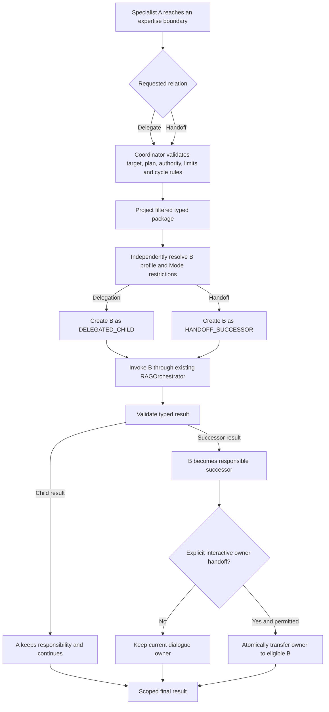

# Flow 10 — Delegation and Handoff

## Document purpose

This brief translates the **Delegation and Handoff** visual into a standalone business and architecture case for AI Fabric. It tells an implementation-analysis assistant why the flow exists, which product patterns it enables, which current framework capabilities must be reused, and what must be added.

It is not a UI specification and does not define an open-ended network of agents.

## Status and maturity

| Label | Meaning in this case |
| --- | --- |
| `CURRENT` | AI Fabric has a bounded single-specialist orchestration path, Mode restrictions, governed evidence/actions, conversational continuity, and application-owned authority. |
| `PROPOSED — P1/P2 dependency` | Versioned `SpecialistDefinition`, invocation identity, effective-capability resolution, canonical gateway ingress, typed results, execution state, and projected context must exist first. |
| `PROPOSED — P3` | Add controlled specialist-requested delegation and explicit responsibility handoff. |
| `LATER` | Add richer delegation policies only after one-level, bounded delegation and handoff are proven. |

## Executive purpose

Allow one specialist to involve another specialist without sharing or combining privileges.

There are two distinct business operations:

- **Delegation:** Specialist A keeps responsibility, asks Specialist B for a bounded typed result, receives it, and continues.
- **Handoff:** Specialist A pauses or completes its responsibility, and a separately authorized Specialist B becomes the successor responsible for continuing the case.

The distinction must be explicit because it changes state ownership, result routing, audit relationships, conversation behavior, and recovery.

> Delegation borrows bounded expertise. Handoff transfers responsibility. Neither operation transfers authority.

## Business problem

Real cases often cross a knowledge boundary. An account specialist may need a payment-risk assessment. A support specialist may need a policy interpretation. An intake specialist may discover that a regulated exception must move to a qualified specialist.

Weak designs handle this by:

- giving one model every action and every data source;
- sharing the full conversation among several agents;
- silently replacing the active agent in place;
- unioning parent and child permissions;
- treating a fixed workflow transition as model-directed delegation.

Those approaches make responsibility, evidence lineage, authorization, pending actions, and audit history ambiguous.

AI Fabric should instead create a new invocation with its own resolved specialist profile and an explicit relationship to the source invocation.

## Product types and business cases opened

- tiered support in which a general specialist asks a product expert and keeps the case;
- regulated escalation in which responsibility transfers to a qualified specialist;
- account servicing with delegated payment or fraud analysis;
- claims handling with medical, policy, or fraud expertise;
- cross-domain investigations with bounded evidence sharing;
- exception routing and case transfer;
- software operations triage that delegates diagnostics but keeps one incident owner;
- onboarding or case intake that hands off to a domain-specific owner;
- back-office copilots that request narrowly scoped compliance advice before recommending a next step.

## Scope

The first release should support:

- specialist-requested delegation to one permitted child at a time;
- explicit handoff to one permitted successor;
- registered and versioned target specialists;
- source `DelegationPolicy` plus plan and current application-policy validation;
- independent effective-capability resolution for every target;
- typed, filtered delegation or handoff packages;
- parent/child relation for delegation;
- predecessor/successor relation for handoff;
- depth, child-count, step, time, model-call, action-call, cost, and cancellation limits;
- cycle prevention;
- optional dialogue-owner transfer only for an explicitly declared interactive handoff;
- durable state when work waits, crosses a process, or must survive restart.

## Non-goals

- turning a fixed plan transition `A → B` into fake dynamic delegation;
- sharing one specialist's Mode, actions, evidence, working state, or conversation access with another;
- merging parent and child capabilities;
- changing the specialist or effective profile of an invocation in place;
- allowing arbitrary target names from model output;
- allowing a child to append to the external conversation;
- automatically transferring dialogue ownership for ordinary delegation;
- embedding a specialist call chain inside `SpecialistDefinition`;
- allowing recursive, unbounded delegation;
- building a distributed workflow product;
- defining handoff or review screens.

## Actors and trust boundaries

| Actor/component | Responsibility | Trust boundary |
| --- | --- | --- |
| Source specialist A | Identifies a bounded need for another registered specialist. | May request only targets declared in its policy; request is a proposal. |
| Target specialist B | Performs delegated child work or continues as a handoff successor. | Receives its own independently resolved profile and filtered input. |
| `AIExecutionCoordinator` | Validates the relationship, creates a new invocation, allocates limits, and routes the result. | Deterministic transition authority. |
| `SpecialistRegistry` | Resolves pinned specialist definitions and versions. | Only registered application-approved definitions may run. |
| `EffectiveCapabilitiesResolver` | Intersects B's definition, B's Mode, registries, and current authority. | A cannot grant B any capability. |
| Context/package projector | Maps only approved typed fields, evidence references, and safe summaries to B. | Prevents parent-context leakage. |
| `AIExecutionGateway` | Canonical submission/resume/cancel/status boundary. | Dynamic specialist calls do not bypass execution coordination. |
| Host application | Supplies identity, tenant, subject, authority, and business policy. | Final authority source. |
| Dialogue owner | Conducts the one external conversation when the execution is interactive. | A worker child is not automatically an external speaker. |
| Registered action handler | Performs a confirmed/reviewed domain operation. | Owns authorization, validation, transaction, effect, idempotency, and receipt. |

`Mode` remains unchanged and reusable. A and B may reference the same or different existing Modes, but each specialist's complete agent definition remains in its own `SpecialistDefinition`.

## Start-to-result reference flows

### Flow A — delegation

1. Specialist A is executing under a pinned effective profile.
2. A returns a typed request to delegate a bounded question to Specialist B.
3. The coordinator validates B against:
   - A's `DelegationPolicy.allowedSpecialistTargets`;
   - the resolved plan's permitted targets;
   - current application and tenant policy;
   - maximum depth, child count, remaining budgets, and cycle rules.
4. The coordinator independently resolves B's specialist definition, referenced Mode, registered capabilities, and current authority.
5. A package projector maps only approved typed input, safe summaries, and evidence references to B.
6. The coordinator creates B as `DELEGATED_CHILD` with `parentInvocationId = A`.
7. B runs through the existing `RAGOrchestrator` and returns a typed result.
8. The coordinator validates and maps the result back to A.
9. A continues as the responsible specialist. Dialogue ownership does not change.

### Flow B — handoff

1. Specialist A determines that responsibility should transfer to Specialist B.
2. A returns a typed handoff request.
3. The coordinator validates the target, declared handoff permission, plan transition, current authority, state, limits, and absence of a cycle.
4. The coordinator pauses or completes A and creates B as `HANDOFF_SUCCESSOR` with `predecessorInvocationId = A`.
5. B receives a filtered handoff package and an independently resolved effective profile.
6. If the plan explicitly declares an interactive owner handoff and B is `DIALOGUE_CAPABLE`, the coordinator transfers dialogue ownership atomically. Otherwise the existing owner remains.
7. B continues the case and produces the scoped outcome.

### Mermaid flow



## Architecture and component responsibilities

### Relationship model

Use explicit invocation relations:

| Relation | Link | Responsibility semantics |
| --- | --- | --- |
| `ROOT` | none | Initial specialist for an implicit plan or root step. |
| `PLAN_STEP` | `predecessorInvocationId` when sequential | Coordinator-authored plan progression, not delegation. |
| `DELEGATED_CHILD` | `parentInvocationId` | Child returns a typed result to the parent; parent remains responsible. |
| `HANDOFF_SUCCESSOR` | `predecessorInvocationId` | Successor takes responsibility; predecessor pauses or completes. |
| `CONVERSATION_MANAGER` | execution role and step relation | Optional dialogue/routing specialist, not an automatic parent of all work. |

Do not overload `parentInvocationId` for fixed sequence or handoff. The distinction must survive in diagnostics, durable state, and evaluation.

### `DelegationPolicy`

`DelegationPolicy` belongs in `SpecialistDefinition` because it describes which targets this agent may request. It should include:

- allowed target specialist references;
- allowed relationship types per target, if delegation and handoff differ;
- maximum depth;
- maximum children;
- optional result-mapping contract references;
- whether interactive owner handoff may be requested.

This declaration is only a requested maximum. Plan policy, application policy, target eligibility, current authority, and remaining execution limits may narrow it.

### Target authorization

Target resolution must be an intersection, not inheritance:

```text
source-declared allowed targets
∩ resolved plan targets and transition
∩ registered target versions
∩ current application and tenant policy
∩ current execution state and limits
```

After target admission, B's effective capabilities are independently computed:

```text
B SpecialistDefinition
∩ B referenced Mode restrictions
∩ registered evidence/action metadata
∩ current application authority
∩ child/successor budget and typed input allocation
```

A's privileges are not an input to that calculation.

### Filtered package

A target receives a new, immutable input package, not A's working memory:

- a typed child goal or successor responsibility;
- only mapped input fields;
- approved evidence references, not unrestricted retrieved content;
- an approved conversation summary or selected facts only if B permits conversation context;
- required subject and correlation references;
- the expected typed result contract;
- remaining deadline and allocated budgets;
- safe provenance for source invocation and mapping.

Hidden reasoning, scratch state, unrestricted transcript, credentials, unrelated evidence, and parent action catalogue are excluded.

### Result routing

- A delegated child result returns to A through a declared type mapping.
- A handoff successor result continues according to the successor's plan transitions.
- Invalid structured output causes a typed failure, bounded retry, review, or escalation.
- A child can return `NeedsUserInput`, but the request is routed through the execution's actual dialogue owner or host input adapter.
- A child action proposal remains a proposal and follows normal confirmation/review and governed action execution.

## CURRENT foundations reused

Reuse:

- `RAGOrchestrator` and `DefaultOrchestrationPipeline` for every specialist invocation;
- current Mode behavior and restrictions from `OrchestrationProperties`;
- `OrchestrationContext` for identity, tenant, subject, and authority;
- `ReadActionResolutionService` for bounded iterative information gathering;
- current retrieval, vector-space, privacy, PII, and access-policy enforcement;
- `AIActionRegistry`, action schemas, handlers, action drafts, and pending confirmation;
- `ChatSessionService` for the external conversation only;
- existing live-data synchronization for committed application changes.

Do not create a second action registry, retrieval path, model client, or specialist-to-specialist chat store.

## PROPOSED framework changes

### Public contracts

- Extend/finalize `DelegationPolicy` in `SpecialistDefinition`.
- Add typed `DelegationRequest` and `HandoffRequest` results or coordination directives.
- Add invocation relations `DELEGATED_CHILD` and `HANDOFF_SUCCESSOR`.
- Add explicit `parentInvocationId` and `predecessorInvocationId`.
- Add `FilteredSpecialistPackage<I>` or equivalent mapped invocation input.
- Add typed target references containing specialist ID/version constraints.
- Add stable target-rejection, depth-exceeded, cycle-detected, mapping-failed, and handoff-denied reasons.
- Add dialogue-owner transfer outcome to execution state.

### Coordination and execution

- Extend `AIExecutionCoordinator` to validate dynamic target requests.
- Create a new target invocation instead of mutating the current one.
- Allocate child/successor budgets below the remaining execution ceiling.
- Track delegation depth and total child count.
- Detect direct and indirect cycles.
- Apply separate result mappings for child return and successor continuation.
- Transfer dialogue ownership only as one atomic, validated state transition.
- Route all target invocations through the existing orchestrator.
- Resume only the waiting child/successor after typed input or review.

### Registration and configuration

- Validate every declared target reference.
- Validate relationship-specific permissions.
- Validate type compatibility between source request, target input, and return mapping.
- Validate that an owner-handoff target is `DIALOGUE_CAPABLE`.
- Validate maximum depth and children against application ceilings.
- Keep Mode unchanged and require every target definition to reference one existing Mode.
- Optionally require target version pinning for production profiles.

### Security, policy, and context

- Independently authorize B; do not copy A's effective capabilities.
- Reapply tenant, subject, privacy, evidence, and action policies to B.
- Project a separate `ApprovedConversationView` when B is allowed conversation context.
- Treat a model-emitted target name as an untrusted proposal.
- Prevent action/evidence/profile union across invocation relationships.
- Recheck current authority after any wait.
- Prevent a source specialist from selecting reviewer, dispatcher, callback, or credential details.
- Ensure one dialogue owner throughout an interactive turn.

### State and durability

- Track relationship, target version, resolved-profile hash, input/output references, budgets, state version, and deadlines.
- Persist parent/child and predecessor/successor links when the flow crosses a request or process boundary.
- Make creation and resume duplicate-safe with tenant-scoped idempotency keys.
- On restart, distinguish:
  - source waiting for a delegated child;
  - source completed after handoff;
  - successor ready, active, waiting, or terminal;
  - action already committed versus action outcome unresolved.
- Define cancellation propagation: cancel pending child work where possible, but never claim to undo a committed application action.

### Actions and human review

- A target may see/propose only actions in its own resolved profile.
- WRITE actions remain proposals until governed confirmation/review.
- Delegation cannot be used to bypass source action limits by choosing a broader child.
- A handoff does not validate or carry forward a pending action automatically; bind proposals to exact invocation/profile/version state and deliberately migrate or cancel them.
- A child or successor can request durable review only through registered policy.
- Correction or compensation remains a new governed action.

### Observability and evaluation

Record safe structured events for:

- source and target invocation IDs;
- relation type;
- requested and admitted target;
- validation result and stable rejection reason;
- source and target specialist/Mode/profile hashes;
- input and output mapping references;
- depth, child count, budgets, and deadlines;
- dialogue-owner change;
- result or wait state;
- evidence/action provenance without unrestricted data.

Evaluate:

- delegation/handoff accuracy;
- task completion compared with a larger single specialist;
- child-result usefulness;
- unnecessary target calls;
- privilege-isolation tests;
- cycle and budget stops;
- latency and cost;
- handoff completion and abandonment rates;
- user experience when ownership does or does not transfer.

### Testing

Add:

- target registration and schema compatibility tests;
- unauthorized target, stale version, and missing target tests;
- privilege non-union tests for evidence, READ actions, and WRITE actions;
- tenant and subject isolation tests;
- context-projection leakage tests;
- one-level and maximum-depth tests;
- direct and indirect cycle tests;
- child-count and total-budget tests;
- dialogue-owner transfer and non-transfer tests;
- delegated-child input wait/resume tests;
- handoff restart/recovery tests;
- pending-action binding tests across handoff;
- cancellation tests around model calls, reviews, and committed actions;
- regression tests proving fixed `A → B` plan steps are not represented as delegation.

## PROPOSED conceptual Java and configuration

These are analysis sketches, not current API claims.

```java
public enum InvocationRelation {
    ROOT,
    PLAN_STEP,
    DELEGATED_CHILD,
    HANDOFF_SUCCESSOR,
    CONVERSATION_MANAGER
}

public enum RequestedRelationship {
    DELEGATION,
    HANDOFF
}

public record SpecialistTargetPolicy(
    String specialistRef,
    Set<RequestedRelationship> allowedRelationships,
    Optional<String> inputMappingRef,
    Optional<String> resultMappingRef,
    boolean allowDialogueOwnerTransfer
) {}

public record DelegationPolicy(
    Set<SpecialistTargetPolicy> allowedTargets,
    int maximumDepth,
    int maximumChildren
) {}

public sealed interface SpecialistTransitionRequest
    permits DelegationRequest, HandoffRequest {}

public record DelegationRequest(
    String targetSpecialistRef,
    Object typedInput,
    String purposeCode
) implements SpecialistTransitionRequest {}

public record HandoffRequest(
    String targetSpecialistRef,
    Object typedHandoffInput,
    boolean requestDialogueOwnerTransfer,
    String reasonCode
) implements SpecialistTransitionRequest {}
```

```yaml
ai:
  specialists:
    account-resolver:
      version: "2"
      mode-ref: resolver
      delegation:
        maximum-depth: 1
        maximum-children: 2
        targets:
          payment-investigator:
            version: "1"
            relationships: [DELEGATION]
            input-mapping-ref: account-to-payment-investigation-v1
            result-mapping-ref: payment-finding-to-account-context-v1
            allow-dialogue-owner-transfer: false
          regulated-case-specialist:
            version: "1"
            relationships: [HANDOFF]
            input-mapping-ref: account-to-regulated-case-v1
            allow-dialogue-owner-transfer: true
```

The plan and current application policy must still permit each requested relationship. This configuration never grants authority by itself.

## Phased delivery and dependencies

### Phase 1 — contracts and static validation (`P1/P2`)

- Finalize specialist definitions, typed results, invocation identity, and effective capabilities.
- Register delegation target metadata without executing dynamic transitions.
- Validate schemas, target versions, and limits at startup.

### Phase 2 — one-level delegation (`P3`)

- Support one delegated child.
- Implement independent target authorization and filtered package projection.
- Return a typed child result to the parent.
- Add depth/child/budget accounting and cycle prevention.
- Keep dialogue ownership unchanged.

### Phase 3 — controlled handoff (`P3`)

- Add successor invocation semantics.
- Define predecessor completion/pause rules.
- Implement explicit atomic owner transfer for eligible interactive cases.
- Add durable recovery, pending-action handling, and typed waits.

### LATER

- Consider multiple children or deeper delegation only after isolation, value, cost, and recovery evidence are strong.
- Do not introduce open-ended peer chat.

## Acceptance criteria

1. Delegation and handoff are different typed operations.
2. A fixed plan transition remains coordinator-authored and is not mislabeled as delegation.
3. Every target is registered, permitted by the source policy, allowed by the plan, and authorized by current application policy.
4. The target receives an independently resolved profile and referenced Mode.
5. No parent/child or predecessor/successor privilege union occurs.
6. The target receives only a filtered typed package.
7. A delegated child returns a typed result to its parent, which remains responsible.
8. A handoff creates a successor invocation, not an in-place profile mutation.
9. Dialogue ownership changes only through an explicit, atomic, plan-permitted handoff to a dialogue-capable target.
10. Depth, child count, total budget, timeout, cancellation, and cycles are enforced.
11. Worker targets cannot append to the external conversation.
12. Action proposals remain bound to exact invocation/profile/version state.
13. Restart and duplicate delivery do not create duplicate child/successor work or replay committed actions.
14. Audit evidence can explain relationship, target admission, context mapping, and result routing.

## Failure modes and edge cases

| Scenario | Required handling |
| --- | --- |
| Source requests an undeclared target | Reject with a stable reason. |
| Plan permits B but A's policy does not | Reject; plan order never grants source delegation authority. |
| A permits B but current tenant policy does not | Reject during target authorization. |
| B has broader actions than A | Resolve B independently; do not assume that source authorization permits those actions. |
| Input mapping exposes data B cannot see | Project and validate against B's effective scope; fail closed. |
| B delegates back to A | Detect the cycle and stop or escalate. |
| Child times out | Apply parent/plan failure policy; preserve partial evidence and remaining budget. |
| Child requests user input | Pause only the child and route the typed request through the actual dialogue owner or host adapter. |
| Handoff target is not dialogue-capable | Continue without owner transfer or reject the requested interactive handoff according to plan policy. |
| A has a pending WRITE proposal at handoff | Do not silently transfer it; cancel, retain with A, or create a separately validated successor proposal. |
| Authorization changes while waiting | Reauthorize before resume; fail closed if the target or action is no longer permitted. |
| Cancellation arrives after a domain commit | Stop future AI work, preserve the committed receipt, and never claim the business effect was undone. |
| Duplicate target request arrives | Deduplicate by execution/invocation/request identity. |

## Questions for the implementation-analysis assistant

1. Which current orchestration result or intent types can carry a typed delegation/handoff request without introducing free-form control parsing?
2. Where should relationship validation live relative to `RAGOrchestrator` and plan coordination?
3. Which current context objects are safe to map into child input, and which require a new projection service?
4. How should specialist version constraints be represented and pinned?
5. Which current action-draft and pending-confirmation records need invocation/profile binding before handoff is safe?
6. What is the smallest durable schema for parent/child and predecessor/successor recovery?
7. How should cycle detection work across fixed steps, delegated children, and handoff successors?
8. What cancellation behavior is already available, and which boundaries need explicit state?
9. Can current authorization services independently resolve B without inheriting A's action catalogue?
10. Which reference demo best proves the difference between “borrow expertise” and “transfer responsibility”?

The requested analysis should map proposed types to modules/packages, identify reusable implementation, highlight compatibility and persistence impact, propose security tests, and recommend an incremental pull-request sequence. Do not implement the extension until these choices are reviewed.

## References

- Visual: [`../ai-fabric-flow-visuals/10-delegation-and-handoff.svg`](../ai-fabric-flow-visuals/10-delegation-and-handoff.svg)
- Presentation PNG: [`../ai-fabric-flow-visuals/10-delegation-and-handoff.png`](../ai-fabric-flow-visuals/10-delegation-and-handoff.png)
- Proposal: `Product-evolution-proposal.md`, especially sections 3, 5, 8.3–8.5, 9, 12, 14 (`P3`), and 15.
