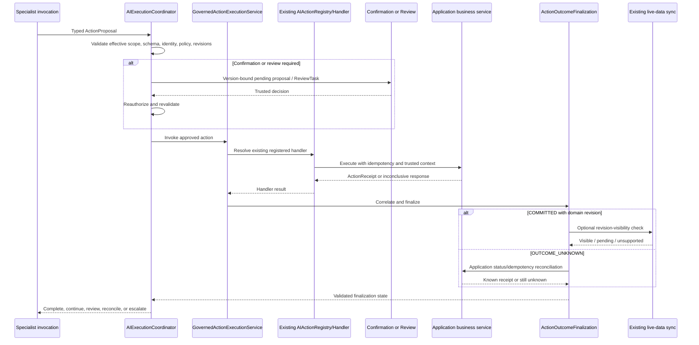

# Flow 11 — Governed Action Lifecycle

## Document purpose

This brief converts the **Governed Action Lifecycle** visual into a standalone business and architecture case. It is written for an implementation-analysis assistant that knows AI Fabric and must determine how to extend the current action foundation for specialist-defined, coordinated, durable work.

The goal is not to move business operations into AI Fabric. The goal is to make the boundary from model proposal to application-owned outcome explicit, safe, observable, and resumable.

## Status and maturity

| Label | Meaning in this case |
| --- | --- |
| `CURRENT` | AI Fabric already discovers registered actions, validates metadata and typed parameters, checks permissions, supports confirmation, invokes application handlers, stores immediate pending actions, and can produce optional post-action LLM facts. |
| `CURRENT GAP` | The current lifecycle needs a consistently enforced link to the resolved specialist/plan/profile and a typed authoritative outcome/finalization model for coordinated, durable work. |
| `PROPOSED — P0/P1` | Add `GovernedActionExecutionService` over the existing registry/handler path, pin proposal state, revalidate before invocation, and accept typed application-issued receipts. |
| `PROPOSED — P2/P3` | Add outcome-driven plan transitions, durable review, explicit uncertain-outcome reconciliation, and optional live-sync revision visibility. |
| `LATER` | Add broader compensation/reconciliation adapters only after application demand; never add a generic rollback. |

## Executive purpose

Turn a natural-language action request into a business result that is controlled and evidenced by the application.

The model may identify an approved action and propose typed parameters. AI Fabric governs discovery, scope filtering, validation, confirmation/review, registered-handler invocation, receipt correlation, and continuation. The host application still owns current authorization, business validation, transactions, side effects, idempotency, and the authoritative statement of what happened.

> The model proposes. AI Fabric governs. The application commits and reports the truth.

The result must distinguish:

- `COMMITTED`;
- `REJECTED`;
- `FAILED_BEFORE_COMMIT`;
- `OUTCOME_UNKNOWN`.

An uncertain WRITE is reconciled or reviewed. It is never replayed blindly.

## Business problem

An AI answer can be probabilistic. A business mutation cannot be treated that way.

Products that let a user say “add this product,” “change the address,” “open the claim,” or “resolve this case” need a lifecycle that answers:

- Was this action actually available to this specialist?
- Is the user or machine initiator currently authorized?
- Are parameters valid against the registered schema?
- Does policy require confirmation or a qualified reviewer?
- Did the application transaction commit?
- If the response was lost, is the outcome known?
- Is the committed revision visible to later retrieval?
- May the plan safely continue?

Without explicit outcome semantics, a model explanation, HTTP success, exception absence, or post-action text can be mistaken for business truth. That creates duplicate writes, false confirmations, unsafe retries, and misleading downstream decisions.

## Product types and business cases opened

- shopping and order actions;
- account servicing and payment operations;
- claims operations;
- case creation and case updates;
- provisioning and access workflows;
- customer-support copilots that propose changes;
- back-office operations assistants;
- proactive recommendations that become reviewable action proposals;
- multi-specialist plans that continue only after an authoritative result;
- regulated processes that require human approval and immutable outcome evidence.

## Scope

The target lifecycle covers:

- action catalogue filtering by the resolved specialist profile;
- typed action proposal and parameter schema validation;
- binding proposal/draft/pending state to exact versions and authority context;
- immediate confirmation through the current pending-action path;
- durable review when work crosses a request, process, actor, or time boundary;
- final revalidation before handler invocation;
- invocation through the current `AIActionRegistry`/`AIActionHandler` path;
- an application-issued typed `ActionReceipt`;
- immutable receipt validation/deduplication;
- a separate `ActionFinalizationRecord`;
- explicit unknown-outcome reconciliation;
- optional domain-revision visibility through the existing live-data synchronization path;
- deterministic plan continuation;
- safe, read-only post-action facts or explanation.

## Non-goals

- creating a second action registry;
- moving domain authorization or transactions into AI Fabric;
- allowing a specialist, plan, model, reviewer adapter, or request to define a new action;
- treating model text or post-action LLM facts as commit evidence;
- blindly retrying an uncertain WRITE;
- performing generic rollback;
- mutating an application-issued receipt during reconciliation;
- introducing a direct post-action indexing path;
- letting a conversation manager execute or approve an action;
- turning compensation into a callback; compensation is a new governed application action;
- designing confirmation or review screens.

## Actors and trust boundaries

| Actor/component | Responsibility | Trust boundary |
| --- | --- | --- |
| Specialist invocation | Produces an `ActionProposal` from its visible, effectively authorized catalogue. | Proposal is non-authoritative and cannot execute itself. |
| `EffectiveCapabilitiesResolver` | Produces the exact action sets visible/requestable/proposable for the invocation. | Intersects definition, Mode, registry metadata, and current authority. |
| `AIActionRegistry` (`CURRENT`) | Discovers annotation-defined beans and contributors, snapshots handlers/metadata, and exposes registered action definitions. | Existing source of registered actions; no duplicate registry. |
| `AIActionHandler` (`CURRENT`) | Validates permission and confirmation, executes the application action, and may produce post-action facts. | Existing governed invocation path to adapt, not replace. |
| `PendingActionStore` (`CURRENT`) | Holds immediate pending confirmation state keyed to conversation and owner. | Appropriate for active confirmation, not a general durable review queue. |
| `GovernedActionExecutionService` (`PROPOSED`) | Applies final framework checks, verifies confirmation/review, invokes the registered handler, validates receipts, and starts finalization. | Framework-owned action lifecycle façade. |
| Host application handler/service | Rechecks business authority, validates invariants, applies the transaction/effect, enforces idempotency, and returns the authoritative receipt. | Sole authority for business outcome. |
| Human confirmer/reviewer | Approves, rejects, corrects, or escalates within current authority. | Identity/authority must be established by the host application. |
| `ActionOutcomeFinalization` | Records receipt or uncertainty, coordinates visibility, and emits a declared continuation outcome. | Cannot change the application's asserted business outcome. |
| Existing live-data synchronization | Makes committed entity revisions available as derived vector evidence. | Database/source tables remain authoritative. |

`Mode` keeps its current meaning and restrictions. `SpecialistDefinition.actionScope.proposableWriteActions` narrows which registered WRITE actions one agent may propose; it never grants permission.

## Start-to-result reference flow

### Prose flow

1. A specialist sees only the WRITE actions permitted by its resolved effective profile.
2. The model proposes one registered action with typed parameters.
3. AI Fabric validates action identity/version, access mode, parameter schema, specialist scope, referenced Mode restrictions, source revisions, identity, tenant, subject, and current authority.
4. AI Fabric stores a version-bound draft or pending proposal when confirmation or review is required.
5. The active user confirms through the existing immediate confirmation lifecycle, or a durable `ReviewTask` is persisted and later decided through `ReviewDecisionGateway`.
6. Immediately before execution, AI Fabric revalidates authority, proposal hash, action metadata, versions, expiry, source revisions, and policy.
7. `GovernedActionExecutionService` invokes the registered handler through the existing action infrastructure.
8. The application service performs current domain authorization, validation, idempotency, transaction, and side effect.
9. The application returns an authoritative `ActionReceipt`, or the invocation ends without a conclusive receipt.
10. AI Fabric validates, correlates, deduplicates, and records an immutable receipt. If none is available, it records an effective `OUTCOME_UNKNOWN` finalization.
11. For `OUTCOME_UNKNOWN`, AI Fabric uses an application status/idempotency reconciliation contract or creates outcome review. It never replays the WRITE blindly.
12. For a committed result, finalization may wait for a receipt-supplied domain revision to become visible through the existing live-data sync adapter if a later retrieval step requires it.
13. The coordinator follows only the transition declared for the finalized outcome.
14. Optional post-action LLM facts may explain the safe result; they cannot alter the receipt, authorize another action, or become business truth.

### Mermaid sequence



## Architecture and component responsibilities

### Existing action registry and handler path

The current `AIActionRegistry` already discovers annotation beans plus contributors and snapshots action handlers and metadata. Current validation covers action annotations such as permission, confirmation, facts, and typed `@Param` schemas. `AIActionHandler` already participates in permission validation, confirmation, execution, and optional post-action LLM facts.

The existing orchestration stages are also part of this path:

- `OrchestrationPolicyResolutionStep` resolves authoritative request policy before intent handling;
- `IntentHandlingStep` checks Mode action capability and anonymous access, performs registry lookup,
  calls handler permission validation, separates trusted/context parameters from required executable
  parameters, manages drafts and confirmation through `PendingActionStore`, invokes the handler,
  and selects RAG fallback or post-action generation.

The proposal must consolidate and adapt this path. It must not duplicate registration,
annotations, policy resolution, parameter schemas, permission checks, drafts, confirmation,
handler discovery, execution, RAG fallback, or post-action generation.

### `GovernedActionExecutionService`

This service sits over the current action infrastructure and owns the framework lifecycle around invocation:

- receive only an already resolved, effectively authorized proposal;
- repeat framework-policy and schema validation;
- verify pending confirmation or review state;
- create stable action invocation and idempotency references;
- invoke the existing registered handler;
- correlate, validate, and deduplicate the application result;
- start outcome finalization;
- return only a finalized state to the coordinator.

It does **not**:

- implement application business operations;
- decide that a transaction committed;
- fabricate an application receipt;
- bypass the existing registry/handler;
- run arbitrary post-action callbacks.

### Application handler/service

The registered application action remains responsible for:

- current domain authorization;
- business validation and invariants;
- transaction and side effect;
- application idempotency;
- authoritative outcome and affected resource;
- domain revision and domain/outbox event when available.

### Receipt versus finalization

Keep two records:

- `ActionReceipt`: immutable application-issued statement of the business outcome.
- `ActionFinalizationRecord`: AI Fabric's evolving lifecycle record for correlation, missing-receipt uncertainty, visibility, warnings, reconciliation, and declared plan transition.

Reconciliation may update finalization and attach a later receipt. It must not mutate a receipt previously issued by the application.

### Post-action facts

The current optional post-action LLM-facts behavior can remain as an explanation/observation feature if:

- it receives only safe result fields;
- it is clearly downstream of authoritative outcome handling;
- it cannot change outcome or receipt;
- it cannot invoke a new action outside a fresh governed proposal;
- its failure does not reclassify a committed operation as failed.

## CURRENT foundations reused

- annotation-based `@AIAction`/`@ActionExecute` application integration;
- `AIActionRegistry` action discovery, contributors, snapshots, handlers, and metadata;
- action permission, confirmation, facts, and typed-parameter validation;
- `AIActionHandler` permission checks, confirmation, handler execution, and optional post-action facts;
- `PendingActionStore` for immediate conversation/owner-scoped confirmation;
- `OrchestrationContext` and application-supplied identity/tenant/authority;
- current Mode action behavior;
- `OrchestrationPolicyResolutionStep` for authoritative policy resolution;
- `IntentHandlingStep` for Mode/anonymous checks, registry lookup, parameter handling, drafts,
  confirmation, handler invocation, fallback, and post-action generation;
- current action-draft and intent/orchestration path;
- `RAGOrchestrator` and existing pipeline;
- application services as action executors;
- existing transaction-aware live-data synchronization after successful domain changes.

## PROPOSED framework changes

### Public contracts

- Add `GovernedActionExecutionService`.
- Add stable `ActionInvocationId` and idempotency reference.
- Add typed `ActionExecutionOutcome`.
- Add application-issued `ActionReceipt<T>`.
- Add `ActionFinalizationRecord` and finalization status/visibility types.
- Add action receipt/finalization references to `AIExecutionResult`.
- Add a reconciliation SPI or application status-query contract for `OUTCOME_UNKNOWN`.
- Add stable finish/failure reasons for confirmation required, review required, denied, stale, committed, rejected, failed-before-commit, unknown, and finalization warning.

`GovernedActionExecutionService` should be a consolidation/adaptation boundary around the current
policy and intent/action path, not an alternate path beside `IntentHandlingStep`.

### Coordination and execution

- Make every action catalogue use the same resolved specialist action set used at final invocation.
- Bind action proposal/draft/pending state to execution, invocation, step, specialist, prompt/schema versions, referenced Mode, resolved-profile hash, action definition version, source revisions, and proposal hash.
- Revalidate immediately before handler invocation.
- Route approved execution only through `GovernedActionExecutionService`.
- Prevent plan success transitions until `ActionOutcomeFinalization` is valid.
- Map each outcome to a declared transition:
  - `COMMITTED` → committed/success path;
  - `REJECTED` → rejection path;
  - `FAILED_BEFORE_COMMIT` → declared retry/failure path;
  - `OUTCOME_UNKNOWN` → reconciliation, outcome review, escalation, or terminal unknown.
- Do not retry after `COMMITTED` or blindly after `OUTCOME_UNKNOWN`.

### Registration and configuration

- Validate specialist WRITE action references against the existing registry and access metadata.
- Add receipt-capability metadata for action handlers or a versioned adapter path.
- Configure confirmation/review/reconciliation policies by registered references only.
- Configure retry only for outcomes proven safe, preserving the same idempotency contract.
- Keep Mode configuration unchanged; Mode remains an additional restriction source.
- Support a compatibility profile for current Mode-only action use without claiming stronger receipt guarantees than the underlying handler provides.

### Security, policy, and context

- Resolve trusted identity, tenant, subject, and authority from application context, not model/request parameters.
- Reauthorize after confirmation/review waits.
- Treat model parameters, confirmation text, and reviewer corrections as typed untrusted inputs until validated.
- Prevent the model from selecting dispatchers, reviewers, callbacks, credentials, or return endpoints.
- Check separation-of-duty and current reviewer authority through application SPI.
- Expose only safe receipt/result fields to later model observations.
- Ensure all proposal, pending, receipt, and finalization lookups are tenant scoped.

### State and durability

- Immediate in-request confirmation may continue using `PendingActionStore`.
- Persist review tasks before dispatch when work crosses a boundary.
- Persist action invocation, receipt, and finalization state for asynchronous, reviewed, uncertain, coordinated, or recovery-sensitive writes.
- Enforce uniqueness for tenant-scoped idempotency and receipt correlation.
- Use optimistic versions and legal state transitions.
- Make duplicate confirmation, review decision, handler callback, receipt, and reconciliation events safe.
- Keep an unresolved outcome explicit across restart.
- Preserve committed outcome when later indexing, notification, or explanation fails.

### Actions and human review

- Keep action definition and execution in registered application code.
- Reuse current immediate confirmation for active conversations.
- Use `ReviewTaskStore`, `ReviewTaskDispatcher`, `ReviewerAuthorizer`, and `ReviewDecisionGateway` for durable human review.
- Allow typed reviewer correction to create a revised proposal; do not rewrite historical evidence.
- Treat compensation or correction after commit as a new registered action with new authorization, idempotency, and review.
- Permit post-outcome review for unknown, conflicting, high-impact, or policy-sampled results.

### Observability and evaluation

Record safe structured events for:

- proposal ID/hash and action definition version;
- execution/invocation/step/specialist/profile references;
- policy and schema validation decisions;
- confirmation/review lifecycle;
- action invocation and idempotency references;
- handler start/end without sensitive parameters;
- receipt outcome and correlation;
- finalization and visibility state;
- reconciliation attempts and results;
- plan continuation;
- warnings when the business action committed but explanation/index visibility needs recovery.

Evaluate:

- proposal-to-confirmation and proposal-to-commit conversion;
- denial/stale/review rates;
- duplicate-prevention evidence;
- receipt completeness;
- unknown-outcome frequency and resolution time;
- visibility lag where supported;
- post-action fact accuracy against safe receipt data;
- committed-action false-failure rate, which should be zero;
- policy bypass and tenant-isolation test results.

### Testing

Add:

- registration tests proving one registry/handler path is used;
- action-scope filtering tests from prompt exposure through final invocation;
- parameter/schema and current-authority tests;
- stale proposal, changed policy, changed action version, and changed source revision tests;
- immediate confirmation compatibility tests;
- durable review persist-before-dispatch and idempotent decision tests;
- receipt correlation, deduplication, and immutability tests;
- all four outcome transition tests;
- timeout/no-receipt tests producing `OUTCOME_UNKNOWN`;
- reconciliation tests proving no blind retry;
- revision-visibility supported/unsupported/timeout tests;
- tests proving a committed action remains committed when later sync, notification, or LLM explanation fails;
- cancellation tests before and after application commit;
- tenant isolation and safe-observation tests;
- compensation-as-new-action tests.

## PROPOSED conceptual Java and configuration

These contracts are design sketches, not current API claims.

```java
public enum ActionExecutionOutcome {
    COMMITTED,
    REJECTED,
    FAILED_BEFORE_COMMIT,
    OUTCOME_UNKNOWN
}

public record ActionReceipt<T>(
    String actionInvocationId,
    String actionId,
    String actionVersion,
    String idempotencyKey,
    ActionExecutionOutcome outcome,
    Optional<DomainReference> affectedResource,
    Optional<String> domainRevision,
    Optional<T> safeResult,
    Optional<String> safeFailureCode,
    Instant issuedAt
) {}

public record ActionFinalizationRecord(
    String actionInvocationId,
    ActionExecutionOutcome effectiveOutcome,
    Optional<ActionReceiptReference> receipt,
    Optional<String> domainRevision,
    RevisionVisibilityStatus revisionVisibility,
    ActionFinalizationStatus status,
    List<String> warnings
) {}

public interface GovernedActionExecutionService {
    ActionFinalizationReference execute(
        AuthorizedActionProposal proposal,
        TrustedActionExecutionContext context
    );
}

public interface ActionOutcomeReconciler {
    ReconciliationResult reconcile(
        ActionInvocationReference invocation,
        String idempotencyKey,
        TrustedActionExecutionContext context
    );
}
```

```yaml
ai:
  specialists:
    order-assistant:
      version: "1"
      mode-ref: shopping
      actions:
        proposable-write:
          - add_to_cart
          - submit_order
      human-control:
        action-review-policy-refs:
          add_to_cart: active-user-confirmation
          submit_order: order-approval

  actions:
    submit_order:
      receipt-contract: SubmitOrderReceipt
      reconciliation-ref: order-status-by-idempotency-v1
      retry:
        allowed-outcomes: [FAILED_BEFORE_COMMIT]
        maximum-attempts: 1
      revision-visibility:
        required-before-next-step: true
        timeout: 5s
```

The precise configuration syntax may differ. The key requirement is that action registration remains authoritative and the specialist only requests a narrower subset.

## Phased delivery and dependencies

### Phase 1 — current path audit (`P0`)

- Map registry, contributors, handler, permission, confirmation, facts, draft, and pending-action behavior.
- Prove all action catalogue and invocation paths can use one effective-capability filter.
- Define exact ownership between AI Fabric and the application.
- Define receipt and finalization semantics before adding durable coordination.

### Phase 2 — synchronous specialist action (`P1`)

- Add `GovernedActionExecutionService` over the current handler path.
- Pin proposal state to specialist/Mode/profile/action versions.
- Add final revalidation.
- Support typed receipts and synchronous finalization.
- Reuse current live-data synchronization.

### Phase 3 — plan and durable governance (`P2/P3`)

- Add outcome-specific plan transitions.
- Add durable review.
- Add unknown-outcome reconciliation.
- Add optional revision-visibility barriers.
- Add restart, duplicate-safe callback, and recovery tests.

### LATER

- Add broader domain-specific reconciliation or workflow adapters only through narrow contracts.
- Never introduce generic rollback or direct post-action indexing.

## Acceptance criteria

1. The current `AIActionRegistry` and handler path remain the only action registration/invocation foundation.
2. A specialist sees and proposes only WRITE actions in its resolved effective profile.
3. Proposal, draft, confirmation/review, invocation, receipt, and finalization share stable correlation and version pins.
4. Authority, policy, schema, and freshness are checked again immediately before invocation.
5. Only the application handler may assert a committed, rejected, or failed-before-commit business outcome.
6. No model text, transport status, missing exception, or post-action facts are treated as commit evidence.
7. `OUTCOME_UNKNOWN` is explicit and never triggers blind replay.
8. A receipt is immutable; finalization carries later reconciliation and visibility progress.
9. Plan continuation is determined from a validated finalization state.
10. A committed operation stays committed when sync, notification, or explanation later fails.
11. Compensation/correction is a fresh governed action.
12. Immediate confirmation remains compatible; durable review is added only where necessary.
13. The database/application service remains the final source of business truth.
14. Safe audit evidence explains the complete proposal-to-outcome lifecycle.

## Failure modes and edge cases

| Scenario | Required handling |
| --- | --- |
| Model proposes an unregistered or out-of-scope action | Reject before pending state or execution. |
| Action was allowed when proposed but denied after review | Fail closed during final revalidation. |
| Typed parameters are corrected by a reviewer | Validate corrections and create a revised proposal; preserve original history. |
| Handler returns `COMMITTED` twice | Deduplicate by invocation/idempotency/receipt identity. |
| Handler response is lost | Record `OUTCOME_UNKNOWN`; query application status or enter review. |
| Handler proves failure before commit | Retry only under declared policy and same idempotency contract. |
| Live-sync visibility is delayed | Keep business outcome committed; mark visibility pending/warning. |
| Post-action explanation fails | Preserve the receipt/finalization and return a warning or recovery-required state. |
| Cancellation arrives after commit | Stop future coordination; do not claim rollback. |
| Reviewer rejects after commit | The operation cannot be retroactively rejected; route to outcome review or a fresh corrective action. |
| Receipt domain revision is absent | Skip the visibility barrier or use action-specific reconciliation; never invent a revision. |
| Reconciliation remains inconclusive | Retain `OUTCOME_UNKNOWN`, escalate, or terminate with explicit unknown evidence. |

## Questions for the implementation-analysis assistant

1. What exact return contracts do current `AIActionHandler` and registered handlers expose, and how can typed receipts be introduced compatibly?
2. Which responsibilities in `OrchestrationPolicyResolutionStep` and `IntentHandlingStep` should
   remain where they are, which should be extracted behind `GovernedActionExecutionService`, and
   how can that refactoring avoid a second path?
3. Where are action catalogues built for intent/prompt exposure, and can one `EffectiveCapabilitiesResolver` cover every path?
4. Which current draft/pending records must gain specialist, Mode, profile, action-version, proposal-hash, and source-revision pins?
5. Should `GovernedActionExecutionService` adapt `AIActionHandler` directly or sit at another existing service boundary?
6. How should current optional post-action facts be separated from authoritative receipt/finalization data?
7. Which actions can supply domain revisions and idempotent status checks today?
8. What persistence is required for receipt/finalization without forcing durable storage on simple synchronous flows?
9. Which stable outcome and finalization states best fit existing result types?
10. How can tests prove no second indexing path is introduced?
11. What is the migration strategy for legacy handlers that cannot yet issue a strong typed receipt?

The analysis response should map current action classes and proposed additions to modules/packages, distinguish confirmed current behavior from assumptions, identify compatibility and persistence impact, specify security tests, and propose incremental pull requests. It should not implement this lifecycle before the ownership and migration rules are approved.

## References

- Visual: [`../ai-fabric-flow-visuals/11-governed-action-lifecycle.svg`](../ai-fabric-flow-visuals/11-governed-action-lifecycle.svg)
- Presentation PNG: [`../ai-fabric-flow-visuals/11-governed-action-lifecycle.png`](../ai-fabric-flow-visuals/11-governed-action-lifecycle.png)
- Proposal: `Product-evolution-proposal.md`, especially sections 2, 3, 5.5, 7.2–7.3, 9, 10, 12, 14, and 15.
