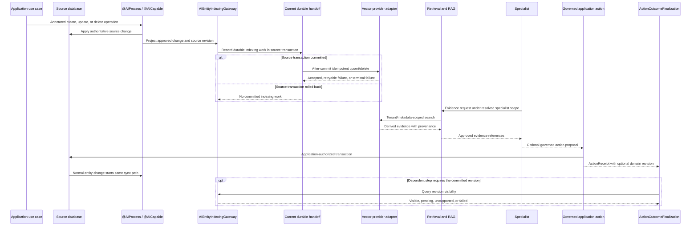

# Flow 12 — Live Data Intelligence Loop

## Document purpose

This brief translates the **Live Data Intelligence Loop** visual into a standalone business and architecture case for AI Fabric. It is intended for an implementation-analysis assistant that understands the framework and must preserve its current live-data differentiator while connecting it safely to specialist-defined and coordinated execution.

This is primarily a **current capability plus integration and hardening case**, not a proposal to rebuild live synchronization.

## Status and maturity

| Label | Meaning in this case |
| --- | --- |
| `CURRENT DIFFERENTIATOR` | Annotation-driven, transaction-aware live synchronization already exists. Source tables remain authoritative; vector content is a derived, rebuildable projection. |
| `CURRENT` | `@AICapable`, `@AIProcess`, `AIEntityIndexingGateway`, versioned class-free `AIIndexDocument`, after-commit provider work, durable queue handoff, retries/dead-letter, stable IDs, idempotent delete, stale update/delete protection, backfill/rebuild support, and metrics already form the core lifecycle. |
| `PROPOSED — P0/P1 integration` | Make specialist evidence scope, evidence provenance, and action/execution correlation use the existing live-data contracts consistently. |
| `PROPOSED — P2/P3 hardening` | Add explicit cross-flow revision visibility, receipt/finalization linkage, provider-capability normalization, and stronger reconciliation/diagnostic contracts where current APIs do not expose them. |
| `LATER` | Add broader source adapters or strict cross-system freshness guarantees only when provider and adopter requirements justify them. |

The implementation assistant must first audit current code and documentation. Anything already supported should be reused and clarified rather than recreated behind a new API.

## Executive purpose

Keep AI-visible evidence aligned with approved application truth without asking each product team to maintain a second manual indexing workflow.

A normal application create, update, or delete succeeds in the domain transaction. AI Fabric observes the declared application process, produces the approved class-free index document, and updates the derived vector evidence through the configured synchronization strategy. Retrieval and specialist reasoning then use evidence with source identity and revision provenance.

The central invariant is:

> Application database/source tables = system of record. Vector store = derived, policy-scoped, rebuildable evidence.

The specialist never owns synchronization. A plan never grants access to indexed data. Retrieval remains constrained by the specialist definition, existing Mode restrictions, tenant policy, and current authority.

## Business problem

An AI assistant becomes unreliable when its searchable evidence lags behind the application:

- a changed product price is answered from an older vector;
- a deleted policy still appears in retrieval;
- an account status update commits, but a later plan step reads a prior revision;
- a provider retry applies an older update after a newer one;
- an action is reported as failed because indexing visibility was delayed even though the business transaction committed.

Many teams solve this with custom event listeners, indexing endpoints, schedulers, and provider-specific repair jobs. That duplicates business lifecycle logic and makes correctness depend on every application feature remembering to update a second store.

AI Fabric's current annotation-driven sync is valuable because it connects ordinary Java application changes to a governed evidence lifecycle. The proposed evolution should make that capability first-class for specialists, plans, action receipts, and diagnostics without turning the vector store into the source of truth.

## Product types and business cases opened

- live product-catalog and inventory assistants;
- account and payment operations copilots;
- policy and compliance assistants;
- claims and case intelligence;
- support assistants grounded in current ticket or customer state;
- recommendation systems that react to approved entity changes;
- proactive intelligence triggered by domain changes;
- multi-step plans that must retrieve a committed revision before continuing;
- regulated applications that need source/revision provenance for AI evidence;
- applications using different vector providers while keeping one richer AI Fabric evidence contract.

## Scope

This case covers:

- annotation-declared searchable entities and fields;
- application-service process interception;
- commit-aware create/update/delete synchronization;
- stable source identity and revision ordering;
- durable handoff, retry, dead-letter, backfill, and rebuild;
- provider-adapter invocation through existing contracts;
- tenant and metadata scoping;
- derived evidence retrieval;
- provenance from source entity/revision to evidence reference;
- integration with specialist evidence scope;
- optional action-receipt-to-revision visibility;
- diagnostics and reconciliation of source-versus-derived projection state.

## Non-goals

- making the vector store authoritative;
- writing directly to the vector provider after an AI action;
- replacing `@AICapable`, `@AIProcess`, or `AIEntityIndexingGateway`;
- building another change-data-capture or event-broker product;
- requiring every application to provide a strong read-after-write guarantee from every provider;
- letting a model choose synchronization strategy, provider, tenant metadata, revision, or index target;
- broadening specialist evidence scope because data exists in an index;
- treating delayed indexing as a failed domain transaction;
- duplicating domain entities in AI execution storage;
- coupling core synchronization to a product UI.

## Actors and trust boundaries

| Actor/component | Responsibility | Trust boundary |
| --- | --- | --- |
| Application entity annotated `@AICapable` | Declares the approved searchable projection and metadata. | Annotation/configuration is application-owned; undeclared fields are not automatically exposed. |
| Application service method annotated `@AIProcess` | Connects a successful application create/update/delete to the indexing lifecycle. | Business transaction remains application-owned. |
| Source database/tables | Hold authoritative entity state and revisions. | Final business truth. |
| `AIEntityIndexingGateway` | Receives the normalized entity change and applies current synchronization semantics. | Existing canonical indexing entry; do not bypass it. |
| Source-transaction queue/worker | Hands provider work off after commit and provides retry/dead-letter behavior. | Derived projection delivery; never rewrites source truth. |
| Vector-provider adapter | Stores and searches approved derived documents. | Provider behavior may vary and must be normalized or exposed as capabilities. |
| Retrieval/RAG | Finds evidence under vector-space, tenant, metadata, privacy, Mode, and specialist scope. | Retrieval result is evidence, not authorization. |
| Specialist invocation | Uses approved evidence to answer, recommend, or propose an action. | Cannot see all indexed data by default. |
| Application action handler | Commits a governed change and may issue a domain revision in `ActionReceipt`. | Sole authority for the action outcome. |
| `ActionOutcomeFinalization` (`PROPOSED`) | Optionally checks whether a receipt revision is visible before a dependent retrieval step. | Cannot change the committed business outcome. |

## Start-to-result reference flow

### Prose flow

1. An application service creates, updates, or deletes a normal domain entity.
2. `@AICapable` defines which entity content and metadata may be projected.
3. `@AIProcess` connects the service operation to the existing indexing lifecycle.
4. During the source transaction, AI Fabric projects the approved change into the versioned
   class-free index document and records the durable indexing work with that transaction.
5. A rollback commits neither the source change nor its indexing work. A successful commit makes
   the indexing work durable.
6. After commit, the current handoff invokes the configured provider adapter. Retries and
   dead-letter behavior handle transient failure.
7. Stable IDs, revisions, stale-event protection, and idempotent delete keep reordered or duplicate work from reintroducing older state.
8. A specialist or plan step later requests evidence.
9. Retrieval intersects the specialist's evidence declaration, current Mode restrictions, tenant/privacy/application policy, and provider metadata.
10. The specialist receives evidence references carrying safe source and projection provenance.
11. It returns a grounded answer, recommendation, or governed action proposal.
12. If an approved action commits, the application-issued receipt may include a domain revision.
13. The normal `@AIProcess`/live-sync path starts the projection loop again.
14. If the declared next step requires that revision to be searchable, finalization uses a capability-aware visibility check on the existing sync path. A delay produces a pending/warning/recovery state, not a false business failure.

### Mermaid sequence



## Architecture and component responsibilities

### Annotation layer

`@AICapable` and related field/context metadata define the approved searchable shape. `@AIProcess` marks application-service operations whose successful changes participate in live synchronization.

The annotations should remain natural Spring/Java integration points. They must not hide:

- which transaction outcome is observed;
- tenant/source identity;
- synchronization strategy;
- stable document identity;
- revision and delete semantics;
- provider failure handling.

### Canonical indexing path

`AIEntityIndexingGateway` remains the canonical indexing boundary. Both ordinary application changes and committed AI-governed actions reach it through the same application/service and annotation-driven path.

No `GovernedActionExecutionService` code should call a vector provider directly.

### Class-free index document and provenance

The current versioned `AIIndexDocument` avoids coupling durable provider work to serialized entity classes. That design should be retained.

For specialist/plan integration, evidence provenance should be sufficient to answer:

- which source entity and tenant produced this evidence;
- which source revision/version it represents;
- which projection/document schema version produced it;
- which provider/index space holds it;
- whether it was an upsert or tombstone/delete lifecycle;
- which safe correlation links an action receipt or execution to the change, when available.

Provenance does not mean persisting unrestricted domain content in execution state.

### Provider-capability normalization

AI Fabric retains a richer RAG/vector contract where a thinner abstraction would lose required behavior. Provider adapters may differ on:

- metadata filtering;
- conditional update/revision checks;
- delete semantics;
- consistency/visibility checks;
- batch behavior;
- error and retry classification.

The framework should normalize what can be normalized and expose explicit capabilities for what cannot. A plan may require revision visibility only when the configured adapter declares support. Unsupported behavior must be visible, not silently assumed.

### Reconciliation and rebuild

Existing retry, dead-letter, backfill, migration, rebuild, and metrics capabilities are foundations. Proposed work should connect them into one source-versus-projection diagnostic model:

- identify lagging or dead-lettered source revisions;
- detect source/projected revision mismatch where feasible;
- resubmit safely through the existing gateway;
- rebuild derived evidence from authoritative source data;
- preserve tenant boundaries and ordering protection.

## CURRENT foundations reused

The following are current and must not be redesigned as missing:

- `@AICapable` searchable entity declaration;
- `@AIProcess` service/process connection;
- `AIEntityIndexingGateway`;
- versioned class-free `AIIndexDocument`;
- transaction-aware synchronization;
- source-transaction queue handoff;
- provider work after successful commit;
- synchronous, asynchronous, and batch strategies where configured;
- durable retry and dead-letter handling;
- stable source/document identities;
- idempotent delete;
- stale update and stale delete protection;
- authoritative source tables;
- vector content as derived evidence;
- migration/backfill/rebuild support;
- synchronization metrics;
- current retrieval, RAG, tenant, metadata, vector-space, privacy, and access-policy controls.

The implementation analysis should cite exact classes/configuration for each confirmed behavior and identify only real gaps.

## PROPOSED framework changes

### Public contracts

- Extend `EvidenceReference` or an adjacent type with safe source revision, projection version, and provider-space provenance.
- Add an optional `IndexingCorrelation` that links execution/action invocation/receipt references to a normal domain change without making AI execution state authoritative.
- Add a capability-aware `RevisionVisibilityQuery` and `RevisionVisibilityResult`.
- Add/clarify provider capability descriptors for revision visibility, conditional revision ordering, delete semantics, and metadata filtering.
- Add stable reconciliation/diagnostic result types for current, pending, dead-lettered, unsupported, and mismatched projection states.
- Reuse current indexing commands/documents rather than define a second document model.

### Coordination and execution

- Make `ResolvedSpecialistProfile.evidenceScope` drive retrieval filters consistently.
- Carry evidence provenance into `SpecialistResult` and `AIExecutionResult`.
- Allow a plan step to declare that a receipt-supplied domain revision must be visible before a dependent retrieval step; this is a coordination requirement, not a new indexing path.
- Route visibility queries through the existing synchronization/indexing service boundary.
- Keep action commit and index visibility as distinct states.
- If visibility is unsupported or delayed, follow declared wait/warning/review/recovery behavior without reclassifying the business outcome.

### Registration and configuration

- Validate specialist entity/document/vector-space references against existing registered evidence metadata.
- Validate that a configured strict visibility requirement is supported by the selected adapter.
- Register provider capabilities explicitly rather than infer them from provider names.
- Keep synchronization strategy application-owned and server configured; a specialist or model cannot select it.
- Add optional policy for visibility timeout, required/best-effort behavior, and reconciliation escalation.
- Preserve existing Mode evidence/vector restrictions as additional narrowing.

### Security, policy, and context

- Apply tenant, subject, privacy, metadata, and authority filters before provider retrieval.
- Treat index existence as neither identity nor authorization.
- Prevent evidence-scope union across specialists or plan steps.
- Do not expose raw source entity data in provenance or diagnostics by default.
- Ensure revision queries, reconciliation, dead-letter inspection, and rebuild commands are tenant scoped and application authorized.
- Redact action/execution correlation where it could reveal sensitive process information.

### State and durability

- Reuse current durable provider handoff, retry, and dead-letter mechanisms.
- Add correlation fields only where needed to connect source revision, evidence reference, action finalization, and execution diagnostics.
- Do not duplicate domain state in `AIExecution`.
- Persist only references and visibility/reconciliation status for a durable plan wait.
- Make duplicate visibility callbacks and reconciliation requests idempotent.
- Keep rebuild sourced from authoritative application data.

### Actions and human review

- A committed governed action returns an optional domain revision in `ActionReceipt`.
- The application's normal service/transaction/`@AIProcess` path performs synchronization.
- `ActionOutcomeFinalization` may query revision visibility when the plan requires it.
- An indexing delay produces a finalization warning, wait, or recovery task; it does not undo or fail the commit.
- `OUTCOME_UNKNOWN` business execution and “committed but not yet searchable” are different states.
- Human review may inspect a visibility or reconciliation problem, but any corrective domain mutation remains a fresh governed action.

### Observability and evaluation

Unify current metrics and proposed cross-flow diagnostics around:

- source change ID/entity ID/tenant and safe revision;
- commit-to-queue and queue-to-provider latency;
- successful upsert/delete;
- retry and dead-letter count;
- stale update/delete skipped;
- duplicate operation deduplicated;
- current source-versus-projection revision where supported;
- provider capability and visibility status;
- retrieval evidence revision;
- action receipt to searchable-revision latency;
- rebuild/backfill progress;
- committed-action finalization warnings.

Evaluate:

- evidence freshness distribution;
- stale-answer rate in reference demos;
- delete correctness;
- out-of-order and duplicate protection;
- provider parity for required contract features;
- recovery time from provider failure/dead letter;
- strict-visibility success and timeout rates;
- tenant/context leakage tests;
- action commit versus evidence visibility correctness.

### Testing

Preserve and expand tests for:

- transaction commit versus rollback;
- after-commit handoff;
- duplicate create/update/delete;
- out-of-order newer/older revisions;
- stale update and stale delete prevention;
- idempotent delete;
- provider transient failure, retry, and dead letter;
- process restart and queue recovery;
- batch and configured strategy behavior;
- tenant and metadata isolation;
- rebuild/backfill from source truth;
- specialist evidence-scope filtering;
- evidence provenance propagation;
- action receipt/domain revision correlation;
- visibility supported, pending, timeout, unsupported, and failed;
- committed action remaining committed when visibility is delayed;
- no direct post-action vector write;
- provider-capability registration mismatch;
- safe diagnostics without leaking source content.

## PROPOSED conceptual Java and configuration

These contracts are integration/hardening sketches, not claims that current APIs have these exact signatures.

```java
public record EvidenceProvenance(
    String sourceType,
    String sourceId,
    Optional<String> sourceRevision,
    String projectionVersion,
    String vectorSpace,
    Optional<String> providerDocumentId,
    Optional<IndexingCorrelationReference> correlation
) {}

public record RevisionVisibilityQuery(
    String sourceType,
    String sourceId,
    String requiredRevision,
    String vectorSpace,
    TrustedTenantContext tenant
) {}

public sealed interface RevisionVisibilityResult
    permits RevisionVisible,
            RevisionPending,
            VisibilityUnsupported,
            VisibilityFailed {}

public interface RevisionVisibilityProbe {
    RevisionVisibilityResult query(RevisionVisibilityQuery query);
}

public record VectorEvidenceProviderCapabilities(
    boolean metadataFiltering,
    boolean revisionOrdering,
    boolean idempotentDelete,
    boolean revisionVisibilityProbe
) {}
```

```yaml
ai:
  live-data:
    # Existing strategy/provider configuration remains authoritative.
    visibility:
      default-policy: BEST_EFFORT
      timeout: 5s
    diagnostics:
      provenance-enabled: true
      action-correlation-enabled: true

  execution-plans:
    update-and-recommend:
      steps:
        update-account:
          specialist-ref: account-maintainer:1
        retrieve-current-account:
          specialist-ref: account-advisor:1
          after-action-revision:
            policy: REQUIRE_IF_SUPPORTED
            on-timeout: COMPLETE_WITH_WARNING
```

The exact configuration syntax may differ. A visibility requirement coordinates the existing synchronization path; it does not create a separate provider write.

## Phased delivery and dependencies

### Phase 1 — current capability audit and contract map

- Map annotation processing, transaction interception, gateway, queue handoff, provider adapters, revision ordering, delete handling, retries/dead-letter, metrics, backfill, and rebuild.
- Document what each provider adapter guarantees.
- Identify where source revision and projection version already exist.
- Add no new abstraction until the current path is fully mapped.

### Phase 2 — specialist evidence integration (`P0/P1`)

- Apply specialist evidence scope consistently.
- Carry safe evidence provenance into typed specialist/execution results.
- Add cross-flow correlation without copying domain state.
- Prove current live-data demos remain unchanged.

### Phase 3 — action/plan visibility (`P2/P3`)

- Link optional action-receipt domain revisions to the current sync lifecycle.
- Add capability-aware visibility queries.
- Add plan wait/warning/recovery semantics.
- Add durable status only for flows that cross a boundary.

### Phase 4 — diagnostics and provider hardening

- Normalize provider capabilities.
- Connect current metrics, dead-letter, reconciliation, and rebuild into explicit diagnostic results.
- Publish clear guarantees and unsupported semantics per adapter.

### LATER

- Add broader source types, external change streams, or stronger consistency options only where application and provider contracts can support them honestly.

## Acceptance criteria

1. The application database/source tables remain the system of record.
2. Vector content remains derived and rebuildable.
3. Existing `@AICapable`, `@AIProcess`, and `AIEntityIndexingGateway` remain the canonical integration path.
4. Rolled-back changes do not become searchable evidence.
5. Stable IDs, revision ordering, stale-event protection, and idempotent delete remain effective.
6. Specialist evidence visibility is the intersection of its definition, Mode, tenant/privacy/application policy, and registered evidence metadata.
7. Evidence results can expose safe source/projection provenance.
8. A governed action reaches indexing through the normal application and live-sync path, never a direct post-action provider write.
9. A receipt revision can be checked only through a capability-aware visibility contract.
10. Delayed/failed visibility does not reclassify a committed business action.
11. Provider limitations are explicit and testable.
12. Retry, dead-letter, reconciliation, backfill, and rebuild remain source-driven and tenant safe.
13. Diagnostics can explain lag or mismatch without exposing unrestricted domain content.
14. Current Mode-only and live-data demo behavior remains compatible.

## Failure modes and edge cases

| Scenario | Required handling |
| --- | --- |
| Application transaction rolls back | Emit no committed searchable change. |
| Older update arrives after a newer revision | Skip it through existing stale-update protection. |
| Delete is delivered twice | Preserve idempotent delete. |
| Older update arrives after delete | Reject according to source revision/tombstone ordering. |
| Provider is temporarily unavailable | Retry through current durable handoff; dead-letter under existing policy when exhausted. |
| Provider accepts write but response is lost | Use stable IDs/revisions and idempotent behavior; reconcile safely. |
| Specialist asks for an entity outside its scope | Filter before retrieval; fail closed. |
| Vector provider cannot prove revision visibility | Return `VisibilityUnsupported`; apply declared warning/wait policy, never pretend strong consistency. |
| Action committed but indexing is delayed | Preserve `COMMITTED`; mark visibility pending or recovery required. |
| Rebuild runs while live changes continue | Preserve ordering/revision guarantees and document adapter-specific behavior. |
| Tenant metadata is missing or malformed | Reject indexing/retrieval or use an explicit safe policy; never fall back to cross-tenant search. |
| Projection schema changes | Use versioned document migration/backfill and retain safe compatibility/rebuild behavior. |
| Dead-letter diagnostics reveal sensitive entity data | Store/expose safe references and codes, not unrestricted content. |

## Questions for the implementation-analysis assistant

1. Which exact modules/classes implement `@AICapable`, `@AIProcess`, transaction interception, `AIEntityIndexingGateway`, queue handoff, provider work, revision ordering, delete handling, and metrics?
2. Where are stable source IDs, source revisions, projection versions, and tenant metadata represented today?
3. Which providers currently support revision-aware visibility, metadata filtering, conditional update, and idempotent delete?
4. Can existing evidence/reference types carry source and projection provenance, or is an adjacent type safer for compatibility?
5. How can action/execution correlation be attached without coupling domain services to AI execution storage?
6. Where should a capability-aware `RevisionVisibilityProbe` adapt the existing sync path?
7. Which reconciliation, dead-letter, backfill, and rebuild operations already exist, and which need only a normalized diagnostic façade?
8. How should a plan wait for visibility without blocking a request thread or forcing persistence on simple flows?
9. What tests prove that no direct post-action vector write or competing indexer exists?
10. Which guarantees should be documented as universal AI Fabric semantics and which must remain provider-specific?

The requested analysis should distinguish verified current behavior from proposed hardening, map proposed additions to existing modules, identify compatibility and persistence impact, specify provider and security tests, and propose incremental pull requests. It must not replace the current live-data architecture.

## References

- Visual: [`../ai-fabric-flow-visuals/12-live-data-intelligence-loop.svg`](../ai-fabric-flow-visuals/12-live-data-intelligence-loop.svg)
- Presentation PNG: [`../ai-fabric-flow-visuals/12-live-data-intelligence-loop.png`](../ai-fabric-flow-visuals/12-live-data-intelligence-loop.png)
- Proposal: `Product-evolution-proposal.md`, especially sections 1–3, 5, 7.3, 9, 11–12, 14, and 15.
